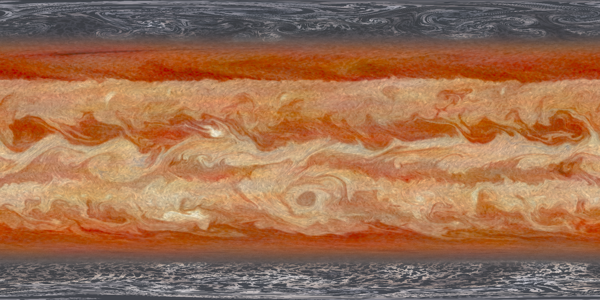
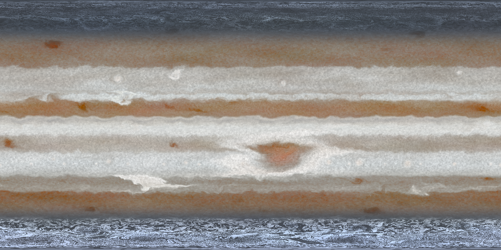
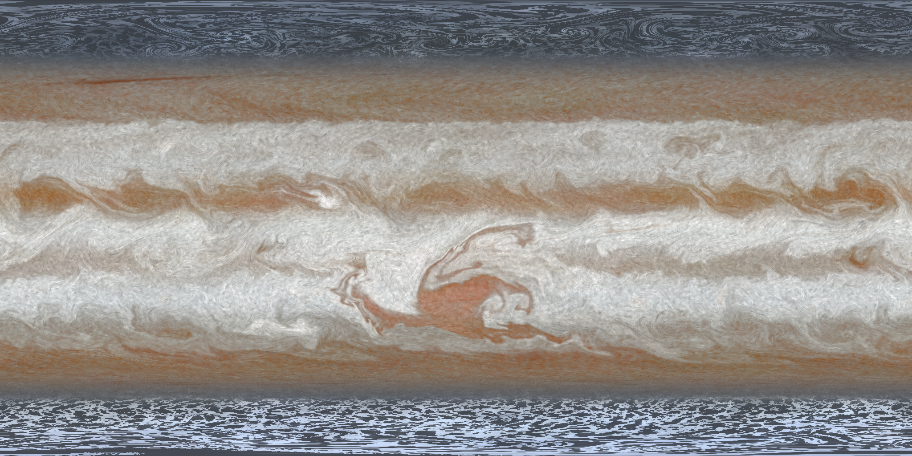
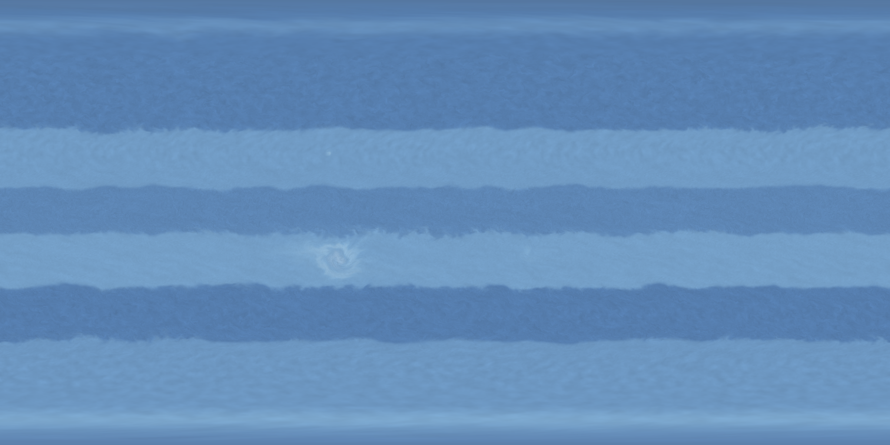
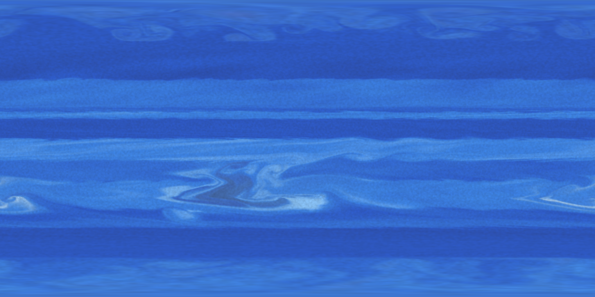

# Gas Giant Studio


Procedural gas giant texture map generator. A GPU "sim-advected procedural"
engine — a physically motivated velocity field (alternating zonal jets,
injected storm vortices, shear-driven turbulence) through which cloud tracer
fields are advected — produces seamless equirectangular map sets (16-bit
color + float height, plus an optional HDR emission map: thermal hot-spot
glow, lightning, aurora) for wrapping on a sphere, plus a Blender extension
that imports a map set as a ready-to-render planet with material, atmosphere,
and demo scene.

Modeled on the visible cloud formations of Jupiter and Saturn: zones and
belts with meandering boundaries, alternating jets, GRS-class anticyclones
with turbulent wakes, white ovals, brown barges, strings of pearls,
Kelvin–Helmholtz billows, festoons and hot spots, convective outbreaks,
vortex mergers with debris collars, GRS internal spiral lanes, intermittent
belt turbulence, Saturn's ribbon, Jupiter's polar cyclone clusters, and
Saturn's polar hexagon. The full catalog and how each is implemented:
`docs/formations.md`. Color and texture are calibrated against NASA
reference maps with chroma-aware per-latitude metrics: `docs/realism.md`.

## Requirements

- Python 3.13+, [uv](https://docs.astral.sh/uv/)
- A GPU with OpenGL 4.3 (developed on an RTX 3070, Windows 11)
- Blender 4.2+ for the importer (verified on 5.1.2)

## Quick start

```sh
uv sync --all-extras

# Live-preview GUI: watch the simulation evolve, tweak, export.
uv run gasgiant-studio
# First launch grows the default planet through a ~700-step development run
# (up to ~15 min at the default speed on a midrange GPU) — watch the
# "developing N/M (~Xm left)" progress in the Playback pane and over the
# viewport; the image is not final until it completes.
# Panels are searchable and auto-generated from the parameters, with
# per-slider help, undo/redo, and playback (pause / step / extend) controls.
# What each slider does, shown on the planet: docs/sliders.md

# Headless: render a map set (factory presets: gas_giant_warm [default],
# jupiter_like, jupiter_vorticity, saturn_pale, ice_giant, neptune)
uv run gasgiant export --preset jupiter_like --res 4096 --out out/jove
uv run gasgiant validate out/jove        # seam/pole invariants

# Override how long the planet develops before the snapshot:
uv run gasgiant export --preset saturn_pale --dev-steps 1000 --out out/saturn

# Big one: 16384x8192 (about half a minute on an RTX 3070)
uv run gasgiant export --preset jupiter_like --res 16384 --out out/jove16k

# Animate: export an N-frame color sequence, advancing the sim between frames
uv run gasgiant export --preset jupiter_vorticity --frames 120 \
    --steps-per-frame 4 --out out/jove_seq
```

## Presets

Six factory presets ship in `src/gasgiant/presets/`. Each image below is that
preset developed for 1,000 steps, exported as the raw equirectangular color map
— the same texture that wraps onto the sphere. Parameter details and the
manifest contract: `docs/presets.md`.

**`gas_giant_warm`** — flagship, and the GUI startup default. Vorticity solver:
high-contrast warm bands, a Great-Red-Spot-class hero storm with a turbulent
wake, and flowing eddies.



**`jupiter_like`** — kinematic (v1.5), calibrated against Cassini reference
maps: orange belts, white zones, red/white ovals, and dark polar hoods.



**`jupiter_vorticity`** — the prognostic vorticity solver (v1.6): stronger
barotropic instability and eddy-shedding give a more turbulent, filament-rich
Jupiter with spiral-laned storms.



**`saturn_pale`** — Saturn's muted gold-and-cream palette: soft, low-contrast
bands and pale ovals.


**`ice_giant`** — a Uranus-like ice giant: cool, pale blue banding with a
discrete dark vortex.



**`neptune`** — a deep methane-blue Neptune: smooth broad zones (laminar, no
belt churn), a dark Great-Dark-Spot anticyclone with bright companion clouds,
and wind-sheared cirrus streaks.



> Generated with `scripts/render_readme_examples.py` (a reduced sim grid keeps
> the set tractable under software GL; the shipped presets develop at
> `sim.resolution` 2048–4096, so a full-quality render carries finer detail).

## Into Blender

```sh
uv run python scripts/build_addon.py     # -> dist/gasgiant_importer-1.1.0.zip
```

Drag the zip into Blender, then *File → Import → Gas Giant Map Set (.json)*
and pick `out/jove/mapset.json`. Enable "Create demo scene" for a framed,
sun-lit, AgX-graded first render. Details and options: `docs/blender_addon.md`.

## How it works

Four cloud tracers (color index, cloud-top height, detail, storm tint) are
advected by a semi-Lagrangian MacCormack solver through a streamfunction-
built velocity field, on an equirect grid plus two azimuthal-equidistant
polar patches slaved by a per-step nesting exchange. Relaxation forcing
toward the analytic band/storm stamps keeps structure alive indefinitely;
export-time advected-coordinate noise adds flow-stretched filament detail at
any output resolution. Architecture: `docs/architecture.md`.

Everything is deterministic from one seed. Presets: `docs/presets.md`.

## Development

```sh
uv run pytest            # unit + GPU tests (llvmpipe works)
uv run ruff check .
uv run lint-imports      # layer contracts
```

The Blender import test runs inside Blender:
`blender --background --factory-startup --python tests/blender/test_import.py -- <mapset_dir>`
(writes `tests/blender/result.json`).
