# Slider reference

What every slider in the live-preview GUI (`uv run gasgiant-studio`) actually does, shown on the planet. Each row renders the **low**, **preset**, and **high** value of one slider; everything else is held at the `jupiter_like` preset (seed 4201, sim resolution 768, 150 development steps). Images are the raw equirectangular color map -- the same texture the exporter writes and the viewport's *Color* channel shows (under the *Standard* view transform).

> The panels are auto-generated from `PlanetParams` (`src/gasgiant/params/model.py`): every `int`/`float` field becomes a slider, every `StrEnum` field becomes a dropdown, and every optional numeric field becomes a pin-checkbox + slider (dropdowns and optional fields are documented here as text entries). This document is generated from the same model by `scripts/render_slider_examples.py`, so it tracks the real UI (CI runs it with `--check` and fails when this file is stale).

> **Tier** is what the engine recomputes when you move the slider: `post` re-derives the maps only (instant), `velocity` rebuilds the flow field, `restart` re-runs the development from step 0.

## Contents

- [Sim](#sim)
- [Solver](#solver)
- [Bands](#bands)
- [Jets](#jets)
- [Turbulence](#turbulence)
- [Storms](#storms)
- [Waves](#waves)
- [Poles](#poles)
- [Appearance](#appearance)
- [Detail](#detail)
- [Mask](#mask)
- [Emission](#emission)
- [Physical](#physical)
- [Export](#export)

## Sim

### dev steps

`sim.dev_steps` &mdash; range **0 to 3000**, default **500**, tier `restart`.

Development steps: how long structures evolve before the snapshot

_High example capped below the slider maximum so it renders in reasonable time; the column label shows the value used._

<table><tr>
<td align="center">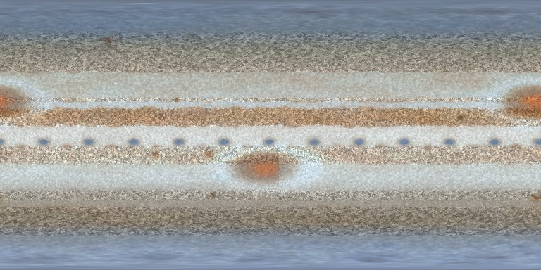 low &middot; 0</td><td align="center"> preset &middot; 150</td><td align="center">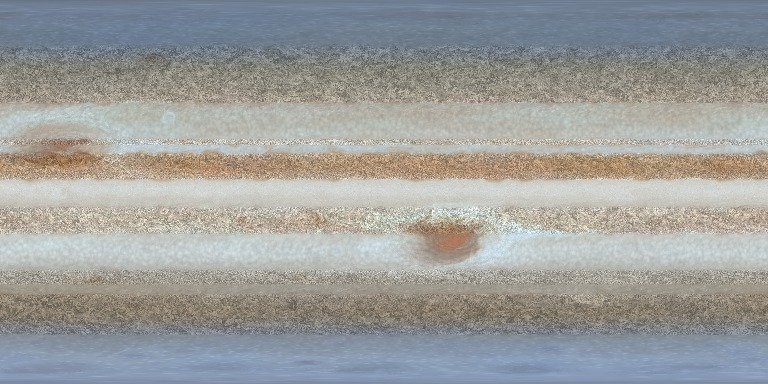 high &middot; 1000</td>
</tr></table>

### dt scale

`sim.dt_scale` &mdash; range **0.2 to 3**, default **1**, tier `restart`.

Time-step multiplier (peak jet displacement ~1.2 cells at 1.0)

<table><tr>
<td align="center">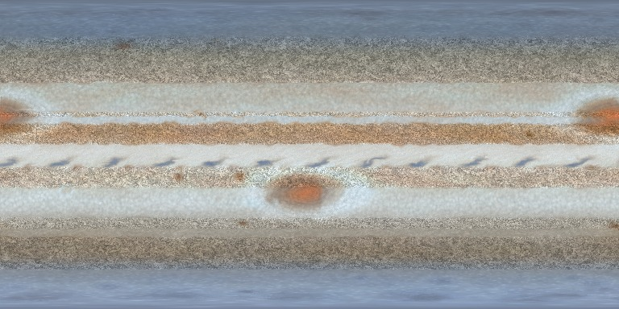 low &middot; 0.2</td><td align="center"> preset &middot; 1</td><td align="center">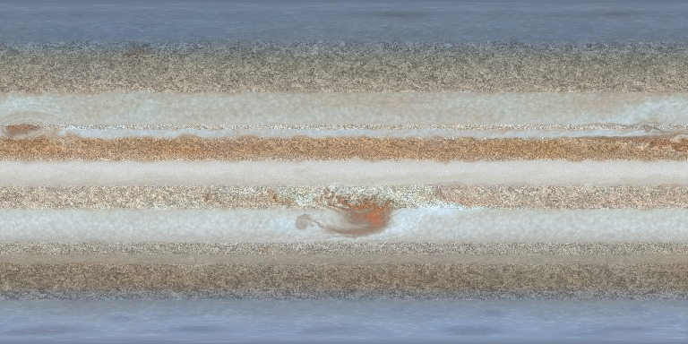 high &middot; 3</td>
</tr></table>

### resolution

`sim.resolution` &mdash; range **512 to 8192**, default **2048**, tier `restart`.

Sim grid width (2:1 equirect); 2048 interactive, 4096+ for final quality

_Passed to the Blender importer / controls the output file, not the texture appearance &mdash; no visual example._

## Solver

### baro steps per update

`solver.baroclinic.baro_steps_per_update` &mdash; range **10 to 1000**, default **150**, tier `restart`.

Internal pacing of the baroclinic storm generator — leave at default (baroclinic steps per source refresh; fixed cadence, no rand)

_Passed to the Blender importer / controls the output file, not the texture appearance &mdash; no visual example._

### enabled

`solver.baroclinic.enabled` &mdash; toggle (on/off), default **`False`**, tier `restart`.

Inject the evolving baroclinic vorticity source into the vorticity solver (adds physically-grounded mid-latitude storms; requires solver type=vorticity). Off = plain v1.6. No rand: randomize() must never silently enable it.

_Boolean toggle (GUI checkbox) &mdash; documented as text; no rendered example._

### gain

`solver.baroclinic.gain` &mdash; range **0 to 8**, default **2**, tier `restart`.

Baroclinic source amplitude as a fraction of coriolis_f0 (~3). The source is injected into the Poisson RHS (NOT the vorticity state), so it is bounded (no accumulation) and coherent (never folded by advection -- it is read fresh from the source each step and never enters the advected q state), enriching mid-latitude belt texture. ~2 = subtle; high gain over-boils. No rand.

_Rendered against the `baroclinic` solver baseline (inert under the default kinematic solver)._

<table><tr>
<td align="center">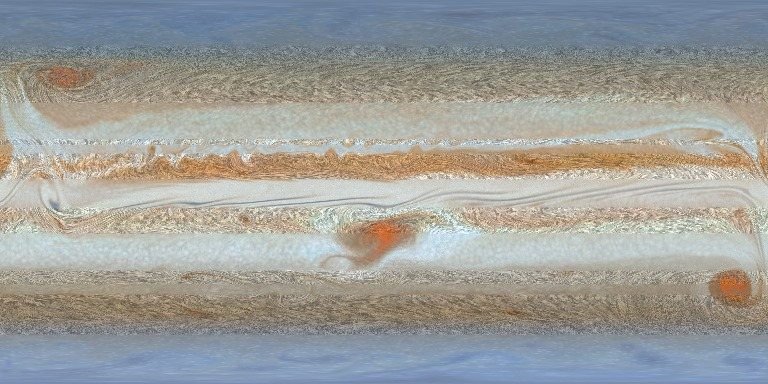 low &middot; 0</td><td align="center">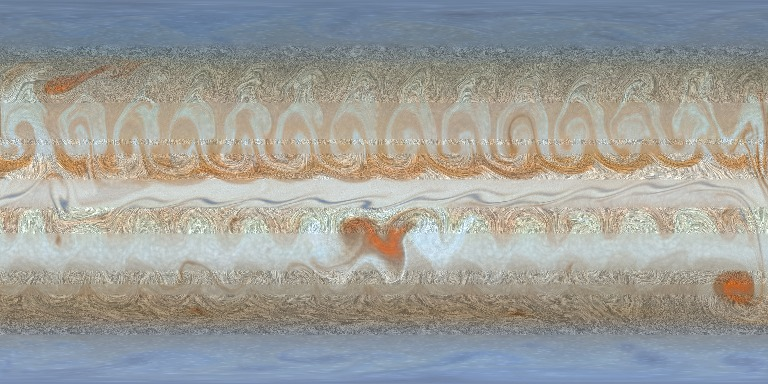 preset &middot; 2</td><td align="center">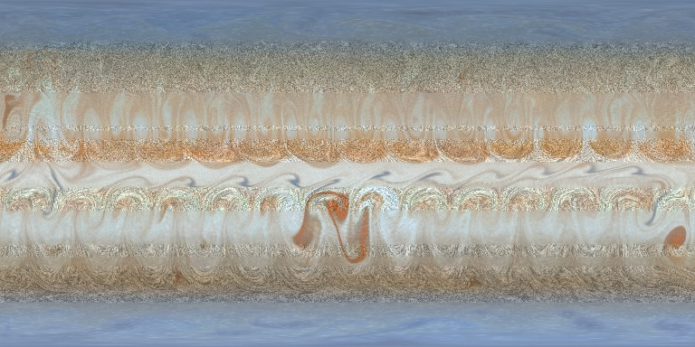 high &middot; 8</td>
</tr></table>

### update every

`solver.baroclinic.update_every` &mdash; range **1 to 512**, default **32**, tier `restart`.

Internal pacing of the baroclinic storm generator — leave at default (main-solver steps between source refreshes; fixed cadence, no rand)

_Passed to the Blender importer / controls the output file, not the texture appearance &mdash; no visual example._

### warmup steps

`solver.baroclinic.warmup_steps` &mdash; range **500 to 20000**, default **8000**, tier `restart`.

Internal pacing of the baroclinic storm generator — leave at default; only affects how the extra mid-latitude storms mature (spin-up steps before coupling; fixed cadence, no rand; hi=20000 leaves headroom past the ~12500 lower-layer blow-up so tests can force it)

_Passed to the Blender importer / controls the output file, not the texture appearance &mdash; no visual example._

### coriolis f0

`solver.coriolis_f0` &mdash; range **0 to 20**, default **2**, tier `restart`.

Planet-rotation strength: higher = more, narrower bands and flatter storms; lower = fewer, fatter bands (f0 in f = f0*sin(lat), sets the Rhines/band scale; vorticity mode)

_Rendered against the `vorticity` solver baseline (inert under the default kinematic solver)._

<table><tr>
<td align="center">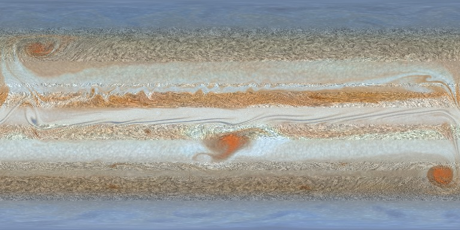 low &middot; 0</td><td align="center">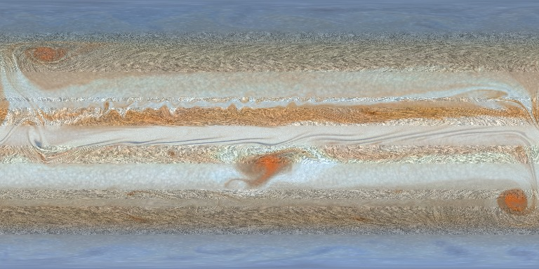 preset &middot; 3</td><td align="center">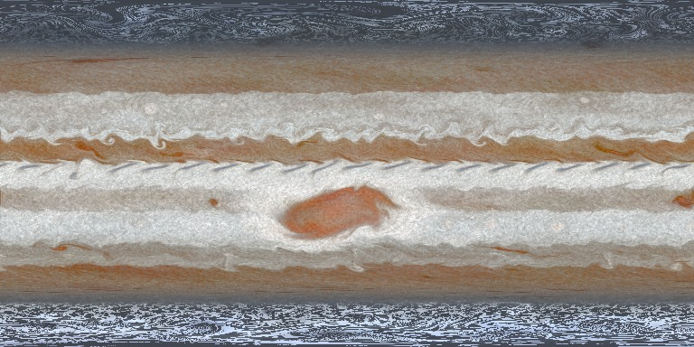 high &middot; 20</td>
</tr></table>

### deformation radius

`solver.deformation_radius` &mdash; range **0 to 3.14**, default **0**, tier `restart`.

Storm locality: how far each vortex's swirl reaches. Smaller = more local — a dominant hero stirs its own band without destabilizing the rest of the map; 0 = off (infinite reach, plain 2D, byte-identical). Values in the (0, 0.05) rad band are rejected (degenerate solve). (Physics: Rossby deformation radius L_d in RADIANS, 1 rad = 57.3 deg; vorticity mode. Screens the inversion to (nabla^2 - 1/L_d^2)psi = omega — equivalent-barotropic / 1.5-layer reduced gravity — so induced velocity decays ~exp(-r/L_d) beyond L_d instead of the 2D ~1/r tail; real Jupiter has L_d << the GRS. With screening on, the advected q is equivalent-barotropic QGPV, so vortex/inject/relax strengths tuned for the plain 2D path read weaker and more localized -- expect to re-tune. No rand.)

<table><tr>
<td align="center"> preset &middot; 0</td><td align="center"> high &middot; 3.14</td>
</tr></table>

### poisson iters

`solver.poisson_iters` &mdash; range **8 to 512**, default **48**, tier `restart`.

Solver accuracy per step: too low leaves smeared, laggy swirls; higher is slower with diminishing returns (fixed red-black SOR iterations; vorticity mode)

_Passed to the Blender importer / controls the output file, not the texture appearance &mdash; no visual example._

### sor omega

`solver.sor_omega` &mdash; range **1 to 2**, default **1.7**, tier `restart`.

Solver convergence speed — leave at 1.7: it changes solve time, not the picture, unless set so low the swirls lag (SOR over-relaxation factor, must be in (1,2) exclusive; vorticity mode)

_Passed to the Blender importer / controls the output file, not the texture appearance &mdash; no visual example._

### type

`solver.type` &mdash; dropdown, one of `kinematic` / `vorticity`, default **`kinematic`**, tier `restart`.

How clouds move: kinematic = fast and painterly, bands stay where they are painted (analytic streamfunction, v1.5); vorticity = a real fluid sim — storms interact and shed filaments, slower, and required by the solid-core storm levers (prognostic vorticity, v1.6+)

_Choice field (GUI dropdown) &mdash; documented as text; no rendered example._

### vort drag

`solver.vort_drag` &mdash; range **0 to 0.3**, default **0**, tier `restart`.

Global brake on swirling: tames runaway planet-scale swirl but also weakens every storm — prefer vort_psi_drag, which targets only the oversized swirl (linear Rayleigh drag fraction on relative vorticity per step, absorbing the 2D inverse-cascade pileup at large scales; 0 = off; vorticity mode)

_Rendered against the `vorticity` solver baseline (inert under the default kinematic solver)._

<table><tr>
<td align="center"> preset &middot; 0</td><td align="center">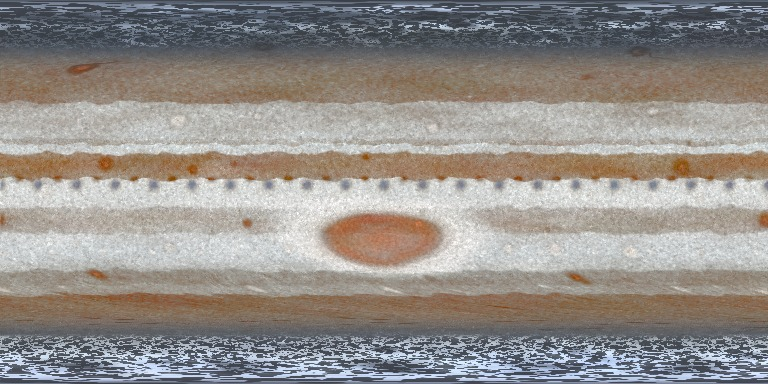 high &middot; 0.3</td>
</tr></table>

### vort eddy drag

`solver.vort_eddy_drag` &mdash; range **0 to 0.3**, default **0**, tier `restart`.

Linear drag fraction on the EDDY vorticity q - <q>_x (the deviation from the per-latitude zonal mean) per step. Leaves the zonal-mean jets intact, but is FLAT in wavenumber, so it damps medium eddies (festoons, band-edge waves) as hard as the gravest-mode swirl -> over-flattens the field. Prefer vort_psi_drag (scale-selective). Equirect only. 0 = off (byte-identical). Vorticity mode.

<table><tr>
<td align="center"> preset &middot; 0</td><td align="center"> high &middot; 0.3</td>
</tr></table>

### vort hypervisc

`solver.vort_hypervisc` &mdash; range **0 to 10**, default **1**, tier `restart`.

Fine-scale smoothing: cleans up pixel-level crackle; too high blurs away the thinnest filaments (scale-selective biharmonic hyperviscosity; vorticity mode)

_Rendered against the `vorticity` solver baseline (inert under the default kinematic solver)._

<table><tr>
<td align="center">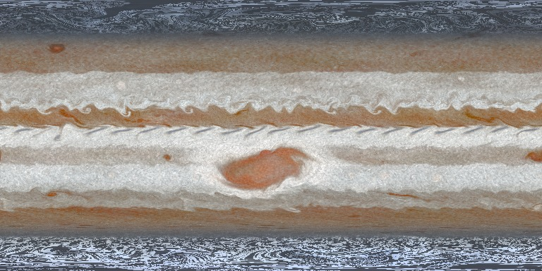 low &middot; 0</td><td align="center"> preset &middot; 0.6</td><td align="center">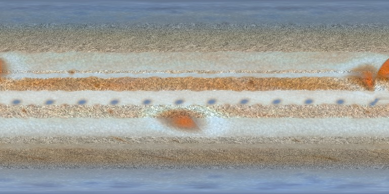 high &middot; 10</td>
</tr></table>

### vort inject

`solver.vort_inject` &mdash; range **0 to 5**, default **0**, tier `restart`.

Broadband eddy-vorticity injection amplitude per step; the jet shear folds it into filaments (the emergent-turbulence source; 0 = off, smooth jets stay zonal). Vorticity mode.

_Rendered against the `vorticity` solver baseline (inert under the default kinematic solver)._

<table><tr>
<td align="center">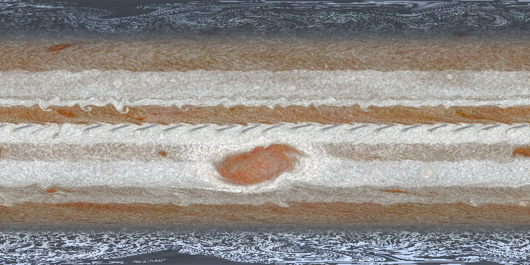 low &middot; 0</td><td align="center"> preset &middot; 1.8</td><td align="center">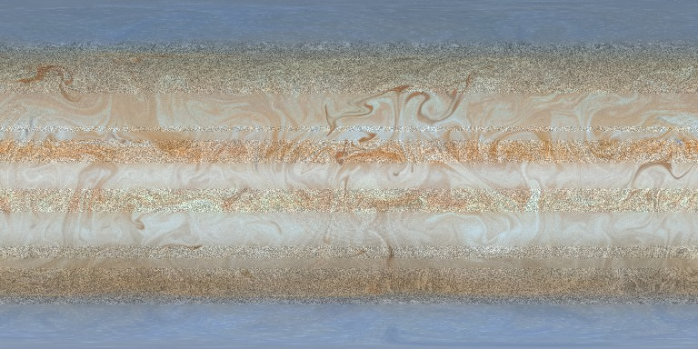 high &middot; 5</td>
</tr></table>

### vort inject mask

`solver.vort_inject_mask` &mdash; dropdown, one of `global` / `belts` / `shear`, default **`global`**, tier `restart`.

Spatial localization of eddy injection: global = churn everywhere; belts = cyclonic dark bands only (anticyclonic zones stay smooth); shear = jet-shear flanks only (filaments where shear is high). Vorticity mode.

_Choice field (GUI dropdown) &mdash; documented as text; no rendered example._

### vort inject scale

`solver.vort_inject_scale` &mdash; range **0.1 to 4**, default **0.5**, tier `restart`.

Size of the injected churn: higher = finer speckle that the shear folds into thin filaments; lower = big blobs (injection frequency as a multiple of bands.detail_freq; vorticity mode)

_Rendered against the `vorticity` solver baseline (inert under the default kinematic solver)._

<table><tr>
<td align="center">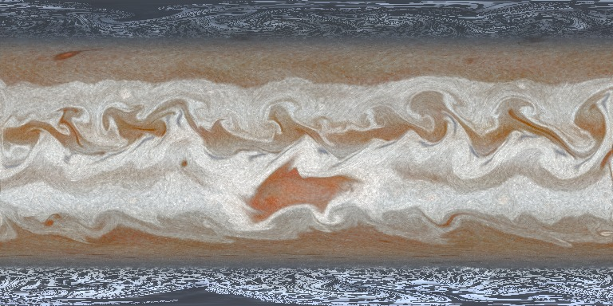 low &middot; 0.1</td><td align="center"> preset &middot; 2.5</td><td align="center">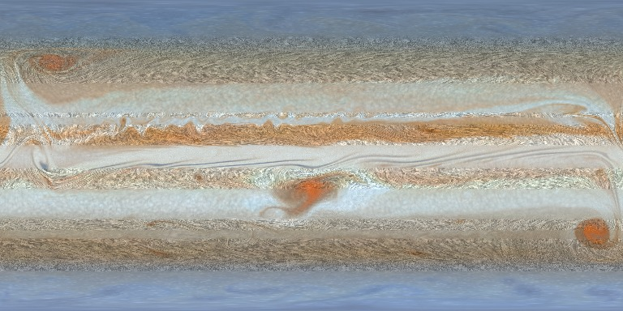 high &middot; 4</td>
</tr></table>

### vort psi drag

`solver.vort_psi_drag` &mdash; range **0 to 20**, default **0**, tier `restart`.

Removes oversized planet-scale swirl while PRESERVING festoons, band-edge waves, and mid-size vortices — the scale-selective brake to reach for before vort_drag or vort_eddy_drag. 0 = off (byte-identical). (Physics: large-scale hypofriction — a vorticity sink proportional to the EDDY STREAMFUNCTION psi - <psi>_x; because psi ~ omega/(k^2 + 1/L_d^2), the effective drag rate ~1/(k^2+1/L_d^2) hits the gravest-mode inverse-cascade swirl far harder than medium eddies, unlike the flat-in-k vort_eddy_drag. Reuses the screened-Poisson psi the solver already computes (one step stale); coefficient runs numerically larger than vort_eddy_drag since psi << omega. Equirect only. Vorticity mode.)

<table><tr>
<td align="center"> preset &middot; 0</td><td align="center"> high &middot; 20</td>
</tr></table>

### vort relax tau

`solver.vort_relax_tau` &mdash; range **20 to 2000**, default **120**, tier `restart`, log scale.

How tightly the flow is leashed to the painted jets and storms: low = tidy and band-locked, high = free-running turbulence that can wander off the template (nudging timescale in steps; vorticity mode)

_Rendered against the `vorticity` solver baseline (inert under the default kinematic solver)._

<table><tr>
<td align="center">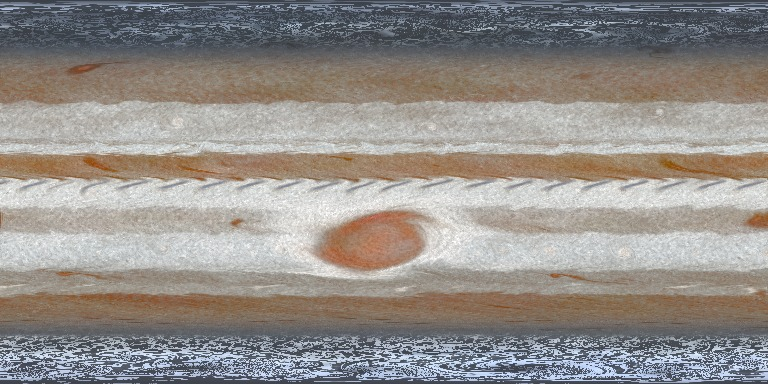 low &middot; 20</td><td align="center"> preset &middot; 600</td><td align="center">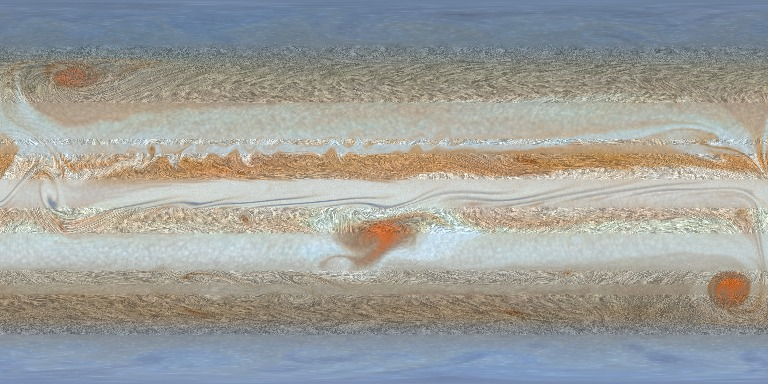 high &middot; 2000</td>
</tr></table>

## Bands

### belt fade

`bands.belt_fade` &mdash; range **0 to 1**, default **0**, tier `restart`.

Whole-belt fade (the SEB-fade epoch): blends the target band's stamped color toward the mean of its neighboring bands, all the way around the planet -- at 1.0 a faded belt reads as a pale ghost band at zone level. VISUAL only (recorded LIMIT): the belt keeps belt-like churn/dynamics and stays a storm host and outbreak candidate, which is the real SEB-fade phenomenology (revival outbreaks erupt IN the faded belt). Target band = faded_band_index, or the widest low/mid belt when that is unset. 0 = off (byte-identical)

<table><tr>
<td align="center"> preset &middot; 0</td><td align="center">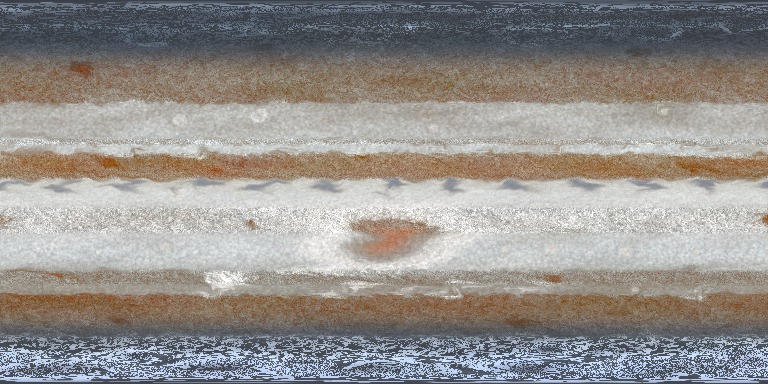 high &middot; 1</td>
</tr></table>

### contrast envelope

`bands.contrast_envelope` &mdash; range **0 to 1**, default **0**, tier `restart`.

Banding contrast collapse poleward of ~45 deg toward mottle (the real latitude-contrast profile)

<table><tr>
<td align="center">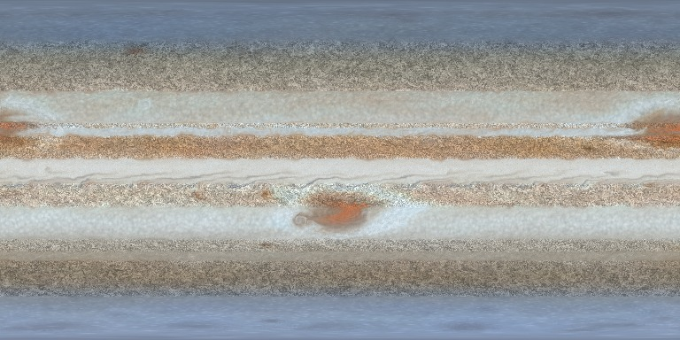 low &middot; 0</td><td align="center"> preset &middot; 0.25</td><td align="center">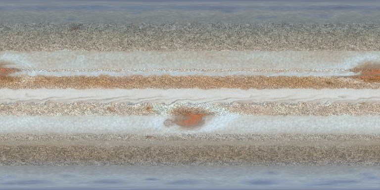 high &middot; 1</td>
</tr></table>

### count

`bands.count` &mdash; range **2 to 40**, default **14**, tier `restart`.

Number of zones+belts pole to pole

<table><tr>
<td align="center"> low &middot; 2</td><td align="center"> preset &middot; 16</td><td align="center"> high &middot; 40</td>
</tr></table>

### detail amount

`bands.detail_amount` &mdash; range **0 to 0.5**, default **0.1**, tier `restart`.

Small-scale color-index noise amplitude

<table><tr>
<td align="center"> low &middot; 0</td><td align="center"> preset &middot; 0.12</td><td align="center">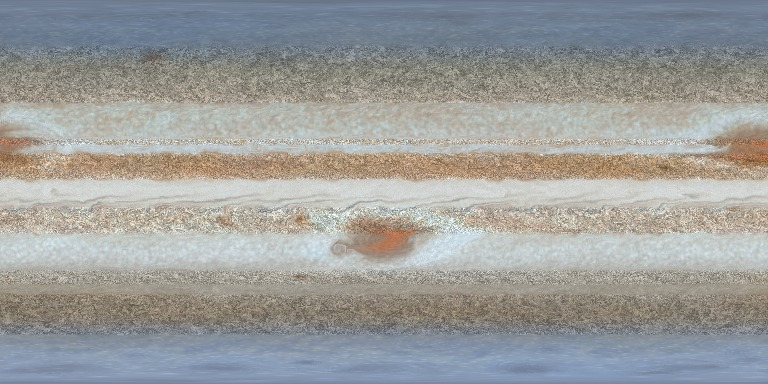 high &middot; 0.5</td>
</tr></table>

### detail freq

`bands.detail_freq` &mdash; range **2 to 64**, default **12**, tier `restart`, log scale.

Small-scale noise spatial frequency

<table><tr>
<td align="center">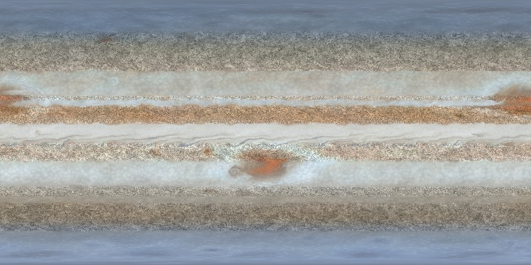 low &middot; 2</td><td align="center"> preset &middot; 14</td><td align="center">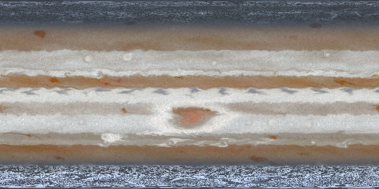 high &middot; 64</td>
</tr></table>

### edge diversity

`bands.edge_diversity` &mdash; range **0 to 1**, default **0**, tier `restart`.

Per-edge softness variation: some band edges diffuse, some sharp (uniform edges are a procedural tell)

<table><tr>
<td align="center">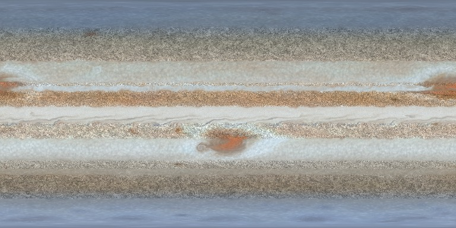 low &middot; 0</td><td align="center"> preset &middot; 0.55</td><td align="center"> high &middot; 1</td>
</tr></table>

### edge softness

`bands.edge_softness` &mdash; range **0.001 to 0.1**, default **0.012**, tier `restart`, log scale.

Half-width of band-edge transitions, radians of latitude (1 rad = 57.3 deg; default 0.012 rad is about 0.7 deg)

<table><tr>
<td align="center"> low &middot; 0.001</td><td align="center"> preset &middot; 0.012</td><td align="center">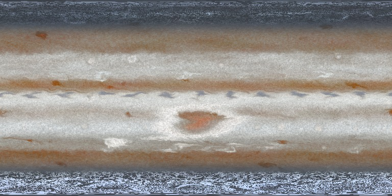 high &middot; 0.1</td>
</tr></table>

### faded band index

`bands.faded_band_index` &mdash; optional; pin range **0 to 39**, default **None (auto)**, tier `restart`.

Band targeted by belt_fade AND the faded_sector longitude window (index 0 = northernmost band). None = auto: the widest belt within ~52 deg of the equator -- note the shipped Jupiter template's SEB wins that pick by only 0.01 deg over the NEB, so set this explicitly when the target matters. Pointing it at a ZONE is allowed (the ochre-EZ recipe: the zone blends toward its belt neighbors). Validated against the band count

_Optional field: the GUI shows a **pin** checkbox &mdash; unpinned (None) keeps the automatic/seeded behavior, pinned uses the slider value verbatim. Documented as text; no rendered example._

### faded sector

`bands.faded_sector` &mdash; range **0 to 1**, default **0**, tier `restart`.

SEB-fade: one belt gets a pale desaturated sector spanning ~100 degrees of longitude

<table><tr>
<td align="center">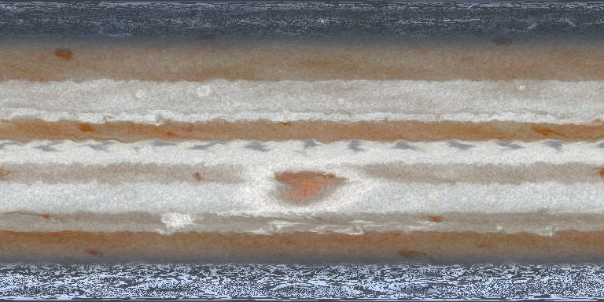 low &middot; 0</td><td align="center"> preset &middot; 0.55</td><td align="center">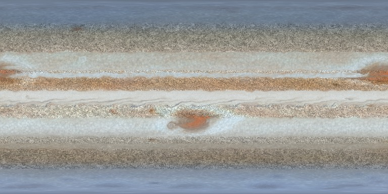 high &middot; 1</td>
</tr></table>

### hue jitter

`bands.hue_jitter` &mdash; range **0 to 0.15**, default **0**, tier `restart`.

Per-band color-index offset along the palette (NEB-orange vs SEB-brown variation); seeded independently of the band layout

<table><tr>
<td align="center"> low &middot; 0</td><td align="center"> preset &middot; 0.04</td><td align="center"> high &middot; 0.15</td>
</tr></table>

### lane density

`bands.lane_density` &mdash; range **0 to 1**, default **0**, tier `velocity`.

Thin dark lane lines at jet cores, drawn analytically at derive time (a 1-3 px line cannot survive the sim grid)

<table><tr>
<td align="center"> preset &middot; 0</td><td align="center"> high &middot; 1</td>
</tr></table>

### value contrast

`bands.value_contrast` &mdash; range **0 to 2**, default **1**, tier `restart`.

Zone/belt brightness separation multiplier

<table><tr>
<td align="center"> low &middot; 0</td><td align="center"> preset &middot; 1.1</td><td align="center"> high &middot; 2</td>
</tr></table>

### variance amount

`bands.variance_amount` &mdash; range **0 to 0.3**, default **0**, tier `restart`.

Within-band longitudinal color drift (real belts hold several hues at once, varying slowly with longitude)

<table><tr>
<td align="center">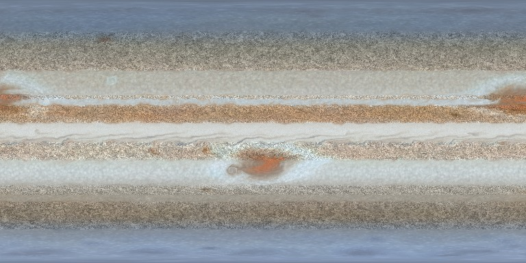 low &middot; 0</td><td align="center"> preset &middot; 0.18</td><td align="center">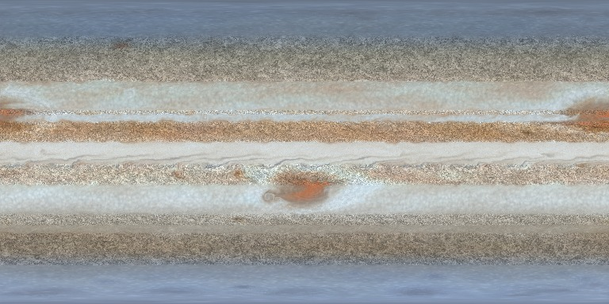 high &middot; 0.3</td>
</tr></table>

### warp amount

`bands.warp_amount` &mdash; range **0 to 0.3**, default **0.035**, tier `restart`.

Band-boundary meander amplitude, radians of latitude (1 rad = 57.3 deg; default 0.035 rad is about 2 deg)

<table><tr>
<td align="center">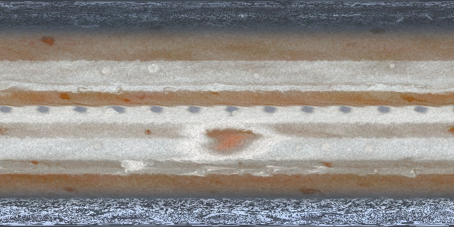 low &middot; 0</td><td align="center"> preset &middot; 0.04</td><td align="center">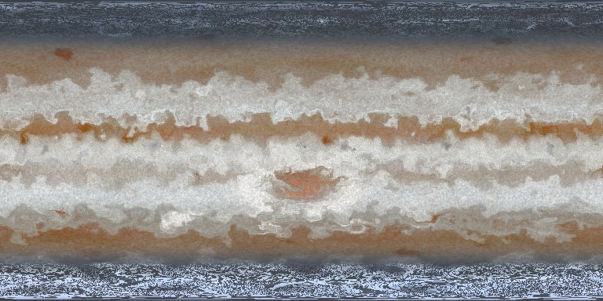 high &middot; 0.3</td>
</tr></table>

### warp freq

`bands.warp_freq` &mdash; range **0.5 to 16**, default **3**, tier `restart`, log scale.

Band-boundary meander spatial frequency

<table><tr>
<td align="center">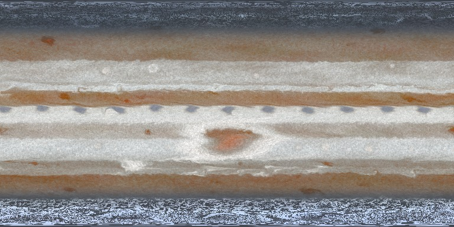 low &middot; 0.5</td><td align="center"> preset &middot; 3.5</td><td align="center">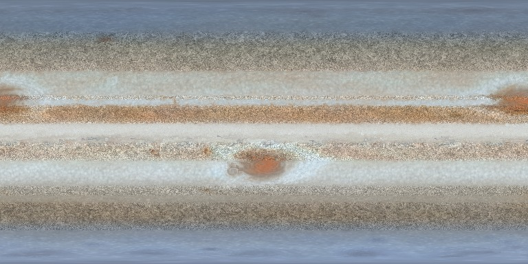 high &middot; 16</td>
</tr></table>

### width jitter

`bands.width_jitter` &mdash; range **0 to 1**, default **0.35**, tier `restart`.

Randomness of band width distribution

<table><tr>
<td align="center"> low &middot; 0</td><td align="center"> preset &middot; 0.4</td><td align="center"> high &middot; 1</td>
</tr></table>

### width tail

`bands.width_tail` &mdash; range **0 to 1**, default **0**, tier `restart`.

Heavier-tailed band width distribution (real maps mix very broad zones with thin strips)

<table><tr>
<td align="center"> low &middot; 0</td><td align="center"> preset &middot; 0.35</td><td align="center"> high &middot; 1</td>
</tr></table>

## Jets

### equatorial speed

`jets.equatorial_speed` &mdash; range **-3 to 4**, default **1.6**, tier `velocity`.

Equatorial superrotation jet peak speed (negative = retrograde, flowing against the planet's rotation)

<table><tr>
<td align="center">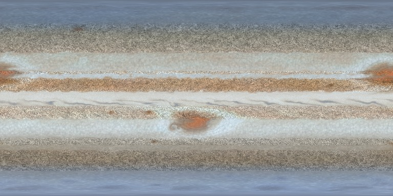 low &middot; -3</td><td align="center"> preset &middot; 1.6</td><td align="center">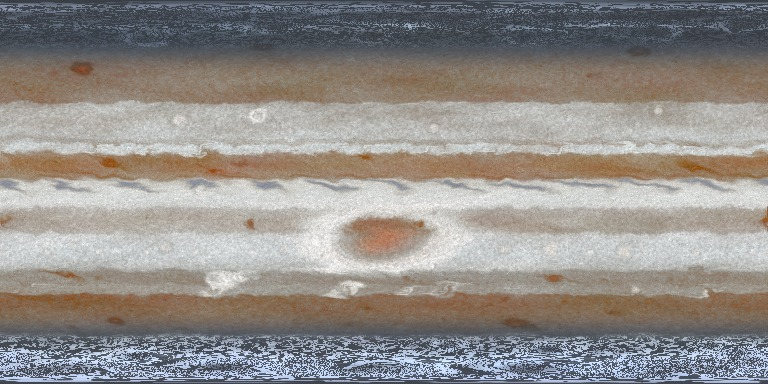 high &middot; 4</td>
</tr></table>

### equatorial width

`jets.equatorial_width` &mdash; range **0.03 to 0.4**, default **0.12**, tier `velocity`.

Equatorial jet half-width, radians of latitude (1 rad = 57.3 deg; default 0.12 rad is about 7 deg)

<table><tr>
<td align="center">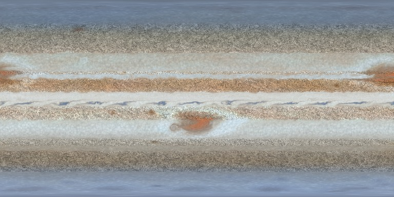 low &middot; 0.03</td><td align="center"> preset &middot; 0.12</td><td align="center">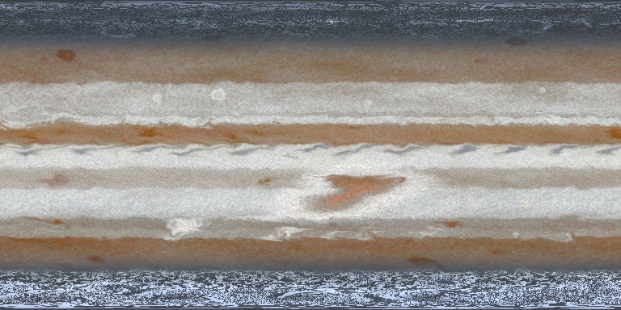 high &middot; 0.4</td>
</tr></table>

### polar decay

`jets.polar_decay` &mdash; range **0 to 1**, default **0.5**, tier `velocity`.

How strongly jet amplitudes decay toward the poles

<table><tr>
<td align="center">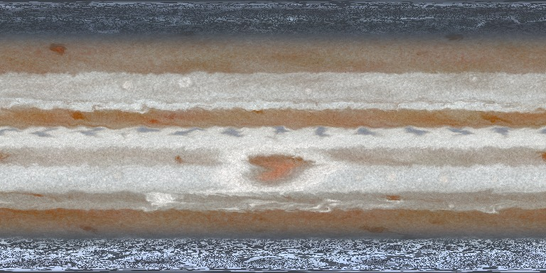 low &middot; 0</td><td align="center"> preset &middot; 0.5</td><td align="center">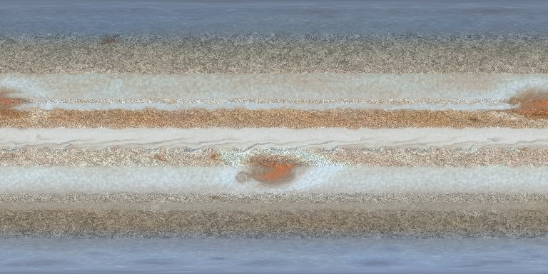 high &middot; 1</td>
</tr></table>

### strength

`jets.strength` &mdash; range **0 to 3**, default **1**, tier `velocity`.

Global zonal jet speed multiplier

<table><tr>
<td align="center">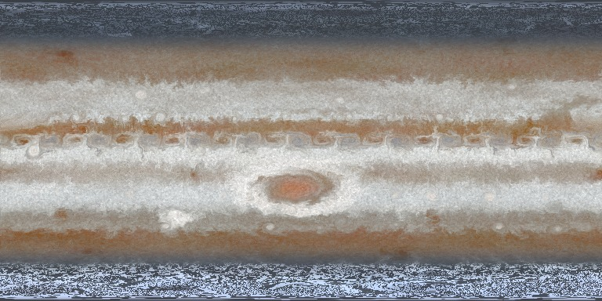 low &middot; 0</td><td align="center"> preset &middot; 1</td><td align="center">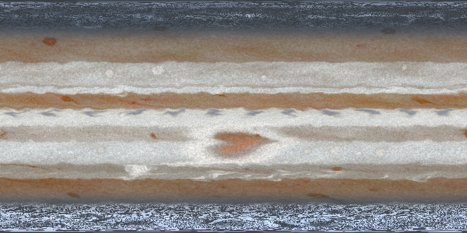 high &middot; 3</td>
</tr></table>

## Turbulence

### belt boost

`turbulence.belt_boost` &mdash; range **1 to 4**, default **1.6**, tier `velocity`.

Turbulence multiplier inside dark belts (cyclonic = spinning with the local planetary rotation; the storm-prone bands)

<table><tr>
<td align="center">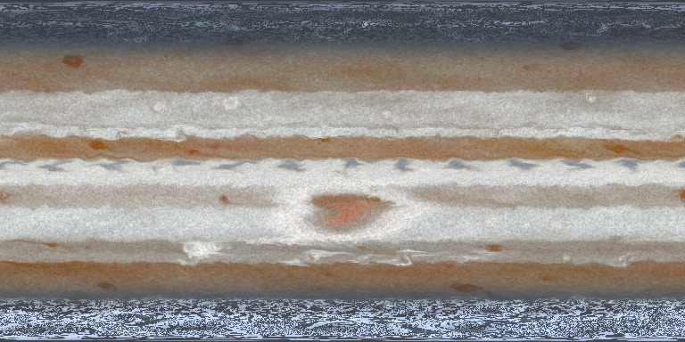 low &middot; 1</td><td align="center"> preset &middot; 1.6</td><td align="center">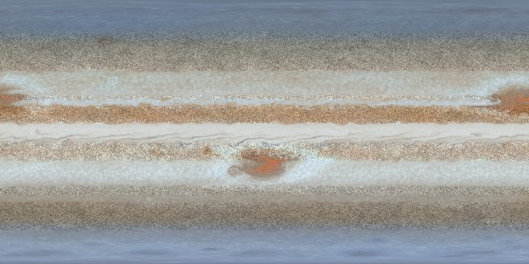 high &middot; 4</td>
</tr></table>

### belt replenish

`turbulence.belt_replenish` &mdash; range **0 to 0.08**, default **0**, tier `restart`.

Extra fine detail-noise replenished per step inside belts (emergent filaments)

<table><tr>
<td align="center">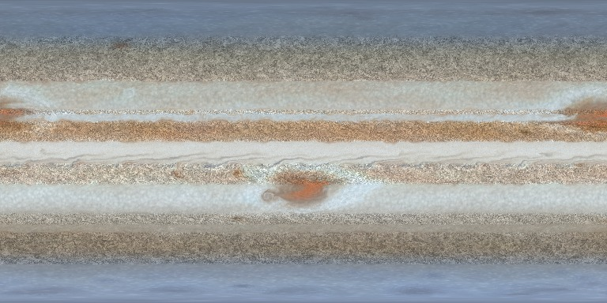 low &middot; 0</td><td align="center"> preset &middot; 0.07</td><td align="center">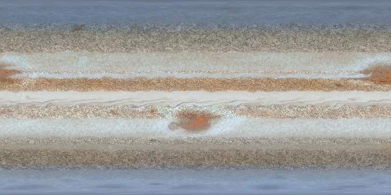 high &middot; 0.08</td>
</tr></table>

### belt replenish scale

`turbulence.belt_replenish_scale` &mdash; range **1 to 4**, default **2**, tier `restart`.

Belt replenishment frequency multiplier relative to the base detail frequency

<table><tr>
<td align="center"> low &middot; 1</td><td align="center"> preset &middot; 2</td><td align="center">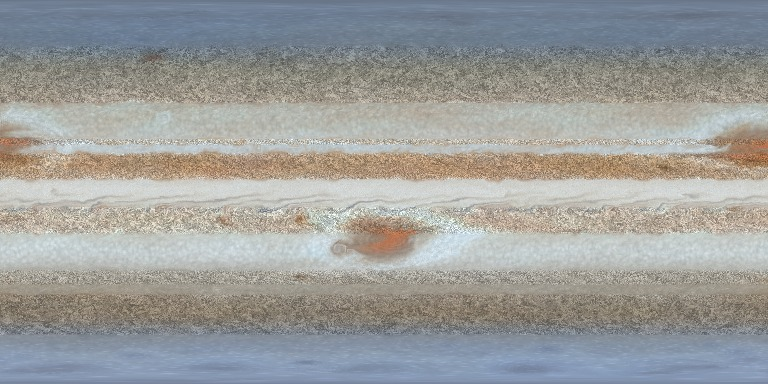 high &middot; 4</td>
</tr></table>

### evolution rate

`turbulence.evolution_rate` &mdash; range **0 to 0.1**, default **0.012**, tier `velocity`.

How fast the turbulence pattern decorrelates per step

<table><tr>
<td align="center">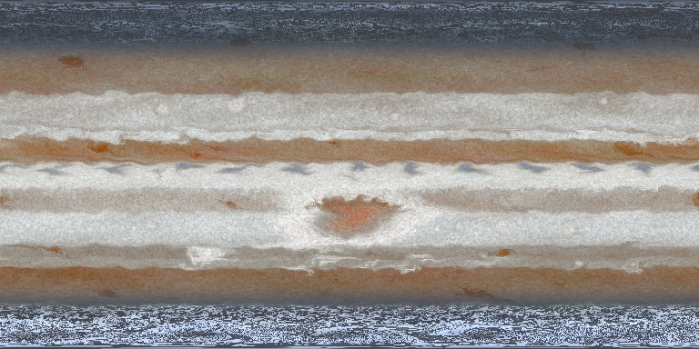 low &middot; 0</td><td align="center"> preset &middot; 0.012</td><td align="center">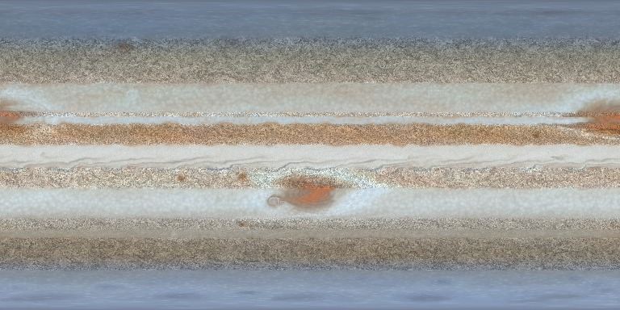 high &middot; 0.1</td>
</tr></table>

### intensity

`turbulence.intensity` &mdash; range **0 to 3**, default **1**, tier `velocity`.

Global turbulence (curl-noise) amplitude

<table><tr>
<td align="center">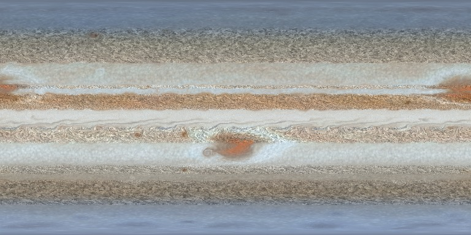 low &middot; 0</td><td align="center"> preset &middot; 1</td><td align="center">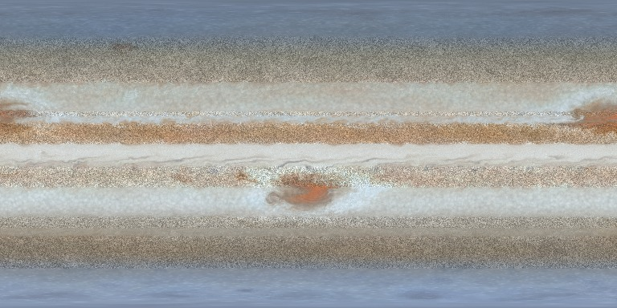 high &middot; 3</td>
</tr></table>

### kh amplitude

`turbulence.kh_amplitude` &mdash; range **0 to 2**, default **0.35**, tier `velocity`.

Kelvin-Helmholtz wave amplitude along high-shear band boundaries

<table><tr>
<td align="center">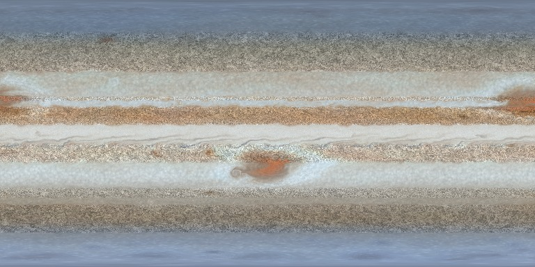 low &middot; 0</td><td align="center"> preset &middot; 0.6</td><td align="center">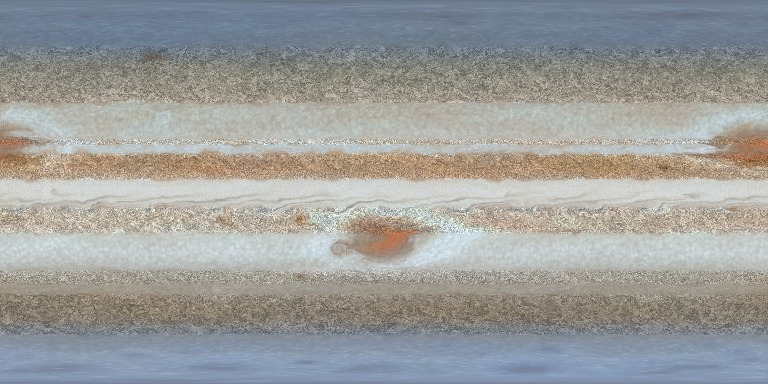 high &middot; 2</td>
</tr></table>

### kh wavenumber

`turbulence.kh_wavenumber` &mdash; range **4 to 80**, default **24**, tier `velocity`.

KH billow longitudinal wavenumber

<table><tr>
<td align="center">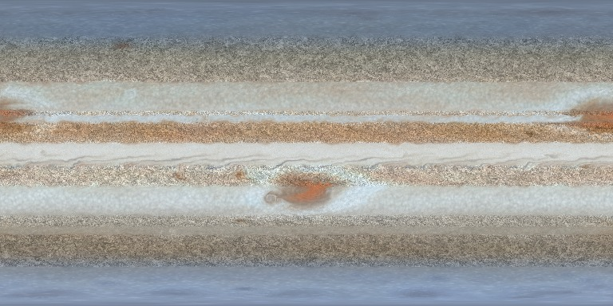 low &middot; 4</td><td align="center"> preset &middot; 24</td><td align="center">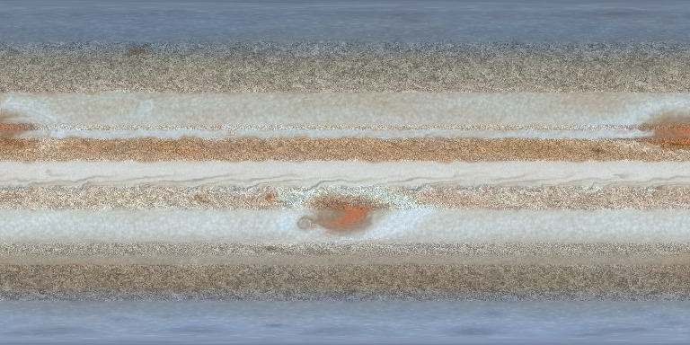 high &middot; 80</td>
</tr></table>

### relax tau

`turbulence.relax_tau` &mdash; range **50 to 2000**, default **350**, tier `restart`, log scale.

Relaxation time (steps) pulling band color/height back toward the stamp

<table><tr>
<td align="center">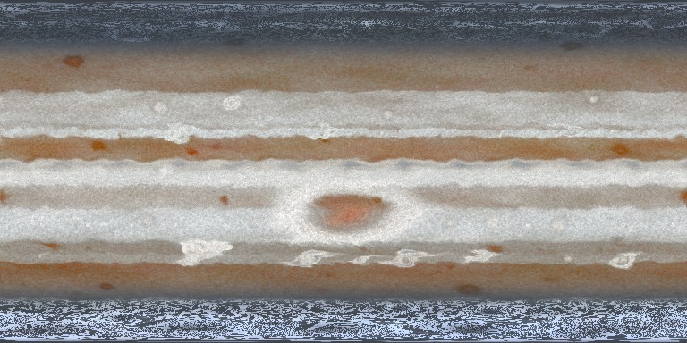 low &middot; 50</td><td align="center"> preset &middot; 350</td><td align="center">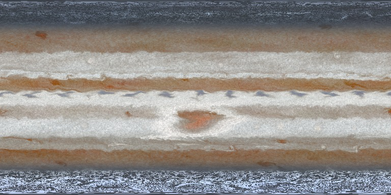 high &middot; 2000</td>
</tr></table>

### replenish rate

`turbulence.replenish_rate` &mdash; range **0 to 0.5**, default **0.015**, tier `restart`.

Fresh detail-noise blended into the detail tracer per step. High values (~0.3) keep quiescent zone bands detailed where the zonal jets would otherwise smear the detail away to ~half the belts'

<table><tr>
<td align="center"> low &middot; 0</td><td align="center"> preset &middot; 0.35</td><td align="center">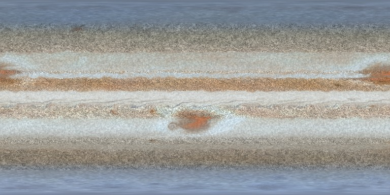 high &middot; 0.5</td>
</tr></table>

### scale

`turbulence.scale` &mdash; range **1 to 32**, default **6**, tier `velocity`, log scale.

Base spatial frequency of the turbulence noise

<table><tr>
<td align="center">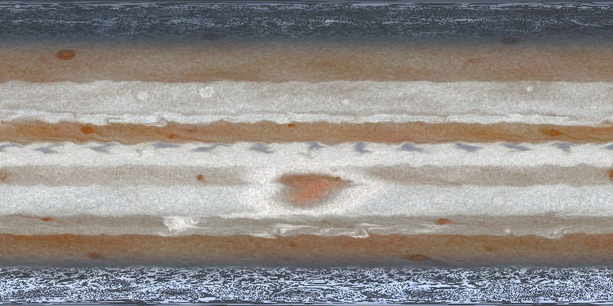 low &middot; 1</td><td align="center"> preset &middot; 6</td><td align="center">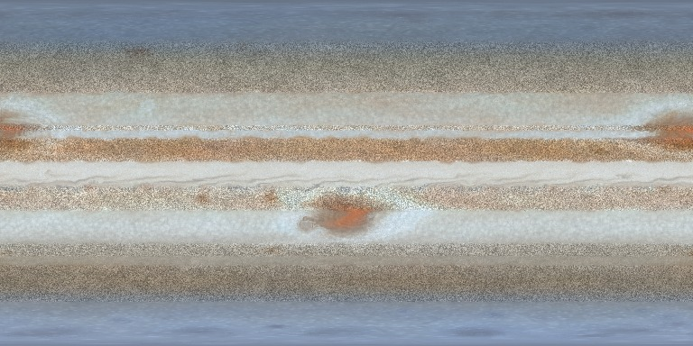 high &middot; 32</td>
</tr></table>

### shear coupling

`turbulence.shear_coupling` &mdash; range **0 to 3**, default **1**, tier `velocity`.

Extra turbulence where jet shear is strong

<table><tr>
<td align="center">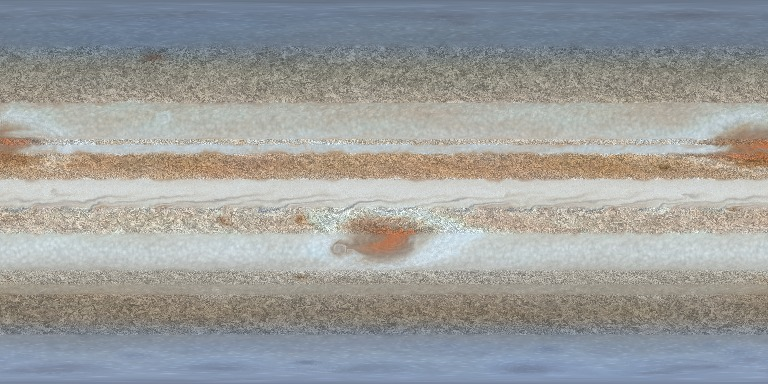 low &middot; 0</td><td align="center"> preset &middot; 1</td><td align="center"> high &middot; 3</td>
</tr></table>

## Storms

### accent brightness

`storms.accent_brightness` &mdash; range **-0.5 to 0.5**, default **0.12**, tier `restart`.

Accent oval brightness (T0); negative = dark oval. Applied verbatim — accents bypass stamp_contrast

<table><tr>
<td align="center"> low &middot; -0.5</td><td align="center"> preset &middot; 0.12</td><td align="center"> high &middot; 0.5</td>
</tr></table>

### accent count

`storms.accent_count` &mdash; range **0 to 2**, default **0**, tier `restart`.

Accent ovals: KIND_OVAL storms with EXPLICIT color (the Oval BA 'second red spot' unlock — a red oval beside the white population). Seeded on their own substream after the population cap, so the base storm field is untouched; count=2 places a pair at offset longitudes with identical appearance. 0 = off (byte-identical)

<table><tr>
<td align="center"> preset &middot; 0</td><td align="center"> high &middot; 2</td>
</tr></table>

### accent latitude

`storms.accent_latitude` &mdash; optional; pin range **-55 to 55**, default **None (auto)**, tier `restart`.

Pin accent ovals to this latitude (degrees). None = seeded zone placement. Like hero_latitude, the effective range is radius-coupled (see validator) so the stamp stays clear of the 63 deg storm-free exchange band

_Optional field: the GUI shows a **pin** checkbox &mdash; unpinned (None) keeps the automatic/seeded behavior, pinned uses the slider value verbatim. Documented as text; no rendered example._

### accent longitude

`storms.accent_longitude` &mdash; optional; pin range **-180 to 180**, default **None (auto)**, tier `restart`.

Pin the accent ovals' RENDERED longitude (degrees, -180..180). Unpinned (None) = seeded Poisson-disc placement. The value is the end-of-run longitude of the FIRST accent: the generator inverse-compensates the shared zonal drift so it lands where you asked, and a count=2 pair is offset a fixed step (0.6 rad) downstream of it. Accents that get caught in a merger deviate (a recorded caveat)

_Optional field: the GUI shows a **pin** checkbox &mdash; unpinned (None) keeps the automatic/seeded behavior, pinned uses the slider value verbatim. Documented as text; no rendered example._

### accent radius

`storms.accent_radius` &mdash; range **0.02 to 0.12**, default **0.05**, tier `restart`.

Accent oval core radius (radians of arc; 1 rad = 57.3 deg, so default 0.05 ~ 2.9 deg). Default 0.05 sits above the 0.035 solid-body threshold (OVAL_SOLID_MIN_R in vortex_omega.glsl), so oval_solid_core>0 keeps accents coherent in vorticity mode; below 0.035 they stay Gaussian and can wind into eddies over a long dev run (F07)

<table><tr>
<td align="center"> low &middot; 0.02</td><td align="center"> preset &middot; 0.05</td><td align="center"> high &middot; 0.12</td>
</tr></table>

### accent tint

`storms.accent_tint` &mdash; range **-1 to 1**, default **0.9**, tier `restart`.

Accent oval tint (T3): positive = warm/red end of the storm_tints gradient (Oval BA red), negative = cool. Applied verbatim — accents bypass stamp_contrast/stamp_tint_contrast

<table><tr>
<td align="center"> low &middot; -1</td><td align="center"> preset &middot; 0.9</td><td align="center"> high &middot; 1</td>
</tr></table>

### barge density

`storms.barge_density` &mdash; range **0 to 3**, default **1**, tier `restart`.

Brown-barge cyclone population multiplier (belts)

<table><tr>
<td align="center">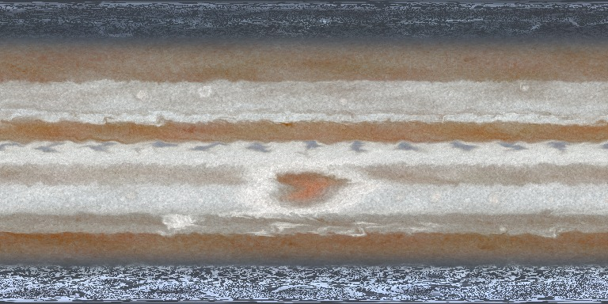 low &middot; 0</td><td align="center"> preset &middot; 2.989</td><td align="center"> high &middot; 3</td>
</tr></table>

### cast

`storms.cast` &mdash; list editor, default **empty list**, tier `restart`.

Cast list: storms placed by hand (kind + rendered position + size + optional color). Each entry is stamped verbatim after the seeded populations, exempt from the population cap and runtime mergers, so a director's storm survives the whole run where it was placed. Empty (the default) = no cast, byte-identical to the seeded-only field. Capped at 16 entries

_List of hand-placed sub-records edited in a dedicated GUI panel &mdash; documented as text; no rendered example._

### hero aspect

`storms.hero_aspect` &mdash; range **1 to 3**, default **1**, tier `restart`.

Hero storm lon:lat elongation (real GRS ~2:1); 1.0 = round. Stretches the stamp, perimeter ring, collar, spiral lanes and detail mask along longitude. Wake across-width and merge capture stay isotropic (recorded LIMITs)

<table><tr>
<td align="center">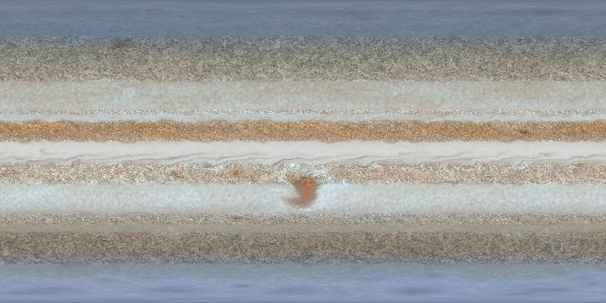 low &middot; 1</td><td align="center"> preset &middot; 2</td><td align="center">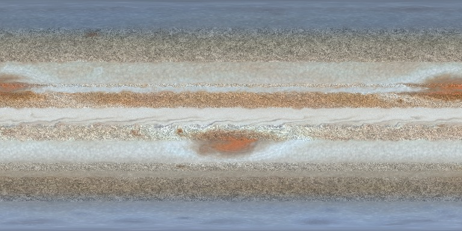 high &middot; 3</td>
</tr></table>

### hero brightness

`storms.hero_brightness` &mdash; range **-0.5 to 0.5**, default **0.05**, tier `restart`.

Hero storm brightness (T0) stamped at generation. 0.05 = the previously hardwired GRS value (byte-identical default). NEGATIVE = dark storm — the Neptune Great-Dark-Spot one-slider (barges use -0.28, polar vortices -0.22, so dark stamps are a supported axis). Exempt from stamp_contrast (KIND_HERO exclusion)

<table><tr>
<td align="center">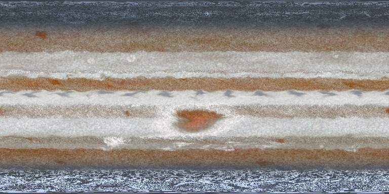 low &middot; -0.5</td><td align="center"> preset &middot; 0.05</td><td align="center">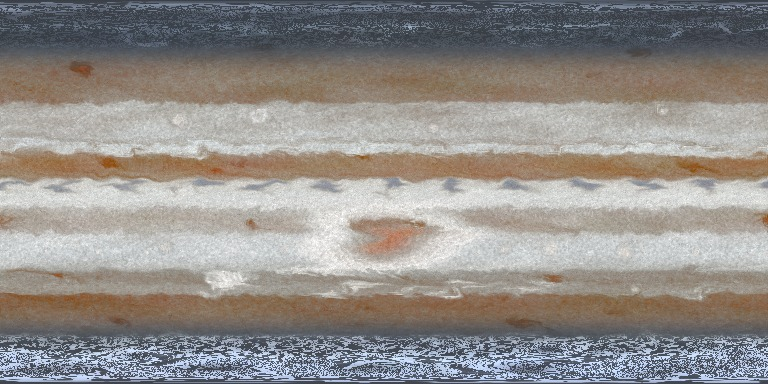 high &middot; 0.5</td>
</tr></table>

### hero companions

`storms.hero_companions` &mdash; range **0 to 3**, default **0**, tier `restart`.

Bright companion clouds pinned beside each hero storm (Neptune GDS companion / Scooter class): KIND_PEARL stamps offset a few core radii from the hero on its wake-free flank, seeded on their own substream after the population cap. 0 = off (byte-identical)

<table><tr>
<td align="center"> preset &middot; 0</td><td align="center"> high &middot; 3</td>
</tr></table>

### hero count

`storms.hero_count` &mdash; range **0 to 3**, default **1**, tier `restart`.

Giant anticyclones of Great Red Spot (GRS) class — the planet-dominating bright/red oval storms (anticyclone = high-pressure vortex spinning against the local cyclonic sense)

<table><tr>
<td align="center">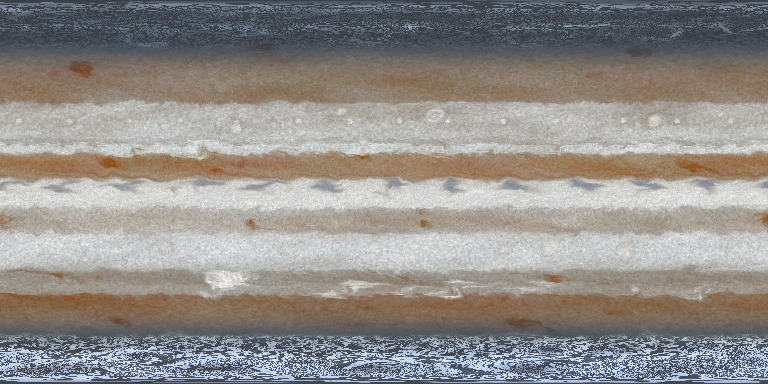 low &middot; 0</td><td align="center"> preset &middot; 1</td><td align="center">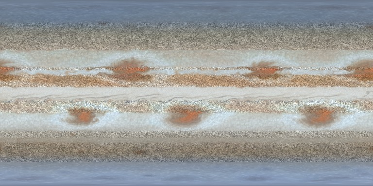 high &middot; 3</td>
</tr></table>

### hero latitude

`storms.hero_latitude` &mdash; optional; pin range **-55 to 55**, default **None (auto)**, tier `restart`.

Pin the hero storm to this latitude (degrees; the 'pin' checkbox toggles it). Unpinned (None) = seeded tropical-zone placement. The effective range is further limited by hero_radius (see validator) so the stamp stays clear of the 63 deg exchange band

_Optional field: the GUI shows a **pin** checkbox &mdash; unpinned (None) keeps the automatic/seeded behavior, pinned uses the slider value verbatim. Documented as text; no rendered example._

### hero longitude

`storms.hero_longitude` &mdash; optional; pin range **-180 to 180**, default **None (auto)**, tier `restart`.

Pin the hero storm's RENDERED longitude (degrees, -180..180; the 'pin' checkbox toggles it). Unpinned (None) = seeded placement. The value is the end-of-run longitude, not the seed: the generator inverse-compensates the storm's eastward zonal drift over the whole development run so the spot lands where you asked when the snapshot is taken. A hero that merges with or absorbs another storm deviates (a recorded caveat)

_Optional field: the GUI shows a **pin** checkbox &mdash; unpinned (None) keeps the automatic/seeded behavior, pinned uses the slider value verbatim. Documented as text; no rendered example._

### hero mottle

`storms.hero_mottle` &mdash; range **0 to 1**, default **0**, tier `restart`.

Turbulent interior churn inside hero storms: a flow-scale fbm breaks up the smooth Gaussian core so the spot reads as churning cloud, not an airbrushed blob. Windowed to the interior so the perimeter ring/collar stay clean; stamped into the relaxation target so the solver folds it into filaments. 0 = smooth v1 core (byte-identical)

<table><tr>
<td align="center"> preset &middot; 0</td><td align="center"> high &middot; 1</td>
</tr></table>

### hero radius

`storms.hero_radius` &mdash; range **0.03 to 0.25**, default **0.1**, tier `restart`.

Hero vortex core radius, radians of arc (1 rad = 57.3 deg; default 0.10 rad is about 5.7 deg — GRS-scale)

<table><tr>
<td align="center">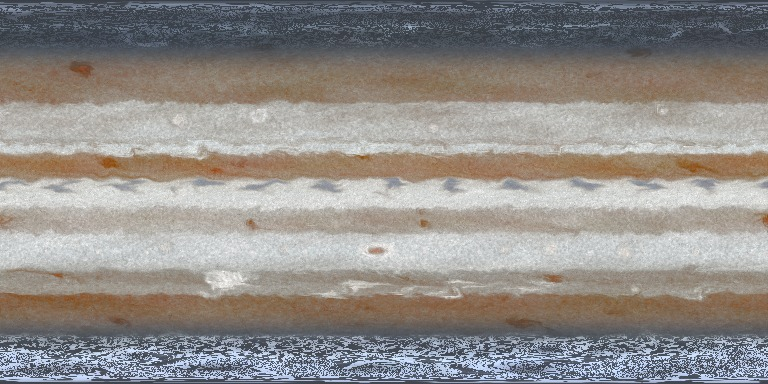 low &middot; 0.03</td><td align="center"> preset &middot; 0.15</td><td align="center">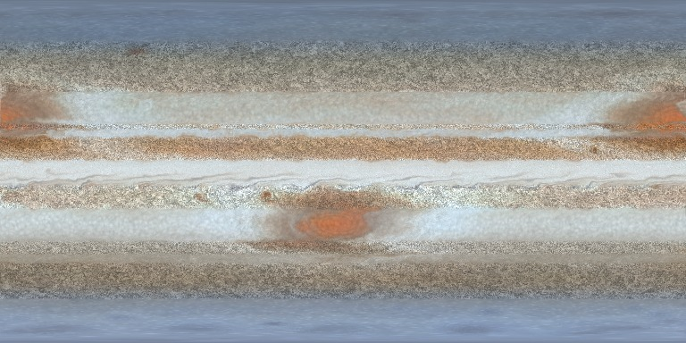 high &middot; 0.25</td>
</tr></table>

### hero rim tint

`storms.hero_rim_tint` &mdash; range **0 to 1**, default **0**, tier `restart`.

Dark reddish collar (the GRS 'Red Spot Hollow' rim): the perimeter currently only darkens; this reddens (raises the warm-red tint) and darkens the perimeter annulus so the oval reads as a discrete vortex with a dark-red rim rather than a soft stain on the band. 0 = no rim tint (byte-identical)

<table><tr>
<td align="center"> preset &middot; 0</td><td align="center">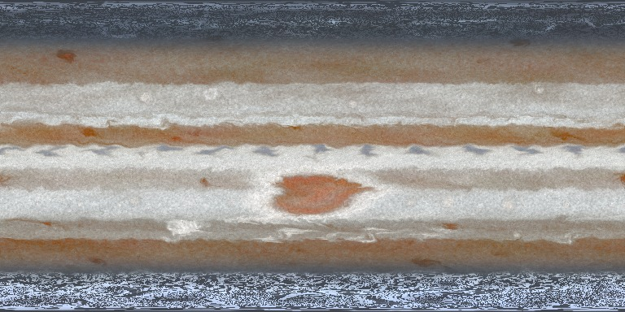 high &middot; 1</td>
</tr></table>

### hero rim warp

`storms.hero_rim_warp` &mdash; range **0 to 1**, default **0**, tier `restart`.

Lumpy-oval boundary: warps the hero's dark perimeter ring + bright collar with a low-azimuthal-wavenumber (few-lobe) per-hero perturbation, so the spot edge reads as a naturally irregular oval instead of a flawless azimuthally-symmetric ring (the 'over-regular' look). Scale-invariant lobes (not pixel-frequency noise) so it holds up at full-disk and close-up; rim and collar warp independently. 0 = perfect oval (byte-identical, the fbm is never evaluated)

<table><tr>
<td align="center"> preset &middot; 0</td><td align="center">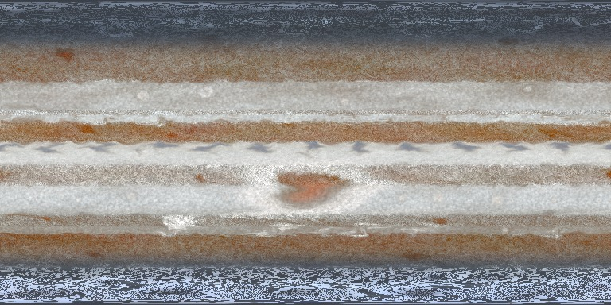 high &middot; 1</td>
</tr></table>

### hero solid core

`storms.hero_solid_core` &mdash; range **0 to 1**, default **0**, tier `restart`.

Solid-body hero rotation (vorticity mode): blends the hero's vorticity from the Gaussian profile (center-peaked -> differential rotation -> the interior winds into a center-draining whirlpool) toward a near-uniform vorticity patch (rigid solid-body interior rotation -> a coherent GRS-like oval with spiral arms only OUTSIDE it). 0 = Gaussian (byte-identical); 1 = full patch. Pairs with a larger hero_radius and lower hero_strength.

<table><tr>
<td align="center"> preset &middot; 0</td><td align="center"> high &middot; 1</td>
</tr></table>

### hero strength

`storms.hero_strength` &mdash; range **0.2 to 3**, default **1**, tier `restart`.

GRS-class hero storm vorticity amplitude

<table><tr>
<td align="center">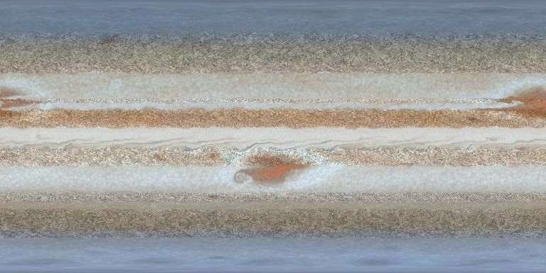 low &middot; 0.2</td><td align="center"> preset &middot; 1</td><td align="center">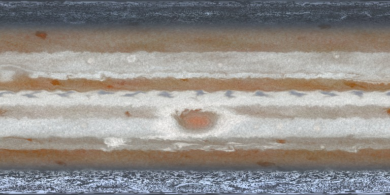 high &middot; 3</td>
</tr></table>

### hero tint

`storms.hero_tint` &mdash; range **-1 to 1**, default **0.9**, tier `restart`.

Hero storm tint (T3) stamped at generation: positive pulls toward the warm/red end of the storm_tints gradient, negative toward the cool end. 0.9 = the previously hardwired GRS red (byte-identical default). Capped at 1.0: the storm-tint LUT lookup clamps at the sampler edge (derive.comp indexes it at (T3+1)/2 clamped to [0,1]), so values past 1.0 saturate and buy nothing. Exempt from stamp_contrast (KIND_HERO exclusion)

<table><tr>
<td align="center">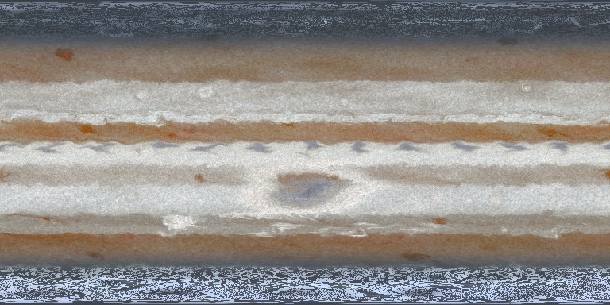 low &middot; -1</td><td align="center"> preset &middot; 0.9</td><td align="center"> high &middot; 1</td>
</tr></table>

### hero tint var

`storms.hero_tint_var` &mdash; range **0 to 1**, default **0**, tier `restart`.

Interior color variation inside hero storms: a flow-scale fbm modulates the warm-red tint tracer (T3) toward salmon/white in the troughs, so the spot reads festooned rather than flat red. 0 = uniform v1 tint (byte-identical)

<table><tr>
<td align="center"> preset &middot; 0</td><td align="center"> high &middot; 1</td>
</tr></table>

### hero wake detail

`storms.hero_wake_detail` &mdash; range **0 to 1**, default **0**, tier `restart`.

Wake filament structure: the downstream wake is stamped as a smooth wedge into the relaxation target, so it reads as a blob even though the wake velocity is turbulent. This frays the wedge envelope and carves its interior with an anisotropic, intermittent, flow-aligned fbm so the wake reads as ragged folded filaments. Scale-invariant (rc-normalized); the velocity wake supplies the along-flow folding. 0 = smooth wedge (byte-identical, the fbm is never evaluated)

<table><tr>
<td align="center"> preset &middot; 0</td><td align="center">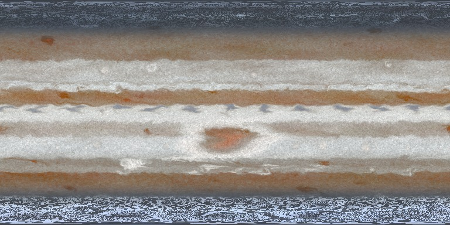 high &middot; 1</td>
</tr></table>

### merge debris

`storms.merge_debris` &mdash; range **0 to 2**, default **1**, tier `restart`.

Brightness of the transient turbulent collar a fresh merger leaves behind (inert while merge_rate is 0)

<table><tr>
<td align="center">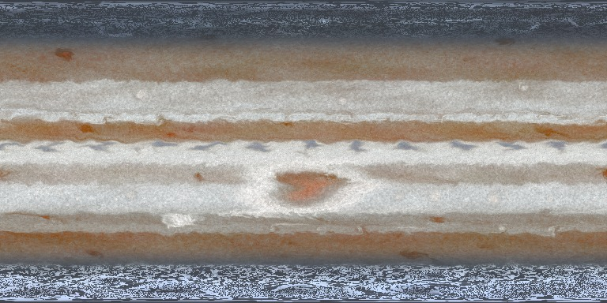 low &middot; 0</td><td align="center"> preset &middot; 1</td><td align="center">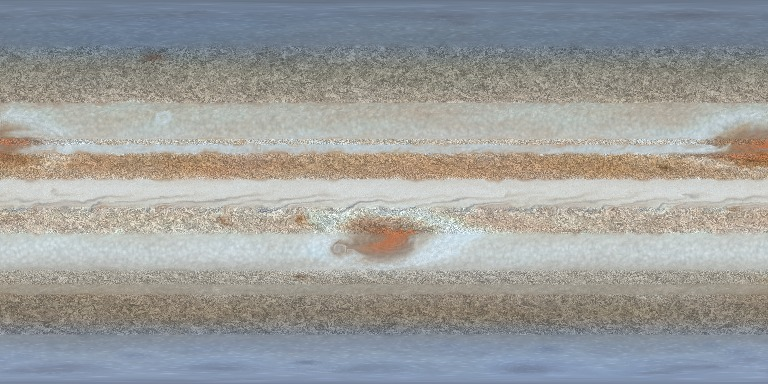 high &middot; 2</td>
</tr></table>

### merge rate

`storms.merge_rate` &mdash; range **0 to 1**, default **0**, tier `restart`.

Anticyclone merger aggressiveness: converging same-sign ovals coalesce when their gap falls under ~1.5*rate*(r1+r2), and generation seeds convergent pairs so mergers actually occur during the dev run (0 = off, the v1.1 behavior)

<table><tr>
<td align="center"> low &middot; 0</td><td align="center"> preset &middot; 0.7</td><td align="center"> high &middot; 1</td>
</tr></table>

### outbreak count

`storms.outbreak_count` &mdash; range **0 to 3**, default **0**, tier `restart`.

Convective outbreaks (Great-White-Spot events) during the development run

<table><tr>
<td align="center">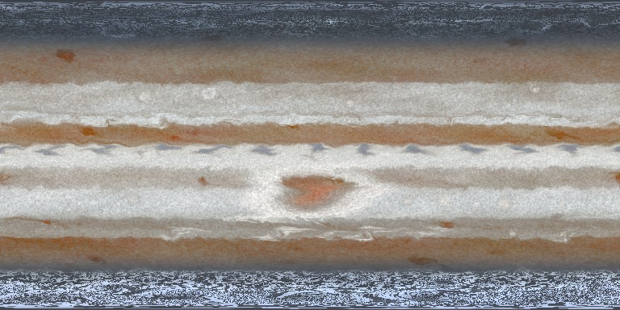 low &middot; 0</td><td align="center"> preset &middot; 1</td><td align="center">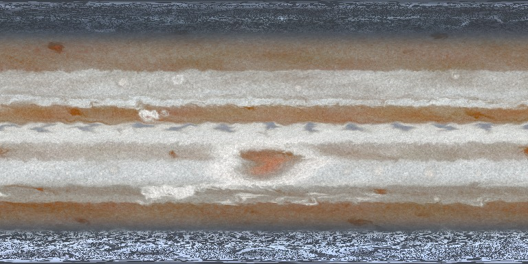 high &middot; 3</td>
</tr></table>

### outbreak lat min

`storms.outbreak_lat_min` &mdash; range **0 to 1**, default **0.2**, tier `restart`.

Minimum |latitude| for AUTO outbreak-belt selection, radians of latitude (1 rad = 57.3 deg; default 0.20 rad is about 11.5 deg). The floor keeps seeded eruptions off the equatorial zone where white-on-white plumes vanish; lower it to admit equatorial belts to the candidate pool, or use outbreak_latitude to pin exactly

<table><tr>
<td align="center"> low &middot; 0</td><td align="center"> preset &middot; 0.2</td><td align="center"> high &middot; 1</td>
</tr></table>

### outbreak latitude

`storms.outbreak_latitude` &mdash; optional; pin range **-55 to 55**, default **None (auto)**, tier `restart`.

Pin convective outbreaks to this latitude (degrees; the 'pin' checkbox toggles it) -- the 2010 Saturn Great White Spot erupted at ~35 N, the 1990 event on the equator. None = seeded placement in a dark belt. A pin bypasses the belt-candidate selection entirely (including the outbreak_lat_min floor), so equatorial eruptions work

_Optional field: the GUI shows a **pin** checkbox &mdash; unpinned (None) keeps the automatic/seeded behavior, pinned uses the slider value verbatim. Documented as text; no rendered example._

### outbreak longitude

`storms.outbreak_longitude` &mdash; optional; pin range **-180 to 180**, default **None (auto)**, tier `restart`.

Pin the outbreak train's RENDERED longitude (degrees, -180..180; the 'pin' checkbox toggles it). Unpinned (None) = seeded placement. The value is where the eruption head sits at the final snapshot: since the plume knots carry no circulation, the sim velocity advects them at roughly the zonal rate, so the generator inverse-compensates that drift over the post-eruption life (best-effort -- the belt shear folds the tail into a streak, so only the head lands precisely)

_Optional field: the GUI shows a **pin** checkbox &mdash; unpinned (None) keeps the automatic/seeded behavior, pinned uses the slider value verbatim. Documented as text; no rendered example._

### outbreak phase

`storms.outbreak_phase` &mdash; optional; pin range **0 to 1**, default **None (auto)**, tier `restart`.

Pin WHEN outbreaks erupt: eruption start as a fraction of the development run (0 = at init, 1 = at the final snapshot). None = seeded 0.55..0.85 draw per eruption, which catches plumes across their life. ~0.6 shows a fresh mid-eruption train at the snapshot; early values leave only the sheared-out streak

_Optional field: the GUI shows a **pin** checkbox &mdash; unpinned (None) keeps the automatic/seeded behavior, pinned uses the slider value verbatim. Documented as text; no rendered example._

### outbreak strength

`storms.outbreak_strength` &mdash; range **0.2 to 3**, default **1**, tier `restart`.

Convective outbreak vorticity amplitude

<table><tr>
<td align="center"> low &middot; 0.2</td><td align="center"> preset &middot; 1</td><td align="center"> high &middot; 3</td>
</tr></table>

### oval density

`storms.oval_density` &mdash; range **0 to 3**, default **1**, tier `restart`.

White-oval anticyclone population multiplier

<table><tr>
<td align="center">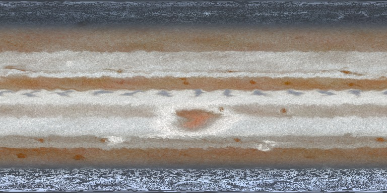 low &middot; 0</td><td align="center"> preset &middot; 3</td>
</tr></table>

### oval solid core

`storms.oval_solid_core` &mdash; range **0 to 1**, default **0**, tier `restart`.

Solid-body rotation for LARGE white ovals (vorticity mode): the same anti-whirlpool patch as hero_solid_core, applied to ovals with core radius >= 0.035 rad. A Gaussian oval is center-peaked -> differential rotation -> at long dev_steps it winds the tracer into a mini-bullseye; this blends its vorticity toward a near-uniform disk (rigid interior rotation) so it stays a coherent spot. 0 = Gaussian (byte-identical); 1 = full patch. Ovals/small storms below the radius threshold are unaffected. Pairs with hero_solid_core to de-bullseye the whole field without lowering dev_steps or oval_density.

<table><tr>
<td align="center"> preset &middot; 0</td><td align="center"> high &middot; 1</td>
</tr></table>

### pearls count

`storms.pearls_count` &mdash; range **0 to 14**, default **7**, tier `restart`.

String-of-pearls ovals on one seeded latitude (0 = off)

<table><tr>
<td align="center">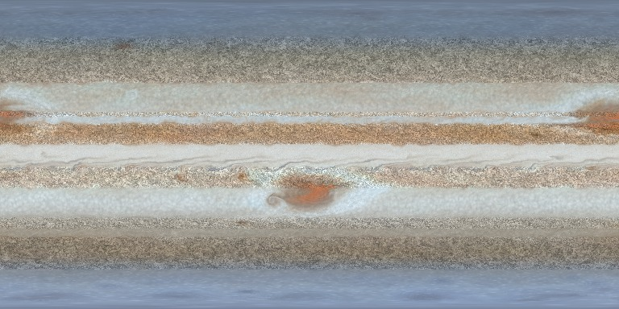 low &middot; 0</td><td align="center"> preset &middot; 14</td>
</tr></table>

### rim contrast

`storms.rim_contrast` &mdash; range **0 to 2.5**, default **1**, tier `restart`.

Scales the hero storm's dark perimeter ring + bright collar (the Red Spot Hollow) amplitude; 1.0 = default, >1 deepens the rim contrast, 0 removes the ring/collar

<table><tr>
<td align="center">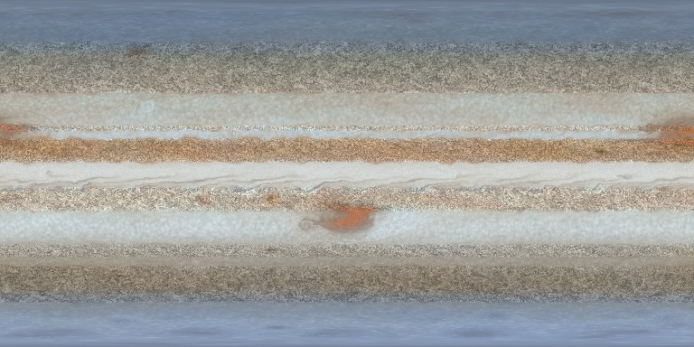 low &middot; 0</td><td align="center"> preset &middot; 2</td><td align="center">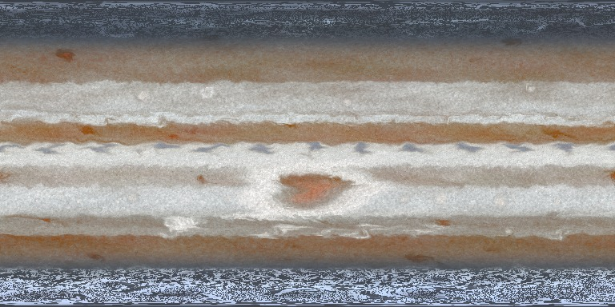 high &middot; 2.5</td>
</tr></table>

### small density

`storms.small_density` &mdash; range **0 to 3**, default **0**, tier `restart`.

Small-storm field: sub-oval white spots and dark spots scattered in loose latitude rows (0 = off, the pre-v1.1 look)

<table><tr>
<td align="center">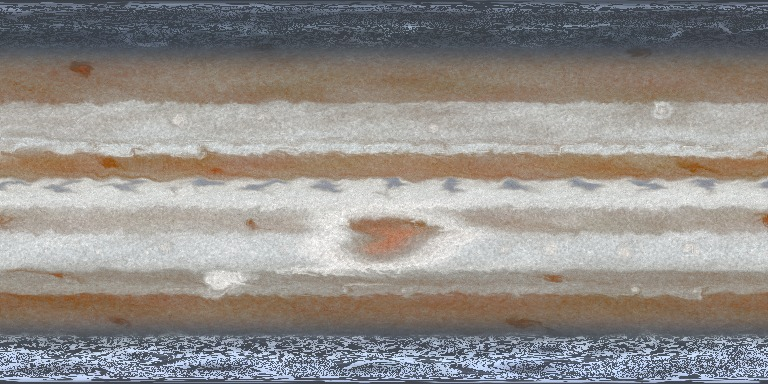 low &middot; 0</td><td align="center"> preset &middot; 3</td>
</tr></table>

### stamp contrast

`storms.stamp_contrast` &mdash; range **0 to 3**, default **1**, tier `restart`.

Tracer-stamp contrast of ovals/barges/pearls/small storms (1 = v1)

<table><tr>
<td align="center">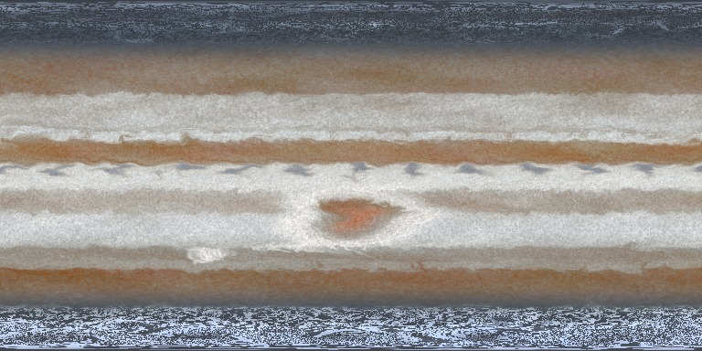 low &middot; 0</td><td align="center"> preset &middot; 2</td><td align="center">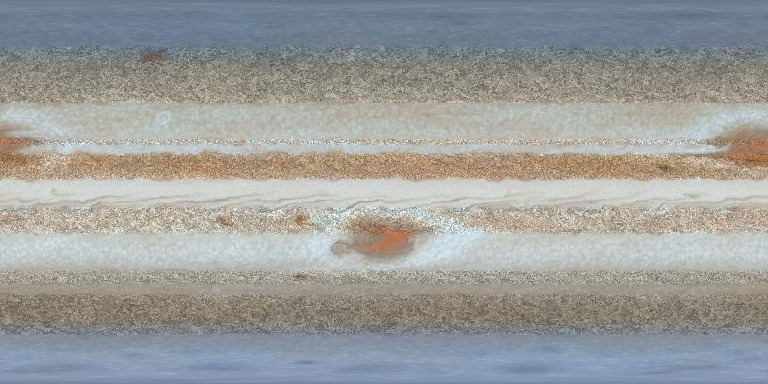 high &middot; 3</td>
</tr></table>

### stamp tint contrast

`storms.stamp_tint_contrast` &mdash; optional; pin range **0 to 3**, default **None (auto)**, tier `restart`.

Tint amplitude of ovals/barges/pearls/small storms, split from the brightness amplitude (review B5-7): stamp_contrast scales brightness, this scales tint. None = follow stamp_contrast (byte-identical legacy coupling). Like stamp_contrast it EXCLUDES the hero (use hero_tint) and does not touch accents (explicit color)

_Optional field: the GUI shows a **pin** checkbox &mdash; unpinned (None) keeps the automatic/seeded behavior, pinned uses the slider value verbatim. Documented as text; no rendered example._

### wake turbulence

`storms.wake_turbulence` &mdash; range **0 to 5**, default **1.8**, tier `restart`.

Turbulence boost in the wake wedge downstream of hero storms

<table><tr>
<td align="center"> low &middot; 0</td><td align="center"> preset &middot; 1.8</td><td align="center">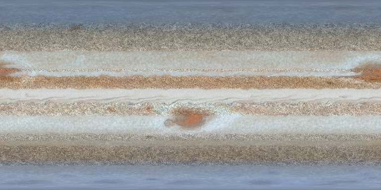 high &middot; 5</td>
</tr></table>

## Waves

### festoon strength

`waves.festoon_strength` &mdash; range **0 to 3**, default **0.8**, tier `restart`.

Festoon plumes + hot spots on the equatorial belt edge (0 = off)

<table><tr>
<td align="center">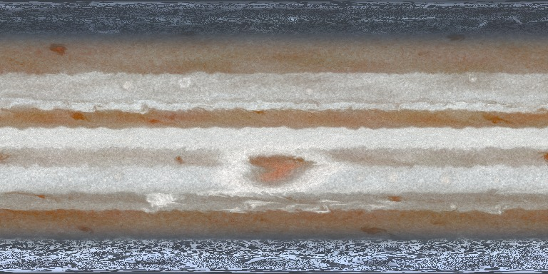 low &middot; 0</td><td align="center"> preset &middot; 2.6</td><td align="center"> high &middot; 3</td>
</tr></table>

### festoon wavenumber

`waves.festoon_wavenumber` &mdash; range **4 to 24**, default **12**, tier `restart`.

How many festoon plumes fit around the equator (higher = more, smaller plumes; the Rossby wavenumber of the train)

<table><tr>
<td align="center">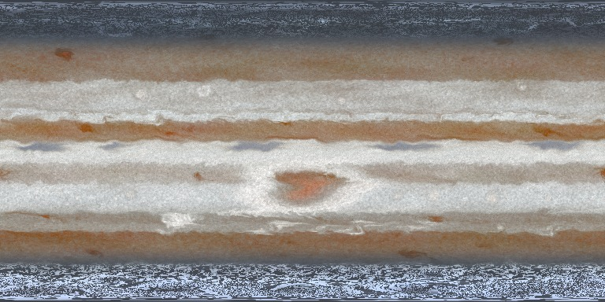 low &middot; 4</td><td align="center"> preset &middot; 12</td><td align="center"> high &middot; 24</td>
</tr></table>

### hotspot depth

`waves.hotspot_depth` &mdash; range **0 to 1**, default **0.6**, tier `restart`.

Depth of the cloud-free hot spots at the wave troughs

<table><tr>
<td align="center"> low &middot; 0</td><td align="center"> preset &middot; 0.7</td><td align="center"> high &middot; 1</td>
</tr></table>

### ribbon strength

`waves.ribbon_strength` &mdash; range **0 to 3**, default **0**, tier `restart`.

Saturn-style ribbon wave on one mid-latitude jet (0 = off)

<table><tr>
<td align="center"> preset &middot; 0</td><td align="center">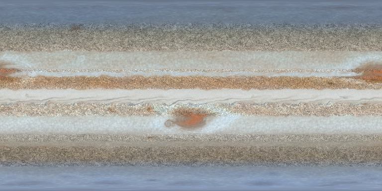 high &middot; 3</td>
</tr></table>

### ribbon wavenumber

`waves.ribbon_wavenumber` &mdash; range **4 to 30**, default **12**, tier `restart`.

Wavenumber of the Saturn-style ribbon wave

<table><tr>
<td align="center"> low &middot; 4</td><td align="center"> preset &middot; 12</td><td align="center"> high &middot; 30</td>
</tr></table>

## Poles

### cyclone count

`poles.north.cyclone_count` &mdash; range **3 to 9**, default **6**, tier `restart`.

Ring cyclones around the central one (cyclone_cluster style)

<table><tr>
<td align="center">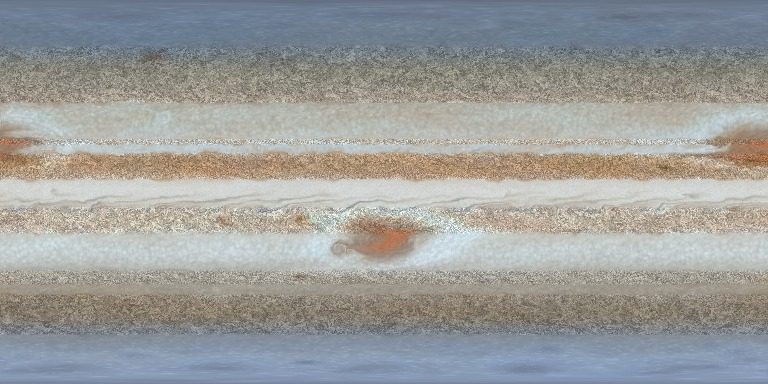 low &middot; 3</td><td align="center"> preset &middot; 8</td><td align="center">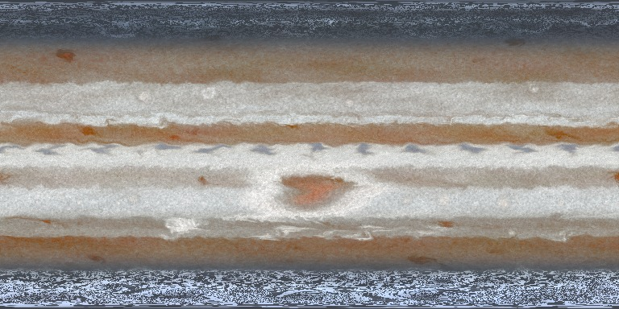 high &middot; 9</td>
</tr></table>

### field density

`poles.north.field_density` &mdash; range **0 to 2**, default **0**, tier `restart`.

Background small-cyclone field filling the cap poleward of 70 deg (PIA21641's dense cyclone hierarchy; 0 = off)

<table><tr>
<td align="center">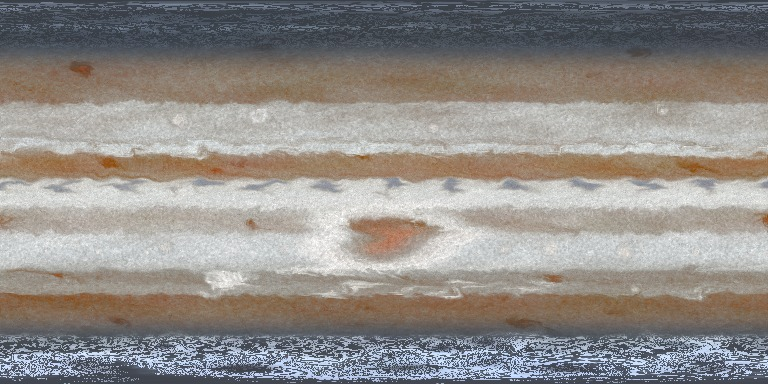 low &middot; 0</td><td align="center"> preset &middot; 1.4</td><td align="center">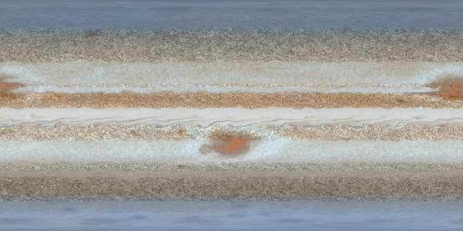 high &middot; 2</td>
</tr></table>

### polygon sides

`poles.north.polygon_sides` &mdash; range **3 to 9**, default **6**, tier `restart`.

Polygon wavenumber of the polar jet (polygon_jet style)

<table><tr>
<td align="center"> low &middot; 3</td><td align="center"> preset &middot; 6</td><td align="center"> high &middot; 9</td>
</tr></table>

### strength

`poles.north.strength` &mdash; range **0 to 3**, default **1**, tier `restart`.

Polar feature vorticity amplitude (central cyclone / polygon jet)

<table><tr>
<td align="center">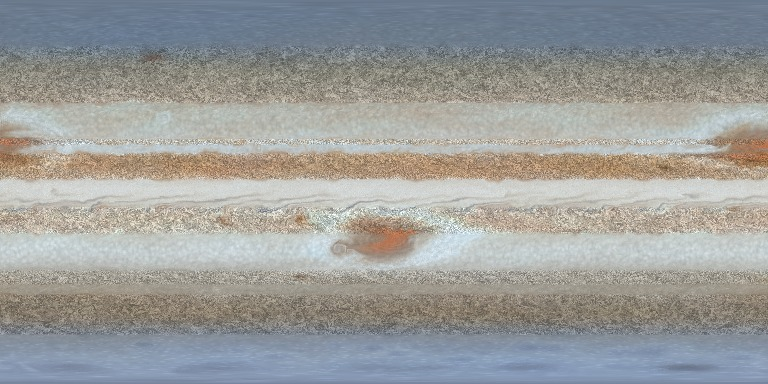 low &middot; 0</td><td align="center"> preset &middot; 1.35</td><td align="center">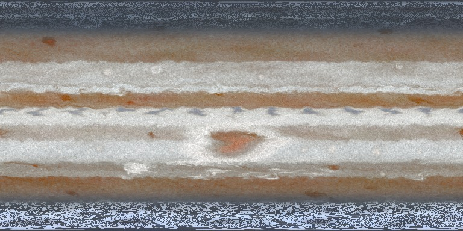 high &middot; 3</td>
</tr></table>

### style

`poles.north.style` &mdash; dropdown, one of `cyclone_cluster` / `polygon_jet` / `plain_vortex` / `calm`, default **`cyclone_cluster`**, tier `restart`.

Polar feature style

_Choice field (GUI dropdown) &mdash; documented as text; no rendered example._

### cyclone count

`poles.south.cyclone_count` &mdash; range **3 to 9**, default **6**, tier `restart`.

Ring cyclones around the central one (cyclone_cluster style)

<table><tr>
<td align="center">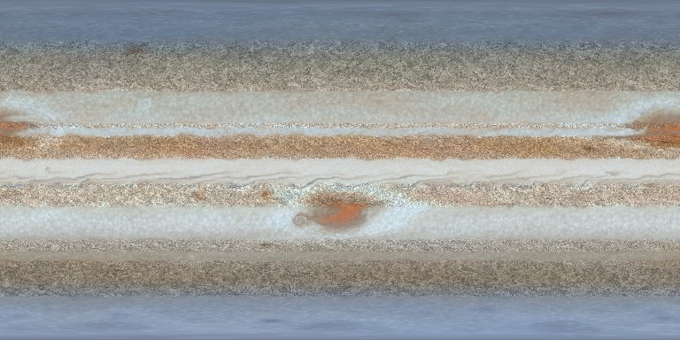 low &middot; 3</td><td align="center"> preset &middot; 5</td><td align="center">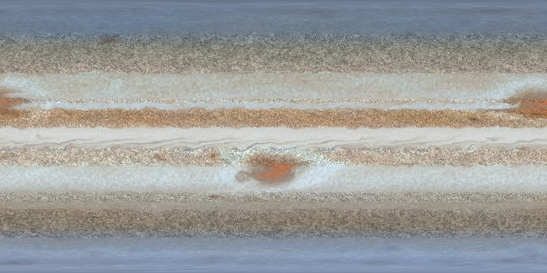 high &middot; 9</td>
</tr></table>

### field density

`poles.south.field_density` &mdash; range **0 to 2**, default **0**, tier `restart`.

Background small-cyclone field filling the cap poleward of 70 deg (PIA21641's dense cyclone hierarchy; 0 = off)

<table><tr>
<td align="center">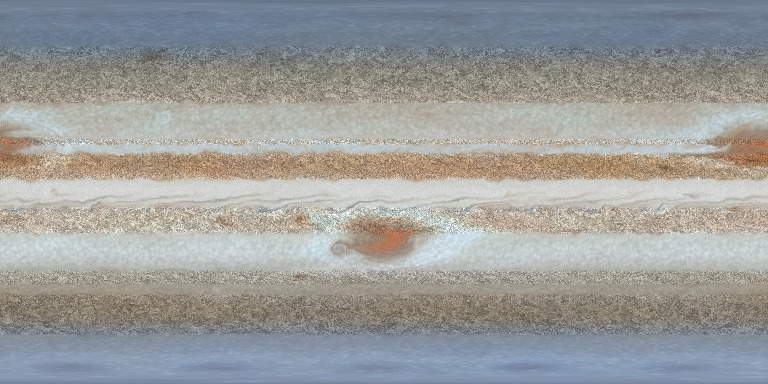 low &middot; 0</td><td align="center"> preset &middot; 1.4</td><td align="center">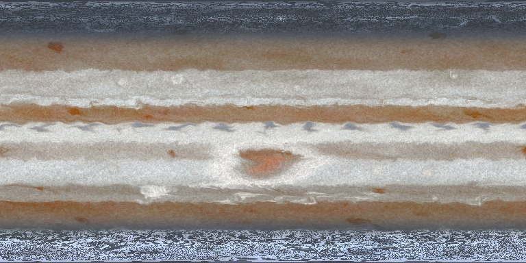 high &middot; 2</td>
</tr></table>

### polygon sides

`poles.south.polygon_sides` &mdash; range **3 to 9**, default **6**, tier `restart`.

Polygon wavenumber of the polar jet (polygon_jet style)

<table><tr>
<td align="center"> low &middot; 3</td><td align="center"> preset &middot; 6</td><td align="center"> high &middot; 9</td>
</tr></table>

### strength

`poles.south.strength` &mdash; range **0 to 3**, default **1**, tier `restart`.

Polar feature vorticity amplitude (central cyclone / polygon jet)

<table><tr>
<td align="center">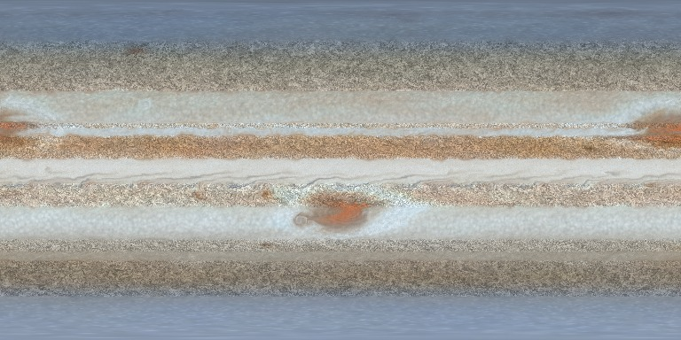 low &middot; 0</td><td align="center"> preset &middot; 1.35</td><td align="center">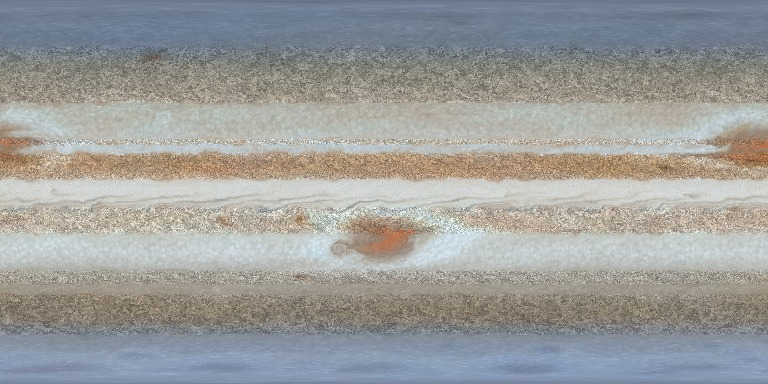 high &middot; 3</td>
</tr></table>

### style

`poles.south.style` &mdash; dropdown, one of `cyclone_cluster` / `polygon_jet` / `plain_vortex` / `calm`, default **`plain_vortex`**, tier `restart`.

Polar feature style

_Choice field (GUI dropdown) &mdash; documented as text; no rendered example._

## Appearance

### band tint strength

`appearance.band_tint_strength` &mdash; range **0 to 1**, default **0**, tier `post`.

How strongly the per-latitude band_tint_stops override the planet color (0 = off, byte-identical; 1 = the tint fully replaces the graded color). Blended in after the post chain and chroma FX so the tint is not re-graded by contrast/saturation

<table><tr>
<td align="center"> preset &middot; 0</td><td align="center">high &middot; 1 (not rendered)</td>
</tr></table>

### chroma aging

`appearance.chroma_aging` &mdash; range **0 to 0.6**, default **0**, tier `post`.

Chromophore aging: ties color saturation to the dynamical freshness tracer (T2). Aged/stagnant air holds more reddish-brown chromophore (more saturated); fresh upwelling air is whiter (less saturated). Chroma-only -- the latitude palette's HUE is untouched, so the band browns/creams just deepen where air is old and pale where it is fresh, tying color to the flow instead of latitude alone. 0 = off (byte-identical)

<table><tr>
<td align="center">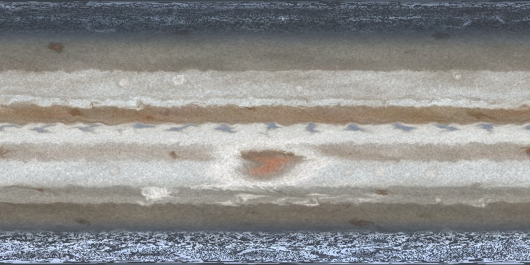 low &middot; 0</td><td align="center"> preset &middot; 0.35</td><td align="center">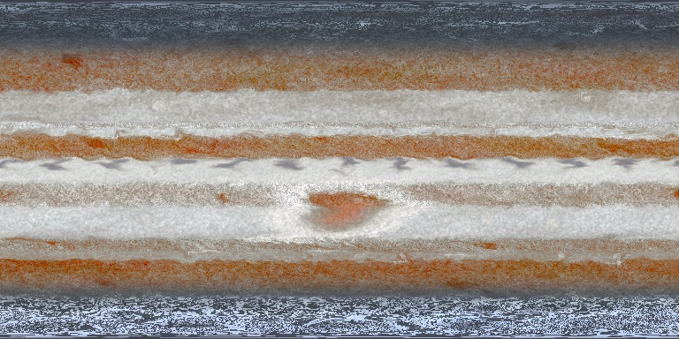 high &middot; 0.6</td>
</tr></table>

### chroma scale

`appearance.chroma_scale` &mdash; range **0 to 2**, default **1**, tier `post`.

Oklab chroma multiplier on the final color (1 = off) — perceptual saturation, recommended over 'saturation' (an sRGB luma mix). No rand: adding a draw would reshuffle every later randomize draw

<table><tr>
<td align="center">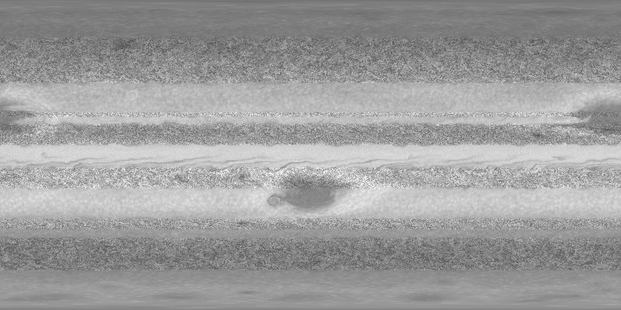 low &middot; 0</td><td align="center"> preset &middot; 1</td><td align="center">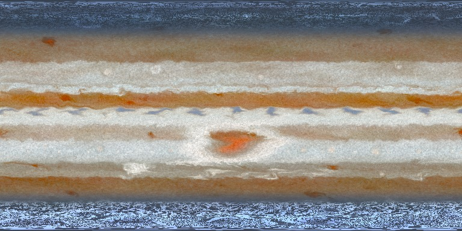 high &middot; 2</td>
</tr></table>

### chroma variance

`appearance.chroma_variance` &mdash; range **0 to 0.5**, default **0**, tier `post`.

Longitudinal within-band chroma drift: bands hold pockets of more/less saturated material varying slowly with longitude (the reference's saturated-pocket texture)

<table><tr>
<td align="center">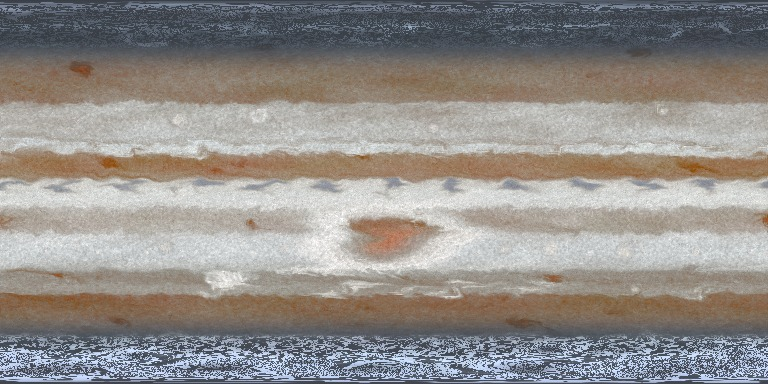 low &middot; 0</td><td align="center"> preset &middot; 0.35</td><td align="center">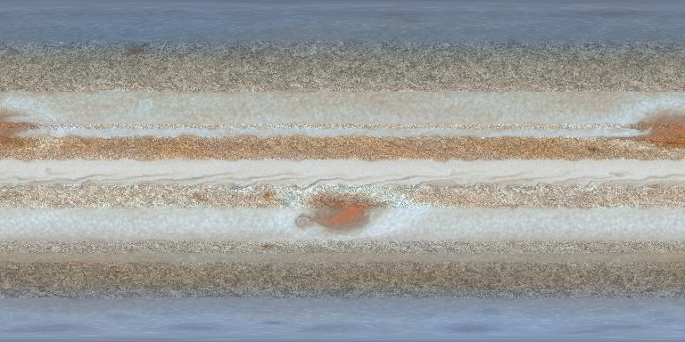 high &middot; 0.5</td>
</tr></table>

### contrast

`appearance.contrast` &mdash; range **0.2 to 2**, default **1**, tier `post`.

Color contrast multiplier about mid-gray

<table><tr>
<td align="center">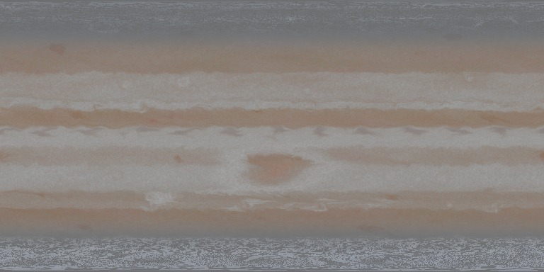 low &middot; 0.2</td><td align="center"> preset &middot; 0.8</td><td align="center">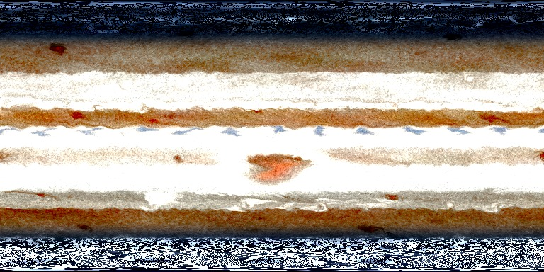 high &middot; 2</td>
</tr></table>

### gamma

`appearance.gamma` &mdash; range **0.4 to 2.5**, default **1**, tier `post`.

Final tone-curve gamma on the color map

<table><tr>
<td align="center">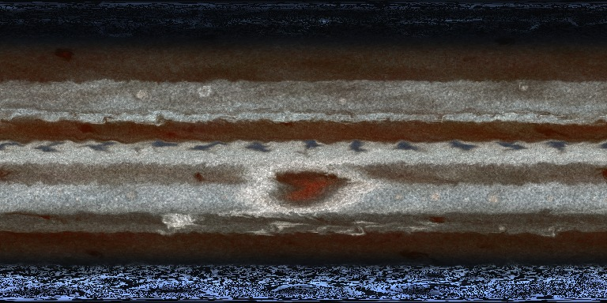 low &middot; 0.4</td><td align="center"> preset &middot; 1</td><td align="center">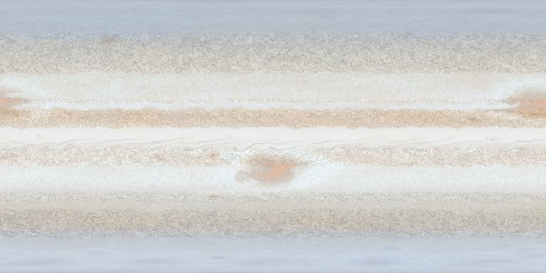 high &middot; 2.5</td>
</tr></table>

### haze amount

`appearance.haze_amount` &mdash; range **0 to 1**, default **0**, tier `post`.

Global haze: the Jupiter (0) to Saturn (~0.6) axis

<table><tr>
<td align="center"> low &middot; 0</td><td align="center"> preset &middot; 0.05</td><td align="center"> high &middot; 1</td>
</tr></table>

### hue variance

`appearance.hue_variance` &mdash; range **0 to 0.35**, default **0**, tier `post`.

Iso-luminance Oklab hue drift (radians of max rotation; 1 rad = 57.3 deg): differently-hued material at the same lightness, which a luminance-keyed palette gradient cannot express -- the hue-diversity lever the realism metrics name

<table><tr>
<td align="center">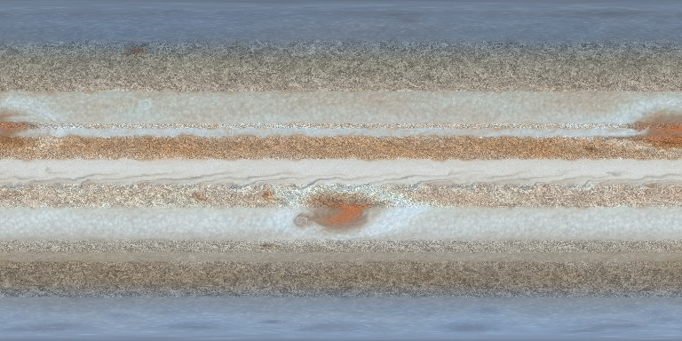 low &middot; 0</td><td align="center"> preset &middot; 0.3</td><td align="center"> high &middot; 0.35</td>
</tr></table>

### polar canvas value

`appearance.polar_canvas_value` &mdash; range **0 to 1**, default **0**, tier `post`.

Deepens the polar cap canvas toward a dark blue-teal floor so the folded-filament lace and cyclones pop; 0 = off. Applied after the lace and keyed on low local luminance, so it darkens the dark inter-wisp floor while bright crests stay bright (raises contrast, does not flatten)

<table><tr>
<td align="center">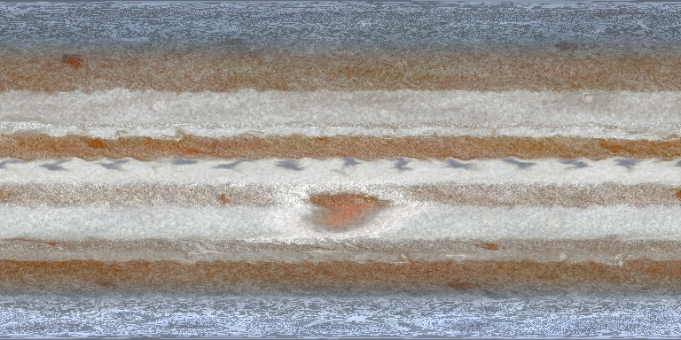 low &middot; 0</td><td align="center"> preset &middot; 0.85</td><td align="center">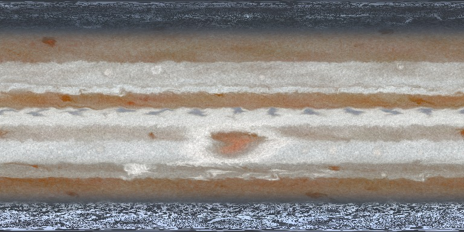 high &middot; 1</td>
</tr></table>

### polar tint start lat

`appearance.polar_tint_start_lat` &mdash; range **30 to 80**, default **55**, tier `post`.

Latitude (deg) where the polar tint begins

<table><tr>
<td align="center">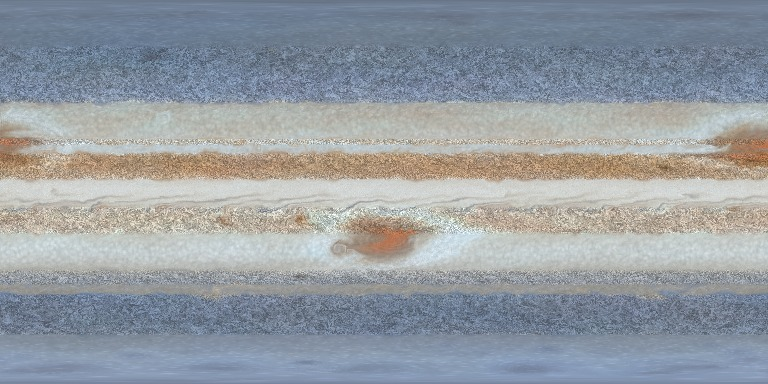 low &middot; 30</td><td align="center"> preset &middot; 56</td><td align="center">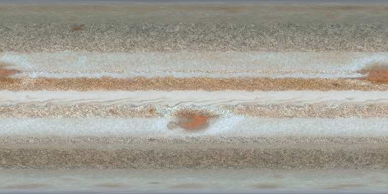 high &middot; 80</td>
</tr></table>

### polar tint strength

`appearance.polar_tint_strength` &mdash; range **0 to 1**, default **0**, tier `post`.

Polar tint blend strength (0 = off, the pre-v1.1 look)

<table><tr>
<td align="center">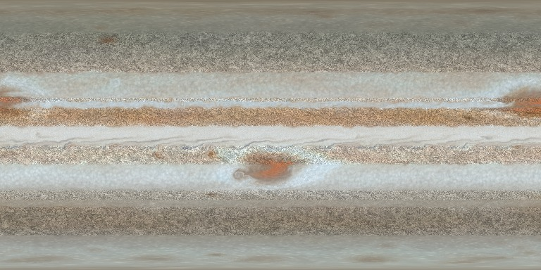 low &middot; 0</td><td align="center"> preset &middot; 0.68</td><td align="center">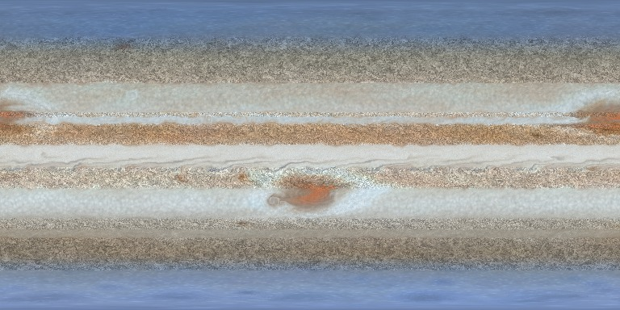 high &middot; 1</td>
</tr></table>

### saturation

`appearance.saturation` &mdash; range **0 to 2**, default **1**, tier `post`.

sRGB saturation multiplier (luma-preserving mix toward gray); prefer chroma_scale for perceptual (Oklab) saturation

<table><tr>
<td align="center"> low &middot; 0</td><td align="center"> preset &middot; 1</td><td align="center">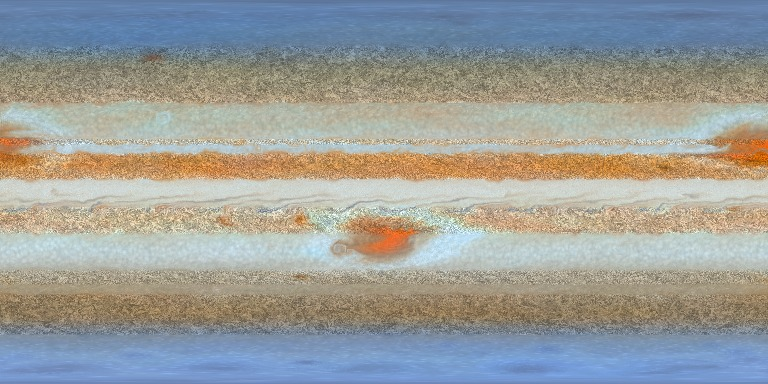 high &middot; 2</td>
</tr></table>

## Detail

### belt texture

`detail.belt_texture` &mdash; range **0 to 2.5**, default **0**, tier `post`.

Storm-scale folded luminance structure inside belts (0.5-3 deg, flow-backtraced so patches fold with the flow) + a belt floor for the fine filaments; the v1.4 audit's dominant texture gap on broad-band layouts

<table><tr>
<td align="center"> low &middot; 0</td><td align="center"> preset &middot; 1.2</td><td align="center"> high &middot; 2.5</td>
</tr></table>

### belt texture fine

`detail.belt_texture_fine` &mdash; range **0 to 2.5**, default **0**, tier `post`.

Finer sub-grid belt fold octave: a second flow-aligned backtrace hop folds mid-frequency noise below the sim grid scale, densifying belt texture at matched scale

<table><tr>
<td align="center"> low &middot; 0</td><td align="center"> preset &middot; 1.4</td><td align="center">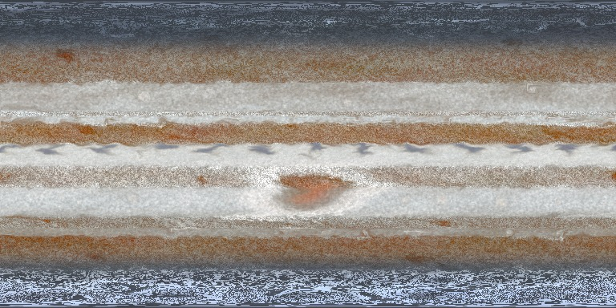 high &middot; 2.5</td>
</tr></table>

### cellular amount

`detail.cellular_amount` &mdash; range **0 to 2**, default **0.6**, tier `post`.

Convective cell (closed-cell/popcorn) texture in quiet zones

<table><tr>
<td align="center"> low &middot; 0</td><td align="center"> preset &middot; 0.9</td><td align="center"> high &middot; 2</td>
</tr></table>

### flow phases

`detail.flow_phases` &mdash; range **1 to 4**, default **3**, tier `post`.

Staggered advected-noise phases (more = richer filaments)

<table><tr>
<td align="center"> low &middot; 1</td><td align="center"> preset &middot; 4</td>
</tr></table>

### flow stretch

`detail.flow_stretch` &mdash; range **0.1 to 4**, default **1**, tier `post`.

How far detail noise is advected along the flow

<table><tr>
<td align="center">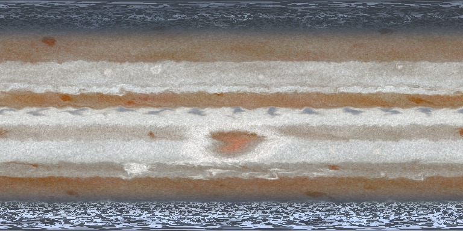 low &middot; 0.1</td><td align="center"> preset &middot; 1.3</td><td align="center">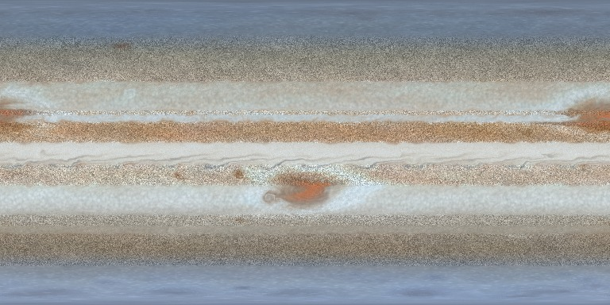 high &middot; 4</td>
</tr></table>

### frequency

`detail.frequency` &mdash; range **8 to 256**, default **48**, tier `post`, log scale.

Base spatial frequency of the detail noise

<table><tr>
<td align="center">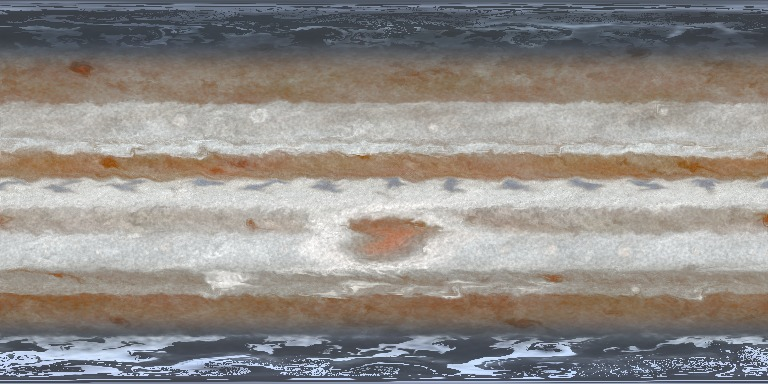 low &middot; 8</td><td align="center"> preset &middot; 64</td><td align="center">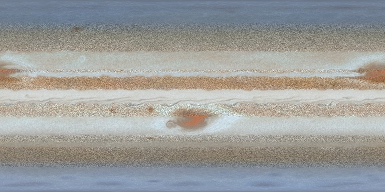 high &middot; 256</td>
</tr></table>

### hero calm

`detail.hero_calm` &mdash; range **0 to 1**, default **0**, tier `post`.

Calm the band-aligned grain inside hero storms: the detail filament streak + striation are flow/band-aligned and are amplified near heroes, so they cross the GRS as straight 'wood-grain' that ignores the vortex rotation. This attenuates those two terms inside the hero (weighted by the hero mask) so the vortex-aligned spiral lanes and the sim-side hero_mottle churn carry the interior instead. 0 = full band grain (byte-identical)

<table><tr>
<td align="center"> preset &middot; 0</td><td align="center"> high &middot; 1</td>
</tr></table>

### hero collar wrap

`detail.hero_collar_wrap` &mdash; range **0 to 1**, default **0**, tier `post`.

Tightly-pitched wound-lane filaments wrapping the hero collar (the GRS 'hollow' look in stills): a log-spiral on the rim window, wound in the storm's rotation sense. Independent of hero_spiral (interior lanes); stationary in the hero frame. 0 = off

<table><tr>
<td align="center"> preset &middot; 0</td><td align="center"> high &middot; 1</td>
</tr></table>

### hero spiral

`detail.hero_spiral` &mdash; range **0 to 1.5**, default **0**, tier `post`.

Tightly wound internal spiral lanes inside hero storms (the Juno-close-up GRS look) plus collar streamlines; winds in the hero's actual rotation sense. Stationary in the hero frame — fine for stills

<table><tr>
<td align="center"> low &middot; 0</td><td align="center"> preset &middot; 0.55</td><td align="center"> high &middot; 1.5</td>
</tr></table>

### intensity

`detail.intensity` &mdash; range **0 to 2**, default **0.55**, tier `post`.

Export/preview detail synthesis amplitude

<table><tr>
<td align="center"> low &middot; 0</td><td align="center"> preset &middot; 0.95</td><td align="center">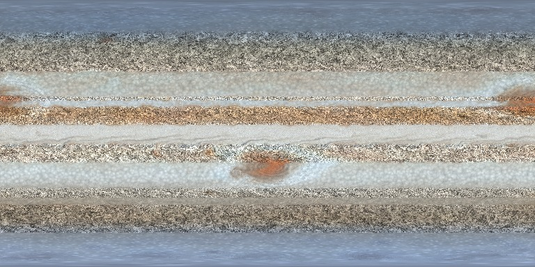 high &middot; 2</td>
</tr></table>

### intermittency

`detail.intermittency` &mdash; range **0 to 1**, default **0**, tier `post`.

Longitudinal patchiness of the filament/striation texture: violent folded patches abutting calm laminar runs (the real mosaic's chaos is intermittent, not uniform). No rand: a draw here would reshuffle every later randomize draw

<table><tr>
<td align="center"> low &middot; 0</td><td align="center"> preset &middot; 0.65</td><td align="center">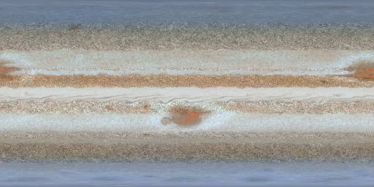 high &middot; 1</td>
</tr></table>

### mottle

`detail.mottle` &mdash; range **0 to 1.5**, default **0**, tier `post`.

Temperate lace mottle (35-60 deg): granular bright rings, dark dots, and lacy folds where banding gives way -- the reference's mid-latitude storm-flecked character

<table><tr>
<td align="center">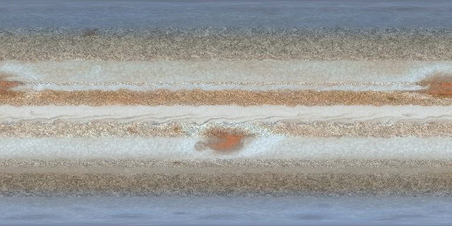 low &middot; 0</td><td align="center"> preset &middot; 1.1</td><td align="center">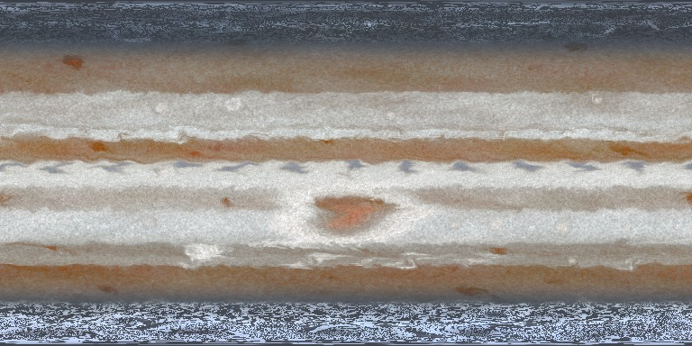 high &middot; 1.5</td>
</tr></table>

### polar filaments

`detail.polar_filaments` &mdash; range **0 to 2**, default **0**, tier `post`.

Polar folded-filamentary region (the Juno cap look): dense, multi-scale, flow-folded RIDGED filaments tangling between the circumpolar cyclones poleward of ~65 deg. Backtraced through the polar patch velocity so the lace winds with the cap vortices; only active when the polar route is on (cyclone-cluster/plain poles). 0 = off (byte-identical)

<table><tr>
<td align="center">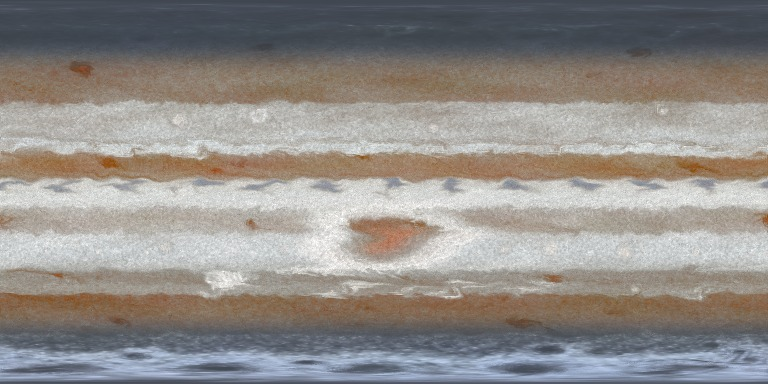 low &middot; 0</td><td align="center"> preset &middot; 1.3</td><td align="center">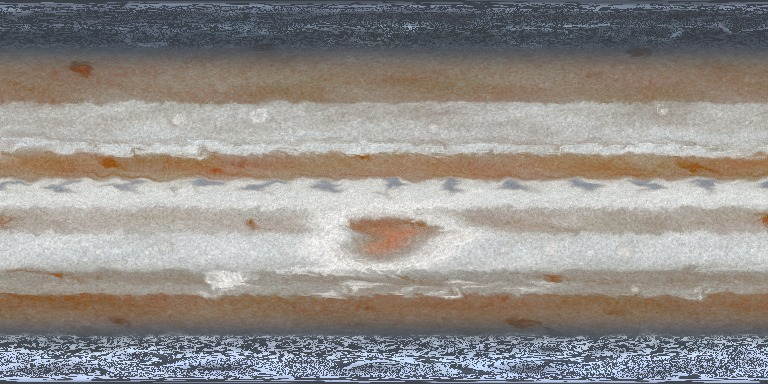 high &middot; 2</td>
</tr></table>

### polar stipple

`detail.polar_stipple` &mdash; range **0 to 2**, default **0**, tier `post`.

Bright granular storm speckle (popcorn) poleward of ~55 deg (the band-to-mottle transition character)

<table><tr>
<td align="center">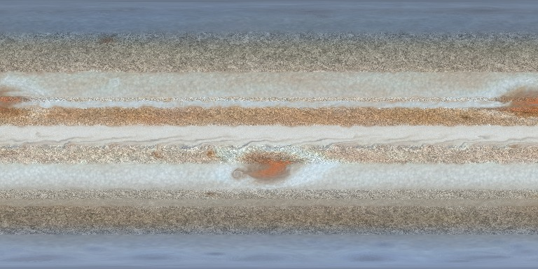 low &middot; 0</td><td align="center"> preset &middot; 0.8</td><td align="center"> high &middot; 2</td>
</tr></table>

### spread

`detail.spread` &mdash; range **0 to 1**, default **0**, tier `post`.

Uniform detail coverage across latitude: 0 = band-gated (belts textured, zones calmer, the default look, byte-identical), >0 = the flow-folded detail-FX texture (belt/zone/mottle folds + filaments) applied at EVEN density everywhere at this level, so there are no detail-starved zones or stamped latitude bands. Still flow-folded (not flat noise). Pole-faded. ~0.36 is a balanced value

<table><tr>
<td align="center">low &middot; 0 (not rendered)</td><td align="center"> preset &middot; 0.25</td><td align="center">high &middot; 1 (not rendered)</td>
</tr></table>

### striation amount

`detail.striation_amount` &mdash; range **0 to 1.5**, default **0**, tier `post`.

Ropey flow-parallel striations inside belts (intra-band thread texture; 0 = the pre-v1.1 look)

<table><tr>
<td align="center"> low &middot; 0</td><td align="center"> preset &middot; 1</td><td align="center"> high &middot; 1.5</td>
</tr></table>

### striation frequency

`detail.striation_frequency` &mdash; range **16 to 512**, default **96**, tier `post`, log scale.

Base spatial frequency of the striation noise

<table><tr>
<td align="center">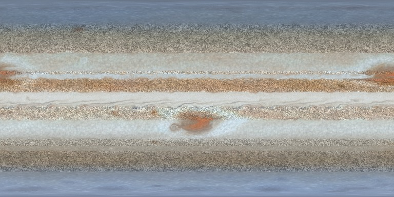 low &middot; 16</td><td align="center"> preset &middot; 160</td><td align="center"> high &middot; 512</td>
</tr></table>

### zone texture

`detail.zone_texture` &mdash; range **0 to 2.5**, default **0**, tier `post`.

Flow-folded luminance structure inside ZONES (the calm lanes between belts, gated by 1 - belt_mask). Belt interiors get belt_texture and shear-gated filaments; zones get neither and read as detail-starved smooth bands cutting across the disk. This gives zones their own flow-structured fold (calmer than belts, not flat). 0 = starved zones (byte-identical)

<table><tr>
<td align="center"> preset &middot; 0</td><td align="center"> high &middot; 2.5</td>
</tr></table>

## Mask

### band fade

`mask.band_fade` &mdash; range **0 to 1**, default **0**, tier `post`.

Fade the busy features (storm tint, polar tint, detail, lanes) back toward the plain band color where the mask is painted -- a way to calm chosen regions to clean bands. Weight is mask * this gain; 0 = off (byte-identical)

<table><tr>
<td align="center"> preset &middot; 0</td><td align="center">high &middot; 1 (not rendered)</td>
</tr></table>

### detail gain

`mask.detail_gain` &mdash; range **0 to 1**, default **0**, tier `post`.

Modulate color luminance/detail by the mask, settling painted-dark regions while painted-bright regions stay untouched. Factor is mix(1, mask, this gain); 0 = off (byte-identical)

<table><tr>
<td align="center"> preset &middot; 0</td><td align="center">high &middot; 1 (not rendered)</td>
</tr></table>

### emission gain

`mask.emission_gain` &mdash; range **0 to 1**, default **0**, tier `post`.

Modulate the night-side emission map (thermal/lightning glow + aurora) by the mask, dimming the glow where the mask is dark. Factor is mix(1, mask, this gain); 0 = off (byte-identical). Only visible on the Emission map, not Color

<table><tr>
<td align="center"> preset &middot; 0</td><td align="center">high &middot; 1 (not rendered)</td>
</tr></table>

### file

`mask.file` &mdash; file path, default **None**, tier `post`.

Path to a grayscale equirect (2:1) PNG mask that paints WHERE the three Mask targets act (white = full effect, black = none). Use forward slashes. None = no mask (all Mask targets inert). The path is resolved relative to a loaded preset's folder and re-saved next to a preset you save, so a preset stays portable; a missing file at load warns and disables the mask (never crashes)

_File-path field: the GUI shows a text entry + **Browse...** button (empty = None). Documented as text; no rendered example._

## Emission

### aurora pole offset

`emission.aurora_pole_offset` &mdash; range **0 to 20**, default **8**, tier `post`.

Magnetic-pole tilt from the rotation pole, degrees (longitude seeded); Saturn's axis is aligned: use 0. Preview: Emission channel, not Color

_Shown on the **emission map** (night-side glow) with all three glows enabled; tonemapped for display. The color map is unchanged by emission sliders._

<table><tr>
<td align="center">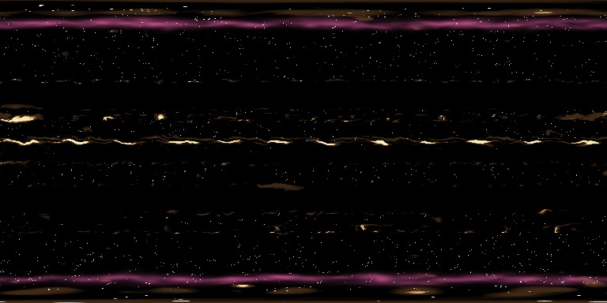 low &middot; 0</td><td align="center">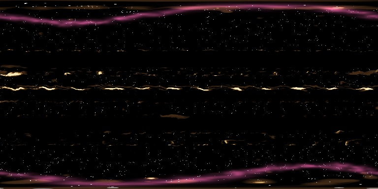 demo &middot; all glows on</td><td align="center">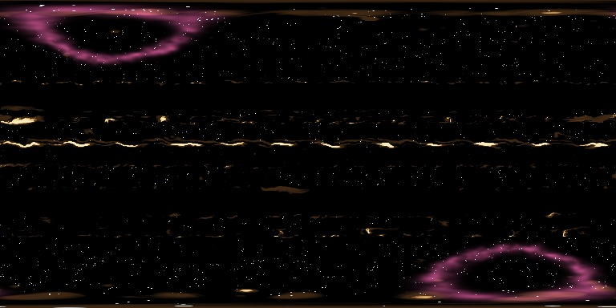 high &middot; 20</td>
</tr></table>

### aurora radius

`emission.aurora_radius` &mdash; range **5 to 25**, default **14**, tier `post`.

Oval angular radius from the magnetic pole, degrees. Preview: Emission channel, not Color

_Shown on the **emission map** (night-side glow) with all three glows enabled; tonemapped for display. The color map is unchanged by emission sliders._

<table><tr>
<td align="center">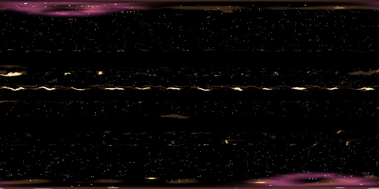 low &middot; 5</td><td align="center"> demo &middot; all glows on</td><td align="center">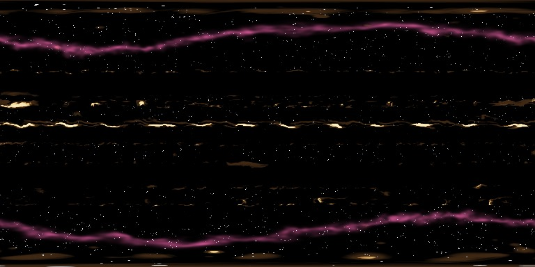 high &middot; 25</td>
</tr></table>

### aurora strength

`emission.aurora_strength` &mdash; range **0 to 2**, default **0**, tier `post`.

Auroral ovals around the (offset) magnetic poles; written to emission.exr's ALPHA channel so the importer can lift it onto a shell. Preview via the viewport's Emission channel (composited as alpha x aurora_color); not visible in the Color preview

_Shown on the **emission map** (night-side glow) with all three glows enabled; tonemapped for display. The color map is unchanged by emission sliders._

<table><tr>
<td align="center">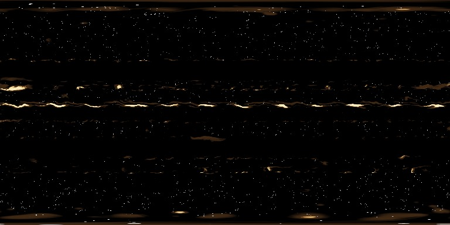 low &middot; 0</td><td align="center"> demo &middot; all glows on</td><td align="center">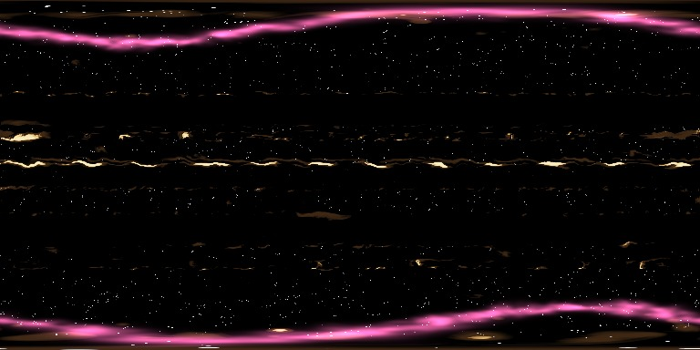 high &middot; 2</td>
</tr></table>

### aurora width

`emission.aurora_width` &mdash; range **0.5 to 8**, default **2.5**, tier `post`.

Auroral oval ring thickness, degrees. Preview: Emission channel, not Color

_Shown on the **emission map** (night-side glow) with all three glows enabled; tonemapped for display. The color map is unchanged by emission sliders._

<table><tr>
<td align="center">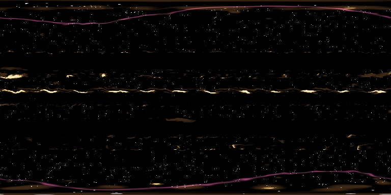 low &middot; 0.5</td><td align="center"> demo &middot; all glows on</td><td align="center">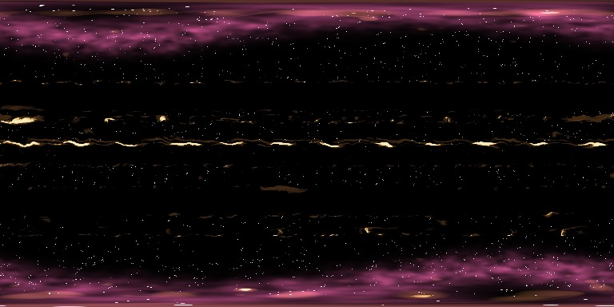 high &middot; 8</td>
</tr></table>

### lightning density

`emission.lightning_density` &mdash; range **0 to 1**, default **0.5**, tier `post`.

Lightning-flash cluster population density. Preview: Emission channel, not Color

_Shown on the **emission map** (night-side glow) with all three glows enabled; tonemapped for display. The color map is unchanged by emission sliders._

<table><tr>
<td align="center">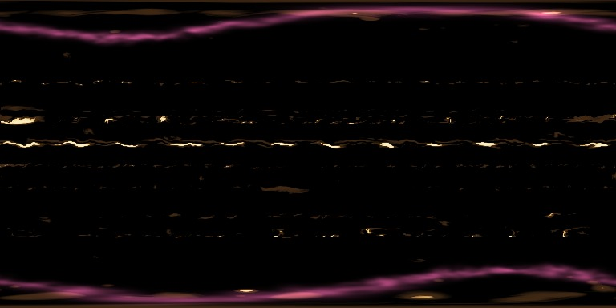 low &middot; 0</td><td align="center"> demo &middot; all glows on</td><td align="center">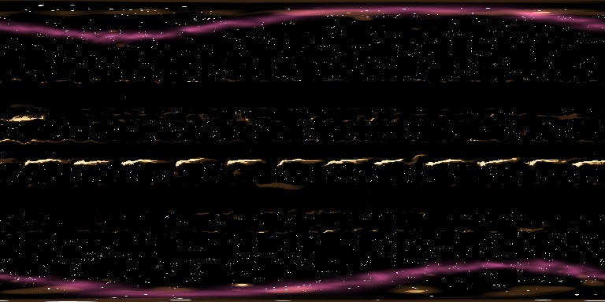 high &middot; 1</td>
</tr></table>

### lightning strength

`emission.lightning_strength` &mdash; range **0 to 2**, default **0**, tier `post`.

Frozen lightning-flash clusters in cyclonic belts and at high latitudes (the Juno look: light pools under the deck plus sparse HDR cores). Preview: Emission channel, not Color

_Shown on the **emission map** (night-side glow) with all three glows enabled; tonemapped for display. The color map is unchanged by emission sliders._

<table><tr>
<td align="center"> low &middot; 0</td><td align="center"> demo &middot; all glows on</td><td align="center">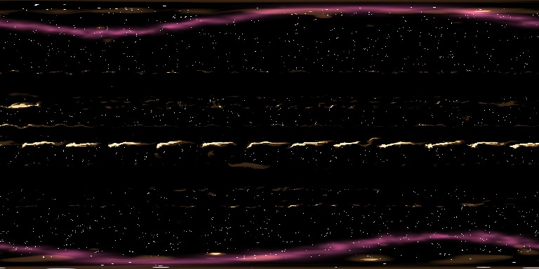 high &middot; 2</td>
</tr></table>

### thermal hdr

`emission.thermal_hdr` &mdash; range **1 to 40**, default **16**, tier `post`.

Radiance of the deepest hot spots relative to the faint belt glow (real 5-micron maps span ~50:1). Preview: Emission channel, not Color

_Shown on the **emission map** (night-side glow) with all three glows enabled; tonemapped for display. The color map is unchanged by emission sliders._

<table><tr>
<td align="center">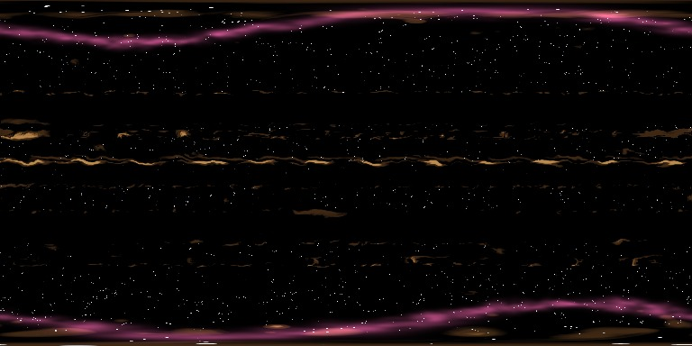 low &middot; 1</td><td align="center"> demo &middot; all glows on</td><td align="center"> high &middot; 40</td>
</tr></table>

### thermal strength

`emission.thermal_strength` &mdash; range **0 to 2**, default **0**, tier `post`.

5-micron thermal glow through cloud gaps (gated on the cloud-top DEPRESSION vs the band stamp: hot-spot chains blaze, barges glow, belts glimmer, zones stay dark). Preview: Emission channel, not Color

_Shown on the **emission map** (night-side glow) with all three glows enabled; tonemapped for display. The color map is unchanged by emission sliders._

<table><tr>
<td align="center">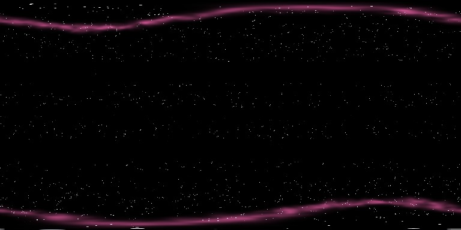 low &middot; 0</td><td align="center"> demo &middot; all glows on</td><td align="center">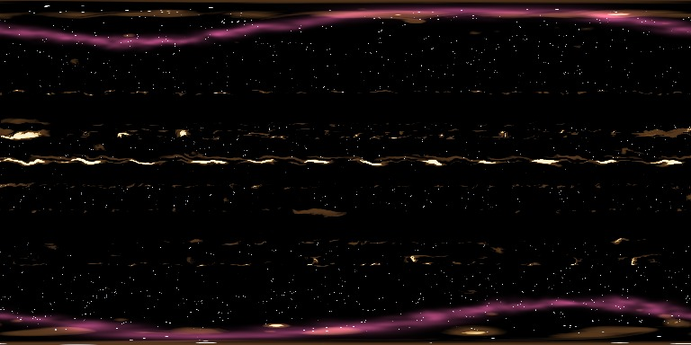 high &middot; 2</td>
</tr></table>

### thermal threshold

`emission.thermal_threshold` &mdash; range **0.05 to 0.5**, default **0.18**, tier `post`.

Cloud-gap anomaly where the HDR hot-spot term begins (higher = only the deepest holes blaze). Preview: Emission channel, not Color

_Shown on the **emission map** (night-side glow) with all three glows enabled; tonemapped for display. The color map is unchanged by emission sliders._

<table><tr>
<td align="center">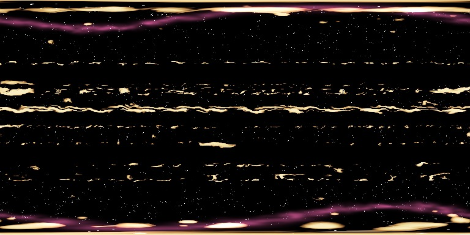 low &middot; 0.05</td><td align="center"> demo &middot; all glows on</td><td align="center">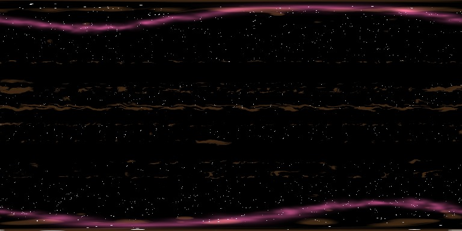 high &middot; 0.5</td>
</tr></table>

## Physical

### height midlevel

`physical.height_midlevel` &mdash; range **0 to 1**, default **0.5**, tier `post`.

Height-map value mapped to the mid cloud deck (Blender importer reference level)

_Passed to the Blender importer / controls the output file, not the texture appearance &mdash; no visual example._

### height scale

`physical.height_scale` &mdash; range **0 to 0.05**, default **0.004**, tier `post`.

Cloud-deck relief as a fraction of planet radius (full height-map range)

_Passed to the Blender importer / controls the output file, not the texture appearance &mdash; no visual example._

### radius km

`physical.radius_km` &mdash; range **1000 to 200000**, default **69911**, tier `post`.

Planet equatorial radius in kilometers, passed through to the Blender importer for scale

_Passed to the Blender importer / controls the output file, not the texture appearance &mdash; no visual example._

## Export

### png compression

`export.png_compression` &mdash; range **0 to 9**, default **2**, tier `post`.

PNG deflate level (low = much faster at 16K)

_Passed to the Blender importer / controls the output file, not the texture appearance &mdash; no visual example._

### width

`export.width` &mdash; range **512 to 16384**, default **2048**, tier `post`.

Equirect map width in pixels; height is width/2

_Passed to the Blender importer / controls the output file, not the texture appearance &mdash; no visual example._

