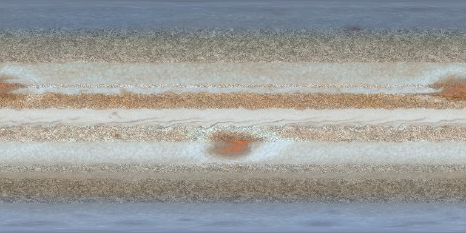
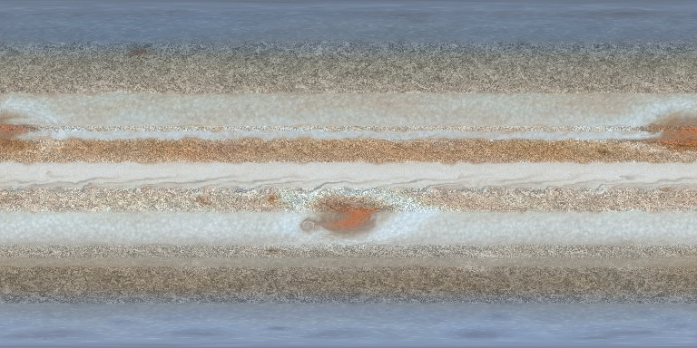

# Slider reference

What every slider in the live-preview GUI (`uv run gasgiant-studio`) actually does, shown on the planet. Each row renders the **low**, **preset**, and **high** value of one slider; everything else is held at the `jupiter_like` preset (seed 4201, sim resolution 768, 150 development steps). Images are the raw equirectangular color map -- the same texture the exporter writes and the viewport's *Standard* mode shows.

> The panels are auto-generated from `PlanetParams` (`src/gasgiant/params/model.py`): every `int`/`float` field becomes a slider. This document is generated from the same model by `scripts/render_slider_examples.py`, so it tracks the real UI.

> **Tier** is what the engine recomputes when you move the slider: `post` re-derives the maps only (instant), `velocity` rebuilds the flow field, `restart` re-runs the development from step 0.

## Contents

- [Sim](#sim)
- [Solver](#solver)
- [Bands](#bands)
- [Jets](#jets)
- [Turbulence](#turbulence)
- [Storms](#storms)
- [Waves](#waves)
- [Poles](#poles)
- [Appearance](#appearance)
- [Detail](#detail)
- [Emission](#emission)
- [Physical](#physical)
- [Export](#export)

## Sim

### dev steps

`sim.dev_steps` &mdash; range **0 to 3000**, default **500**, tier `restart`.

Development steps: how long structures evolve before the snapshot

_High example capped below the slider maximum so it renders in reasonable time; the column label shows the value used._

<table><tr>
<td align="center"> low &middot; 0</td><td align="center"> preset &middot; 150</td><td align="center"> high &middot; 1000</td>
</tr></table>

### dt scale

`sim.dt_scale` &mdash; range **0.2 to 3**, default **1**, tier `restart`.

Time-step multiplier (peak jet displacement ~1.2 cells at 1.0)

<table><tr>
<td align="center"> low &middot; 0.2</td><td align="center"> preset &middot; 1</td><td align="center"> high &middot; 3</td>
</tr></table>

### resolution

`sim.resolution` &mdash; range **512 to 8192**, default **2048**, tier `restart`.

Sim grid width (2:1 equirect); 2048 interactive, 4096+ for final quality

_Passed to the Blender importer / controls the output file, not the texture appearance &mdash; no visual example._

## Solver

### baro steps per update

`solver.baroclinic.baro_steps_per_update` &mdash; range **10 to 1000**, default **150**, tier `restart`.

Baroclinic steps per source refresh (fixed cadence). No rand.

_Passed to the Blender importer / controls the output file, not the texture appearance &mdash; no visual example._

### gain

`solver.baroclinic.gain` &mdash; range **0 to 8**, default **2**, tier `restart`.

Baroclinic source amplitude as a fraction of coriolis_f0 (~3). The source is injected into the Poisson RHS (NOT the vorticity state), so it is bounded (no accumulation) and coherent (never folded by advection -- it is read fresh from the source each step and never enters the advected q state), enriching mid-latitude belt texture. ~2 = subtle; high gain over-boils. No rand.

_Rendered against the `baroclinic` solver baseline (inert under the default kinematic solver)._

<table><tr>
<td align="center"> low &middot; 0</td><td align="center"> preset &middot; 2</td><td align="center"> high &middot; 8</td>
</tr></table>

### update every

`solver.baroclinic.update_every` &mdash; range **1 to 512**, default **32**, tier `restart`.

v1.6 steps between source refreshes (fixed cadence). No rand.

_Passed to the Blender importer / controls the output file, not the texture appearance &mdash; no visual example._

### warmup steps

`solver.baroclinic.warmup_steps` &mdash; range **500 to 20000**, default **8000**, tier `restart`.

Baroclinic spin-up before coupling (fixed cadence). No rand. hi=20000 leaves headroom past the ~12500 outcrop so a forced outcrop can be exercised by tests.

_Passed to the Blender importer / controls the output file, not the texture appearance &mdash; no visual example._

### coriolis f0

`solver.coriolis_f0` &mdash; range **0 to 20**, default **2**, tier `restart`.

Planetary vorticity magnitude f0 in f=f0*sin(lat); sets the Rhines/band scale (vorticity mode)

_Rendered against the `vorticity` solver baseline (inert under the default kinematic solver)._

<table><tr>
<td align="center"> low &middot; 0</td><td align="center"> preset &middot; 3</td><td align="center"> high &middot; 20</td>
</tr></table>

### poisson iters

`solver.poisson_iters` &mdash; range **8 to 512**, default **48**, tier `restart`.

Fixed red-black SOR iterations per step (vorticity mode)

_Passed to the Blender importer / controls the output file, not the texture appearance &mdash; no visual example._

### sor omega

`solver.sor_omega` &mdash; range **1 to 2**, default **1.7**, tier `restart`.

SOR over-relaxation factor, must be in (1,2) exclusive (vorticity mode)

_Passed to the Blender importer / controls the output file, not the texture appearance &mdash; no visual example._

### vort drag

`solver.vort_drag` &mdash; range **0 to 0.3**, default **0**, tier `restart`.

Linear (Rayleigh) drag fraction on relative vorticity per step; absorbs the 2D inverse-cascade energy that piles up at large scales (0 = off). Vorticity mode.

_Rendered against the `vorticity` solver baseline (inert under the default kinematic solver)._

<table><tr>
<td align="center"> preset &middot; 0</td><td align="center"> high &middot; 0.3</td>
</tr></table>

### vort hypervisc

`solver.vort_hypervisc` &mdash; range **0 to 10**, default **1**, tier `restart`.

Scale-selective biharmonic hyperviscosity rate (vorticity mode)

_Rendered against the `vorticity` solver baseline (inert under the default kinematic solver)._

<table><tr>
<td align="center"> low &middot; 0</td><td align="center"> preset &middot; 0.6</td><td align="center"> high &middot; 10</td>
</tr></table>

### vort inject

`solver.vort_inject` &mdash; range **0 to 5**, default **0**, tier `restart`.

Broadband eddy-vorticity injection amplitude per step; the jet shear folds it into filaments (the emergent-turbulence source; 0 = off, smooth jets stay zonal). Vorticity mode.

_Rendered against the `vorticity` solver baseline (inert under the default kinematic solver)._

<table><tr>
<td align="center"> preset &middot; 0</td><td align="center"> high &middot; 5</td>
</tr></table>

### vort inject scale

`solver.vort_inject_scale` &mdash; range **0.1 to 4**, default **0.5**, tier `restart`.

Eddy-injection frequency as a multiple of bands.detail_freq (vorticity mode)

_Rendered against the `vorticity` solver baseline (inert under the default kinematic solver)._

<table><tr>
<td align="center"> low &middot; 0.1</td><td align="center"> preset &middot; 0.5</td><td align="center"> high &middot; 4</td>
</tr></table>

### vort relax tau

`solver.vort_relax_tau` &mdash; range **20 to 2000**, default **120**, tier `restart`, log scale.

Vorticity nudging timescale toward jets+vortices (vorticity mode)

_Rendered against the `vorticity` solver baseline (inert under the default kinematic solver)._

<table><tr>
<td align="center"> low &middot; 20</td><td align="center"> preset &middot; 600</td><td align="center"> high &middot; 2000</td>
</tr></table>

## Bands

### contrast envelope

`bands.contrast_envelope` &mdash; range **0 to 1**, default **0**, tier `restart`.

Banding contrast collapse poleward of ~45 deg toward mottle (the real latitude-contrast profile)

<table><tr>
<td align="center"> low &middot; 0</td><td align="center"> preset &middot; 0.25</td><td align="center"> high &middot; 1</td>
</tr></table>

### count

`bands.count` &mdash; range **2 to 40**, default **14**, tier `restart`.

Number of zones+belts pole to pole

<table><tr>
<td align="center"> low &middot; 2</td><td align="center"> preset &middot; 16</td><td align="center"> high &middot; 40</td>
</tr></table>

### detail amount

`bands.detail_amount` &mdash; range **0 to 0.5**, default **0.1**, tier `restart`.

Small-scale color-index noise amplitude

<table><tr>
<td align="center"> low &middot; 0</td><td align="center"> preset &middot; 0.12</td><td align="center"> high &middot; 0.5</td>
</tr></table>

### detail freq

`bands.detail_freq` &mdash; range **2 to 64**, default **12**, tier `restart`, log scale.

Small-scale noise spatial frequency

<table><tr>
<td align="center"> low &middot; 2</td><td align="center"> preset &middot; 14</td><td align="center"> high &middot; 64</td>
</tr></table>

### edge diversity

`bands.edge_diversity` &mdash; range **0 to 1**, default **0**, tier `restart`.

Per-edge softness variation: some band edges diffuse, some sharp (uniform edges are a procedural tell)

<table><tr>
<td align="center"> low &middot; 0</td><td align="center"> preset &middot; 0.55</td><td align="center"> high &middot; 1</td>
</tr></table>

### edge softness

`bands.edge_softness` &mdash; range **0.001 to 0.1**, default **0.012**, tier `restart`, log scale.

Half-width of band-edge transitions, radians of latitude

<table><tr>
<td align="center"> low &middot; 0.001</td><td align="center"> preset &middot; 0.012</td><td align="center"> high &middot; 0.1</td>
</tr></table>

### faded sector

`bands.faded_sector` &mdash; range **0 to 1**, default **0**, tier `restart`.

SEB-fade: one belt gets a pale desaturated sector spanning ~100 degrees of longitude

<table><tr>
<td align="center"> low &middot; 0</td><td align="center"> preset &middot; 0.55</td><td align="center"> high &middot; 1</td>
</tr></table>

### hue jitter

`bands.hue_jitter` &mdash; range **0 to 0.15**, default **0**, tier `restart`.

Per-band color-index offset along the palette (NEB-orange vs SEB-brown variation); seeded independently of the band layout

<table><tr>
<td align="center"> low &middot; 0</td><td align="center"> preset &middot; 0.04</td><td align="center"> high &middot; 0.15</td>
</tr></table>

### lane density

`bands.lane_density` &mdash; range **0 to 1**, default **0**, tier `velocity`.

Thin dark lane lines at jet cores, drawn analytically at derive time (a 1-3 px line cannot survive the sim grid)

<table><tr>
<td align="center"> preset &middot; 0</td><td align="center"> high &middot; 1</td>
</tr></table>

### value contrast

`bands.value_contrast` &mdash; range **0 to 2**, default **1**, tier `restart`.

Zone/belt brightness separation multiplier

<table><tr>
<td align="center"> low &middot; 0</td><td align="center"> preset &middot; 1.1</td><td align="center"> high &middot; 2</td>
</tr></table>

### variance amount

`bands.variance_amount` &mdash; range **0 to 0.3**, default **0**, tier `restart`.

Within-band longitudinal color drift (real belts hold several hues at once, varying slowly with longitude)

<table><tr>
<td align="center"> low &middot; 0</td><td align="center"> preset &middot; 0.18</td><td align="center"> high &middot; 0.3</td>
</tr></table>

### warp amount

`bands.warp_amount` &mdash; range **0 to 0.3**, default **0.035**, tier `restart`.

Band-boundary meander amplitude, radians of latitude

<table><tr>
<td align="center"> low &middot; 0</td><td align="center"> preset &middot; 0.04</td><td align="center"> high &middot; 0.3</td>
</tr></table>

### warp freq

`bands.warp_freq` &mdash; range **0.5 to 16**, default **3**, tier `restart`, log scale.

Band-boundary meander spatial frequency

<table><tr>
<td align="center"> low &middot; 0.5</td><td align="center"> preset &middot; 3.5</td><td align="center"> high &middot; 16</td>
</tr></table>

### width jitter

`bands.width_jitter` &mdash; range **0 to 1**, default **0.35**, tier `restart`.

Randomness of band width distribution

<table><tr>
<td align="center"> low &middot; 0</td><td align="center"> preset &middot; 0.4</td><td align="center"> high &middot; 1</td>
</tr></table>

### width tail

`bands.width_tail` &mdash; range **0 to 1**, default **0**, tier `restart`.

Heavier-tailed band width distribution (real maps mix very broad zones with thin strips)

<table><tr>
<td align="center"> low &middot; 0</td><td align="center"> preset &middot; 0.35</td><td align="center"> high &middot; 1</td>
</tr></table>

## Jets

### equatorial speed

`jets.equatorial_speed` &mdash; range **-3 to 4**, default **1.6**, tier `velocity`.

Equatorial superrotation jet peak speed (negative = retrograde)

<table><tr>
<td align="center"> low &middot; -3</td><td align="center"> preset &middot; 1.6</td><td align="center"> high &middot; 4</td>
</tr></table>

### equatorial width

`jets.equatorial_width` &mdash; range **0.03 to 0.4**, default **0.12**, tier `velocity`.

Equatorial jet half-width, radians of latitude

<table><tr>
<td align="center"> low &middot; 0.03</td><td align="center"> preset &middot; 0.12</td><td align="center"> high &middot; 0.4</td>
</tr></table>

### polar decay

`jets.polar_decay` &mdash; range **0 to 1**, default **0.5**, tier `velocity`.

How strongly jet amplitudes decay toward the poles

<table><tr>
<td align="center"> low &middot; 0</td><td align="center"> preset &middot; 0.5</td><td align="center"> high &middot; 1</td>
</tr></table>

### strength

`jets.strength` &mdash; range **0 to 3**, default **1**, tier `velocity`.

Global zonal jet speed multiplier

<table><tr>
<td align="center"> low &middot; 0</td><td align="center"> preset &middot; 1</td><td align="center"> high &middot; 3</td>
</tr></table>

## Turbulence

### belt boost

`turbulence.belt_boost` &mdash; range **1 to 4**, default **1.6**, tier `velocity`.

Turbulence multiplier inside dark belts (cyclonic bands)

<table><tr>
<td align="center"> low &middot; 1</td><td align="center"> preset &middot; 1.6</td><td align="center"> high &middot; 4</td>
</tr></table>

### belt replenish

`turbulence.belt_replenish` &mdash; range **0 to 0.08**, default **0**, tier `restart`.

Extra fine detail-noise replenished per step inside belts (emergent filaments)

<table><tr>
<td align="center"> low &middot; 0</td><td align="center"> preset &middot; 0.07</td><td align="center"> high &middot; 0.08</td>
</tr></table>

### belt replenish scale

`turbulence.belt_replenish_scale` &mdash; range **1 to 4**, default **2**, tier `restart`.

Belt replenishment frequency multiplier relative to the base detail frequency

<table><tr>
<td align="center"> low &middot; 1</td><td align="center"> preset &middot; 2</td><td align="center"> high &middot; 4</td>
</tr></table>

### evolution rate

`turbulence.evolution_rate` &mdash; range **0 to 0.1**, default **0.012**, tier `velocity`.

How fast the turbulence pattern decorrelates per step

<table><tr>
<td align="center"> low &middot; 0</td><td align="center"> preset &middot; 0.012</td><td align="center"> high &middot; 0.1</td>
</tr></table>

### intensity

`turbulence.intensity` &mdash; range **0 to 3**, default **1**, tier `velocity`.

Global turbulence (curl-noise) amplitude

<table><tr>
<td align="center"> low &middot; 0</td><td align="center"> preset &middot; 1</td><td align="center"> high &middot; 3</td>
</tr></table>

### kh amplitude

`turbulence.kh_amplitude` &mdash; range **0 to 2**, default **0.35**, tier `velocity`.

Kelvin-Helmholtz wave amplitude along high-shear band boundaries

<table><tr>
<td align="center"> low &middot; 0</td><td align="center"> preset &middot; 0.6</td><td align="center"> high &middot; 2</td>
</tr></table>

### kh wavenumber

`turbulence.kh_wavenumber` &mdash; range **4 to 80**, default **24**, tier `velocity`.

KH billow longitudinal wavenumber

<table><tr>
<td align="center"> low &middot; 4</td><td align="center"> preset &middot; 24</td><td align="center"> high &middot; 80</td>
</tr></table>

### relax tau

`turbulence.relax_tau` &mdash; range **50 to 2000**, default **350**, tier `restart`, log scale.

Relaxation time (steps) pulling band color/height back toward the stamp

<table><tr>
<td align="center"> low &middot; 50</td><td align="center"> preset &middot; 350</td><td align="center"> high &middot; 2000</td>
</tr></table>

### replenish rate

`turbulence.replenish_rate` &mdash; range **0 to 0.5**, default **0.015**, tier `restart`.

Fresh detail-noise blended into the detail tracer per step. High values (~0.3) keep quiescent zone bands detailed where the zonal jets would otherwise smear the detail away to ~half the belts'

<table><tr>
<td align="center"> low &middot; 0</td><td align="center"> preset &middot; 0.015</td><td align="center"> high &middot; 0.5</td>
</tr></table>

### scale

`turbulence.scale` &mdash; range **1 to 32**, default **6**, tier `velocity`, log scale.

Base spatial frequency of the turbulence noise

<table><tr>
<td align="center"> low &middot; 1</td><td align="center"> preset &middot; 6</td><td align="center"> high &middot; 32</td>
</tr></table>

### shear coupling

`turbulence.shear_coupling` &mdash; range **0 to 3**, default **1**, tier `velocity`.

Extra turbulence where jet shear is strong

<table><tr>
<td align="center"> low &middot; 0</td><td align="center"> preset &middot; 1</td><td align="center"> high &middot; 3</td>
</tr></table>

## Storms

### barge density

`storms.barge_density` &mdash; range **0 to 3**, default **1**, tier `restart`.

Brown-barge cyclone population multiplier (belts)

<table><tr>
<td align="center"> low &middot; 0</td><td align="center"> preset &middot; 1.2</td><td align="center"> high &middot; 3</td>
</tr></table>

### hero aspect

`storms.hero_aspect` &mdash; range **1 to 3**, default **1**, tier `restart`.

Hero storm lon:lat elongation (real GRS ~2:1); 1.0 = round. Stretches the stamp, perimeter ring, collar, spiral lanes and detail mask along longitude. Wake across-width and merge capture stay isotropic (recorded LIMITs)

<table><tr>
<td align="center"> low &middot; 1</td><td align="center"> preset &middot; 2</td><td align="center"> high &middot; 3</td>
</tr></table>

### hero count

`storms.hero_count` &mdash; range **0 to 3**, default **1**, tier `restart`.

GRS-class giant anticyclones

<table><tr>
<td align="center"> low &middot; 0</td><td align="center"> preset &middot; 1</td><td align="center"> high &middot; 3</td>
</tr></table>

### hero radius

`storms.hero_radius` &mdash; range **0.03 to 0.25**, default **0.1**, tier `restart`.

Hero vortex core radius, radians of arc

<table><tr>
<td align="center"> low &middot; 0.03</td><td align="center"> preset &middot; 0.15</td><td align="center"> high &middot; 0.25</td>
</tr></table>

### hero strength

`storms.hero_strength` &mdash; range **0.2 to 3**, default **1**, tier `restart`.

<table><tr>
<td align="center"> low &middot; 0.2</td><td align="center"> preset &middot; 1</td><td align="center"> high &middot; 3</td>
</tr></table>

### merge debris

`storms.merge_debris` &mdash; range **0 to 2**, default **1**, tier `restart`.

Brightness of the transient turbulent collar a fresh merger leaves behind (inert while merge_rate is 0)

<table><tr>
<td align="center"> low &middot; 0</td><td align="center"> preset &middot; 1</td><td align="center"> high &middot; 2</td>
</tr></table>

### merge rate

`storms.merge_rate` &mdash; range **0 to 1**, default **0**, tier `restart`.

Anticyclone merger aggressiveness: converging same-sign ovals coalesce when their gap falls under ~1.5*rate*(r1+r2), and generation seeds convergent pairs so mergers actually occur during the dev run (0 = off, the v1.1 behavior)

<table><tr>
<td align="center"> low &middot; 0</td><td align="center"> preset &middot; 0.7</td><td align="center"> high &middot; 1</td>
</tr></table>

### outbreak count

`storms.outbreak_count` &mdash; range **0 to 3**, default **0**, tier `restart`.

Convective outbreaks (Great-White-Spot events) during the development run

<table><tr>
<td align="center"> low &middot; 0</td><td align="center"> preset &middot; 1</td><td align="center"> high &middot; 3</td>
</tr></table>

### outbreak strength

`storms.outbreak_strength` &mdash; range **0.2 to 3**, default **1**, tier `restart`.

<table><tr>
<td align="center"> low &middot; 0.2</td><td align="center"> preset &middot; 1</td><td align="center"> high &middot; 3</td>
</tr></table>

### oval density

`storms.oval_density` &mdash; range **0 to 3**, default **1**, tier `restart`.

White-oval anticyclone population multiplier

<table><tr>
<td align="center"> low &middot; 0</td><td align="center"> preset &middot; 1.6</td><td align="center"> high &middot; 3</td>
</tr></table>

### pearls count

`storms.pearls_count` &mdash; range **0 to 14**, default **7**, tier `restart`.

String-of-pearls ovals on one seeded latitude (0 = off)

<table><tr>
<td align="center"> low &middot; 0</td><td align="center"> preset &middot; 7</td><td align="center"> high &middot; 14</td>
</tr></table>

### rim contrast

`storms.rim_contrast` &mdash; range **0 to 2.5**, default **1**, tier `restart`.

Scales the hero storm's dark perimeter ring + bright collar (the Red Spot Hollow) amplitude; 1.0 = default, >1 deepens the rim contrast, 0 removes the ring/collar

<table><tr>
<td align="center"> low &middot; 0</td><td align="center"> preset &middot; 1.5</td><td align="center"> high &middot; 2.5</td>
</tr></table>

### small density

`storms.small_density` &mdash; range **0 to 3**, default **0**, tier `restart`.

Small-storm field: sub-oval white spots and dark spots scattered in loose latitude rows (0 = off, the pre-v1.1 look)

<table><tr>
<td align="center"> low &middot; 0</td><td align="center"> preset &middot; 1.2</td><td align="center"> high &middot; 3</td>
</tr></table>

### stamp contrast

`storms.stamp_contrast` &mdash; range **0 to 2**, default **1**, tier `restart`.

Tracer-stamp contrast of ovals/barges/pearls/small storms (1 = v1)

<table><tr>
<td align="center"> low &middot; 0</td><td align="center"> preset &middot; 1.5</td><td align="center"> high &middot; 2</td>
</tr></table>

### wake turbulence

`storms.wake_turbulence` &mdash; range **0 to 5**, default **1.8**, tier `restart`.

Turbulence boost in the wake wedge downstream of hero storms

<table><tr>
<td align="center"> low &middot; 0</td><td align="center"> preset &middot; 1.8</td><td align="center"> high &middot; 5</td>
</tr></table>

## Waves

### festoon strength

`waves.festoon_strength` &mdash; range **0 to 2**, default **0.8**, tier `restart`.

Festoon plumes + hot spots on the equatorial belt edge (0 = off)

<table><tr>
<td align="center"> low &middot; 0</td><td align="center"> preset &middot; 1.7</td><td align="center"> high &middot; 2</td>
</tr></table>

### festoon wavenumber

`waves.festoon_wavenumber` &mdash; range **4 to 24**, default **12**, tier `restart`.

Rossby wavenumber of the festoon/hot-spot train

<table><tr>
<td align="center"> low &middot; 4</td><td align="center"> preset &middot; 12</td><td align="center"> high &middot; 24</td>
</tr></table>

### hotspot depth

`waves.hotspot_depth` &mdash; range **0 to 1**, default **0.6**, tier `restart`.

Depth of the cloud-free hot spots at the wave troughs

<table><tr>
<td align="center"> low &middot; 0</td><td align="center"> preset &middot; 0.7</td><td align="center"> high &middot; 1</td>
</tr></table>

### ribbon strength

`waves.ribbon_strength` &mdash; range **0 to 2**, default **0**, tier `restart`.

Saturn-style ribbon wave on one mid-latitude jet (0 = off)

<table><tr>
<td align="center"> preset &middot; 0</td><td align="center"> high &middot; 2</td>
</tr></table>

### ribbon wavenumber

`waves.ribbon_wavenumber` &mdash; range **4 to 30**, default **12**, tier `restart`.

<table><tr>
<td align="center"> low &middot; 4</td><td align="center"> preset &middot; 12</td><td align="center"> high &middot; 30</td>
</tr></table>

## Poles

### cyclone count

`poles.north.cyclone_count` &mdash; range **3 to 9**, default **6**, tier `restart`.

Ring cyclones around the central one (cyclone_cluster style)

<table><tr>
<td align="center"> low &middot; 3</td><td align="center"> preset &middot; 8</td><td align="center"> high &middot; 9</td>
</tr></table>

### field density

`poles.north.field_density` &mdash; range **0 to 2**, default **0**, tier `restart`.

Background small-cyclone field filling the cap poleward of 70 deg (PIA21641's dense cyclone hierarchy; 0 = off)

<table><tr>
<td align="center"> low &middot; 0</td><td align="center"> preset &middot; 1.4</td><td align="center"> high &middot; 2</td>
</tr></table>

### polygon sides

`poles.north.polygon_sides` &mdash; range **3 to 9**, default **6**, tier `restart`.

Polygon wavenumber of the polar jet (polygon_jet style)

<table><tr>
<td align="center"> low &middot; 3</td><td align="center"> preset &middot; 6</td><td align="center"> high &middot; 9</td>
</tr></table>

### strength

`poles.north.strength` &mdash; range **0 to 3**, default **1**, tier `restart`.

<table><tr>
<td align="center"> low &middot; 0</td><td align="center"> preset &middot; 1.35</td><td align="center"> high &middot; 3</td>
</tr></table>

### cyclone count

`poles.south.cyclone_count` &mdash; range **3 to 9**, default **6**, tier `restart`.

Ring cyclones around the central one (cyclone_cluster style)

<table><tr>
<td align="center"> low &middot; 3</td><td align="center"> preset &middot; 5</td><td align="center"> high &middot; 9</td>
</tr></table>

### field density

`poles.south.field_density` &mdash; range **0 to 2**, default **0**, tier `restart`.

Background small-cyclone field filling the cap poleward of 70 deg (PIA21641's dense cyclone hierarchy; 0 = off)

<table><tr>
<td align="center"> low &middot; 0</td><td align="center"> preset &middot; 1.4</td><td align="center"> high &middot; 2</td>
</tr></table>

### polygon sides

`poles.south.polygon_sides` &mdash; range **3 to 9**, default **6**, tier `restart`.

Polygon wavenumber of the polar jet (polygon_jet style)

<table><tr>
<td align="center"> low &middot; 3</td><td align="center"> preset &middot; 6</td><td align="center"> high &middot; 9</td>
</tr></table>

### strength

`poles.south.strength` &mdash; range **0 to 3**, default **1**, tier `restart`.

<table><tr>
<td align="center"> low &middot; 0</td><td align="center"> preset &middot; 1.35</td><td align="center"> high &middot; 3</td>
</tr></table>

## Appearance

### chroma scale

`appearance.chroma_scale` &mdash; range **0 to 2**, default **1**, tier `post`.

Oklab chroma multiplier on the final color (1 = off) — perceptual saturation, recommended over 'saturation' (an sRGB luma mix). No rand: adding a draw would reshuffle every later randomize draw

<table><tr>
<td align="center"> low &middot; 0</td><td align="center"> preset &middot; 1</td><td align="center"> high &middot; 2</td>
</tr></table>

### chroma variance

`appearance.chroma_variance` &mdash; range **0 to 0.5**, default **0**, tier `post`.

Longitudinal within-band chroma drift: bands hold pockets of more/less saturated material varying slowly with longitude (the reference's saturated-pocket texture)

<table><tr>
<td align="center"> low &middot; 0</td><td align="center"> preset &middot; 0.35</td><td align="center"> high &middot; 0.5</td>
</tr></table>

### contrast

`appearance.contrast` &mdash; range **0.2 to 2**, default **1**, tier `post`.

<table><tr>
<td align="center"> low &middot; 0.2</td><td align="center"> preset &middot; 1.05</td><td align="center"> high &middot; 2</td>
</tr></table>

### gamma

`appearance.gamma` &mdash; range **0.4 to 2.5**, default **1**, tier `post`.

Final tone-curve gamma on the color map

<table><tr>
<td align="center"> low &middot; 0.4</td><td align="center"> preset &middot; 1</td><td align="center"> high &middot; 2.5</td>
</tr></table>

### haze amount

`appearance.haze_amount` &mdash; range **0 to 1**, default **0**, tier `post`.

Global haze: the Jupiter (0) to Saturn (~0.6) axis

<table><tr>
<td align="center"> low &middot; 0</td><td align="center"> preset &middot; 0.05</td><td align="center"> high &middot; 1</td>
</tr></table>

### hue variance

`appearance.hue_variance` &mdash; range **0 to 0.35**, default **0**, tier `post`.

Iso-luminance Oklab hue drift (radians of max rotation): differently-hued material at the same lightness, which a luminance-keyed palette gradient cannot express -- the hue-diversity lever the realism metrics name

<table><tr>
<td align="center"> low &middot; 0</td><td align="center"> preset &middot; 0.18</td><td align="center"> high &middot; 0.35</td>
</tr></table>

### polar tint start lat

`appearance.polar_tint_start_lat` &mdash; range **30 to 80**, default **55**, tier `post`.

Latitude (deg) where the polar tint begins

<table><tr>
<td align="center"> low &middot; 30</td><td align="center"> preset &middot; 56</td><td align="center"> high &middot; 80</td>
</tr></table>

### polar tint strength

`appearance.polar_tint_strength` &mdash; range **0 to 1**, default **0**, tier `post`.

Polar tint blend strength (0 = off, the pre-v1.1 look)

<table><tr>
<td align="center"> low &middot; 0</td><td align="center"> preset &middot; 0.68</td><td align="center"> high &middot; 1</td>
</tr></table>

### saturation

`appearance.saturation` &mdash; range **0 to 2**, default **1**, tier `post`.

<table><tr>
<td align="center"> low &middot; 0</td><td align="center"> preset &middot; 1</td><td align="center"> high &middot; 2</td>
</tr></table>

## Detail

### belt texture

`detail.belt_texture` &mdash; range **0 to 1.5**, default **0**, tier `post`.

Storm-scale folded luminance structure inside belts (0.5-3 deg, flow-backtraced so patches fold with the flow) + a belt floor for the fine filaments; the v1.4 audit's dominant texture gap on broad-band layouts

<table><tr>
<td align="center"> low &middot; 0</td><td align="center"> preset &middot; 1.3</td><td align="center"> high &middot; 1.5</td>
</tr></table>

### belt texture fine

`detail.belt_texture_fine` &mdash; range **0 to 1.5**, default **0**, tier `post`.

Finer sub-grid belt fold octave: a second flow-aligned backtrace hop folds mid-frequency noise below the sim grid scale, densifying belt texture at matched scale

<table><tr>
<td align="center"> low &middot; 0</td><td align="center"> preset &middot; 1.5</td>
</tr></table>

### cellular amount

`detail.cellular_amount` &mdash; range **0 to 2**, default **0.6**, tier `post`.

Convective cell (closed-cell/popcorn) texture in quiet zones

<table><tr>
<td align="center"> low &middot; 0</td><td align="center"> preset &middot; 0.7</td><td align="center"> high &middot; 2</td>
</tr></table>

### flow phases

`detail.flow_phases` &mdash; range **1 to 4**, default **3**, tier `post`.

Staggered advected-noise phases (more = richer filaments)

<table><tr>
<td align="center"> low &middot; 1</td><td align="center"> preset &middot; 4</td>
</tr></table>

### flow stretch

`detail.flow_stretch` &mdash; range **0.1 to 4**, default **1**, tier `post`.

How far detail noise is advected along the flow

<table><tr>
<td align="center"> low &middot; 0.1</td><td align="center"> preset &middot; 1.3</td><td align="center"> high &middot; 4</td>
</tr></table>

### frequency

`detail.frequency` &mdash; range **8 to 256**, default **48**, tier `post`, log scale.

Base spatial frequency of the detail noise

<table><tr>
<td align="center"> low &middot; 8</td><td align="center"> preset &middot; 64</td><td align="center"> high &middot; 256</td>
</tr></table>

### hero spiral

`detail.hero_spiral` &mdash; range **0 to 1.5**, default **0**, tier `post`.

Tightly wound internal spiral lanes inside hero storms (the Juno-close-up GRS look) plus collar streamlines; winds in the hero's actual rotation sense. Stationary in the hero frame — fine for stills

<table><tr>
<td align="center"> low &middot; 0</td><td align="center"> preset &middot; 0.55</td><td align="center"> high &middot; 1.5</td>
</tr></table>

### intensity

`detail.intensity` &mdash; range **0 to 2**, default **0.55**, tier `post`.

Export/preview detail synthesis amplitude

<table><tr>
<td align="center"> low &middot; 0</td><td align="center"> preset &middot; 0.95</td><td align="center"> high &middot; 2</td>
</tr></table>

### intermittency

`detail.intermittency` &mdash; range **0 to 1**, default **0**, tier `post`.

Longitudinal patchiness of the filament/striation texture: violent folded patches abutting calm laminar runs (the real mosaic's chaos is intermittent, not uniform). No rand: a draw here would reshuffle every later randomize draw

<table><tr>
<td align="center"> low &middot; 0</td><td align="center"> preset &middot; 0.65</td><td align="center"> high &middot; 1</td>
</tr></table>

### mottle

`detail.mottle` &mdash; range **0 to 1.5**, default **0**, tier `post`.

Temperate lace mottle (35-60 deg): granular bright rings, dark dots, and lacy folds where banding gives way -- the reference's mid-latitude storm-flecked character

<table><tr>
<td align="center"> low &middot; 0</td><td align="center"> preset &middot; 0.85</td><td align="center"> high &middot; 1.5</td>
</tr></table>

### polar stipple

`detail.polar_stipple` &mdash; range **0 to 2**, default **0**, tier `post`.

Bright granular storm speckle (popcorn) poleward of ~55 deg (the band-to-mottle transition character)

<table><tr>
<td align="center"> low &middot; 0</td><td align="center"> preset &middot; 0.8</td><td align="center"> high &middot; 2</td>
</tr></table>

### striation amount

`detail.striation_amount` &mdash; range **0 to 1.5**, default **0**, tier `post`.

Ropey flow-parallel striations inside belts (intra-band thread texture; 0 = the pre-v1.1 look)

<table><tr>
<td align="center"> low &middot; 0</td><td align="center"> preset &middot; 0.8</td><td align="center"> high &middot; 1.5</td>
</tr></table>

### striation frequency

`detail.striation_frequency` &mdash; range **16 to 512**, default **96**, tier `post`, log scale.

Base spatial frequency of the striation noise

<table><tr>
<td align="center"> low &middot; 16</td><td align="center"> preset &middot; 160</td><td align="center"> high &middot; 512</td>
</tr></table>

## Emission

### aurora pole offset

`emission.aurora_pole_offset` &mdash; range **0 to 20**, default **8**, tier `post`.

Magnetic-pole tilt from the rotation pole, degrees (longitude seeded); Saturn's axis is aligned: use 0

_Shown on the **emission map** (night-side glow) with all three glows enabled; tonemapped for display. The color map is unchanged by emission sliders._

<table><tr>
<td align="center"> low &middot; 0</td><td align="center"> demo &middot; all glows on</td><td align="center"> high &middot; 20</td>
</tr></table>

### aurora radius

`emission.aurora_radius` &mdash; range **5 to 25**, default **14**, tier `post`.

Oval angular radius from the magnetic pole, degrees

_Shown on the **emission map** (night-side glow) with all three glows enabled; tonemapped for display. The color map is unchanged by emission sliders._

<table><tr>
<td align="center"> low &middot; 5</td><td align="center"> demo &middot; all glows on</td><td align="center"> high &middot; 25</td>
</tr></table>

### aurora strength

`emission.aurora_strength` &mdash; range **0 to 2**, default **0**, tier `post`.

Auroral ovals around the (offset) magnetic poles; written to the emission map's ALPHA channel so the importer can lift it onto a shell. Not visible in the Color preview — export and view emission.exr

_Shown on the **emission map** (night-side glow) with all three glows enabled; tonemapped for display. The color map is unchanged by emission sliders._

<table><tr>
<td align="center"> low &middot; 0</td><td align="center"> demo &middot; all glows on</td><td align="center"> high &middot; 2</td>
</tr></table>

### aurora width

`emission.aurora_width` &mdash; range **0.5 to 8**, default **2.5**, tier `post`.

_Shown on the **emission map** (night-side glow) with all three glows enabled; tonemapped for display. The color map is unchanged by emission sliders._

<table><tr>
<td align="center"> low &middot; 0.5</td><td align="center"> demo &middot; all glows on</td><td align="center"> high &middot; 8</td>
</tr></table>

### lightning density

`emission.lightning_density` &mdash; range **0 to 1**, default **0.5**, tier `post`.

_Shown on the **emission map** (night-side glow) with all three glows enabled; tonemapped for display. The color map is unchanged by emission sliders._

<table><tr>
<td align="center"> low &middot; 0</td><td align="center"> demo &middot; all glows on</td><td align="center"> high &middot; 1</td>
</tr></table>

### lightning strength

`emission.lightning_strength` &mdash; range **0 to 2**, default **0**, tier `post`.

Frozen lightning-flash clusters in cyclonic belts and at high latitudes (the Juno look: light pools under the deck plus sparse HDR cores)

_Shown on the **emission map** (night-side glow) with all three glows enabled; tonemapped for display. The color map is unchanged by emission sliders._

<table><tr>
<td align="center"> low &middot; 0</td><td align="center"> demo &middot; all glows on</td><td align="center"> high &middot; 2</td>
</tr></table>

### thermal hdr

`emission.thermal_hdr` &mdash; range **1 to 40**, default **16**, tier `post`.

Radiance of the deepest hot spots relative to the faint belt glow (real 5-micron maps span ~50:1)

_Shown on the **emission map** (night-side glow) with all three glows enabled; tonemapped for display. The color map is unchanged by emission sliders._

<table><tr>
<td align="center"> low &middot; 1</td><td align="center"> demo &middot; all glows on</td><td align="center"> high &middot; 40</td>
</tr></table>

### thermal strength

`emission.thermal_strength` &mdash; range **0 to 2**, default **0**, tier `post`.

5-micron thermal glow through cloud gaps (gated on the cloud-top DEPRESSION vs the band stamp: hot-spot chains blaze, barges glow, belts glimmer, zones stay dark)

_Shown on the **emission map** (night-side glow) with all three glows enabled; tonemapped for display. The color map is unchanged by emission sliders._

<table><tr>
<td align="center"> low &middot; 0</td><td align="center"> demo &middot; all glows on</td><td align="center"> high &middot; 2</td>
</tr></table>

### thermal threshold

`emission.thermal_threshold` &mdash; range **0.05 to 0.5**, default **0.18**, tier `post`.

Cloud-gap anomaly where the HDR hot-spot term begins (higher = only the deepest holes blaze)

_Shown on the **emission map** (night-side glow) with all three glows enabled; tonemapped for display. The color map is unchanged by emission sliders._

<table><tr>
<td align="center"> low &middot; 0.05</td><td align="center"> demo &middot; all glows on</td><td align="center"> high &middot; 0.5</td>
</tr></table>

## Physical

### height midlevel

`physical.height_midlevel` &mdash; range **0 to 1**, default **0.5**, tier `post`.

_Passed to the Blender importer / controls the output file, not the texture appearance &mdash; no visual example._

### height scale

`physical.height_scale` &mdash; range **0 to 0.05**, default **0.004**, tier `post`.

Cloud-deck relief as a fraction of planet radius (full height-map range)

_Passed to the Blender importer / controls the output file, not the texture appearance &mdash; no visual example._

### radius km

`physical.radius_km` &mdash; range **1000 to 200000**, default **69911**, tier `post`.

_Passed to the Blender importer / controls the output file, not the texture appearance &mdash; no visual example._

## Export

### png compression

`export.png_compression` &mdash; range **0 to 9**, default **2**, tier `post`.

PNG deflate level (low = much faster at 16K)

_Passed to the Blender importer / controls the output file, not the texture appearance &mdash; no visual example._

### width

`export.width` &mdash; range **512 to 16384**, default **2048**, tier `post`.

Equirect map width in pixels; height is width/2

_Passed to the Blender importer / controls the output file, not the texture appearance &mdash; no visual example._

