# Slider reference

What every slider in the live-preview GUI (`uv run gasgiant-studio`) actually does, shown on the planet. Each row renders the **low**, **preset**, and **high** value of one slider; everything else is held at the `jupiter_like` preset (seed 4201, sim resolution 768, 150 development steps). Images are the raw equirectangular color map -- the same texture the exporter writes and the viewport's *Color* channel shows (under the *Standard* view transform).

> The panels are auto-generated from `PlanetParams` (`src/gasgiant/params/model.py`): every `int`/`float` field becomes a slider, every `StrEnum` field becomes a dropdown, and every optional numeric field becomes a pin-checkbox + slider (dropdowns and optional fields are documented here as text entries). This document is generated from the same model by `scripts/render_slider_examples.py`, so it tracks the real UI (CI runs it with `--check` and fails when this file is stale).

> **Tier** is what the engine recomputes when you move the slider: `post` re-derives the maps only (instant), `velocity` rebuilds the flow field, `restart` re-runs the development from step 0.

## Contents

- [Sim](#sim)
- [Solver](#solver)
- [Bands](#bands)
- [Jets](#jets)
- [Turbulence](#turbulence)
- [Storms](#storms)
- [Waves](#waves)
- [Poles](#poles)
- [Appearance](#appearance)
- [Detail](#detail)
- [Mask](#mask)
- [Emission](#emission)
- [Physical](#physical)
- [Export](#export)
- [Rings](#rings)

## Sim

### dev steps

`sim.dev_steps` &mdash; range **0 to 3000**, default **500**, tier `restart`.

Development steps: how long structures evolve before the snapshot

_High example capped below the slider maximum so it renders in reasonable time; the column label shows the value used._

<table><tr>
<td align="center">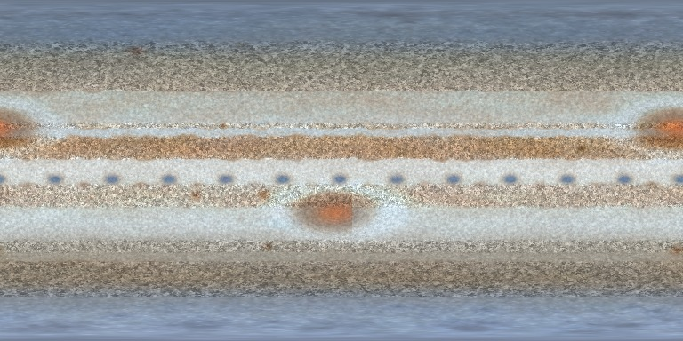 low &middot; 0</td><td align="center"> preset &middot; 150</td><td align="center">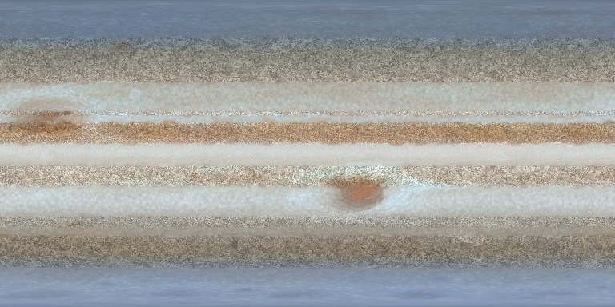 high &middot; 1000</td>
</tr></table>

### reference resolution

`sim.reference_resolution` &mdash; range **512 to 8192**, default **2048**, tier `restart`.

The sim resolution these settings were authored/tuned at; invariant scaling normalizes development to it. Only used when resolution_invariant is on (s == 1 at this resolution is a no-op).

<table><tr>
<td align="center">low &middot; 512 (not rendered)</td><td align="center"> preset &middot; 2048</td><td align="center">high &middot; 8192 (not rendered)</td>
</tr></table>

### resolution

`sim.resolution` &mdash; range **512 to 8192**, default **2048**, tier `restart`.

Sim grid width (2:1 equirect); 2048 interactive, 4096+ for final quality

_Passed to the Blender importer / controls the output file, not the texture appearance &mdash; no visual example._

### resolution invariant

`sim.resolution_invariant` &mdash; toggle (on/off), default **`False`**, tier `restart`.

Auto-scale time-axis settings so a sim tuned at a lower resolution develops similarly at higher resolution (iterate low, render high). Off = byte-identical. Scaling normalizes to reference_resolution. Fully effective for nudge-dominated presets; turbulence-dominated presets (strong vort_inject) improve only partially.

_Boolean toggle (GUI checkbox) &mdash; documented as text; no rendered example._

### Time step

`sim.dt_scale` &mdash; range **0.2 to 3**, default **1**, tier `restart`.

How far the flow moves per sim step. Higher = faster development but a coarser, less stable solve (time-step multiplier; peak jet displacement ~1.2 cells at 1.0)

<table><tr>
<td align="center">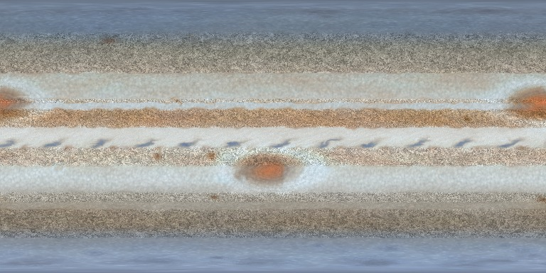 low &middot; 0.2</td><td align="center"> preset &middot; 1</td><td align="center">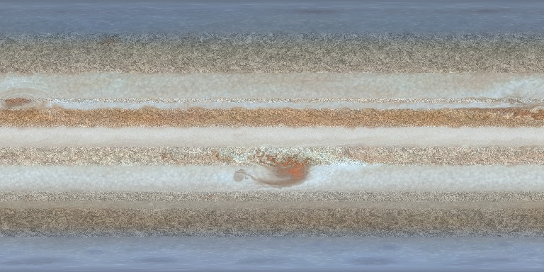 high &middot; 3</td>
</tr></table>

## Solver

### baro steps per update

`solver.baroclinic.baro_steps_per_update` &mdash; range **10 to 1000**, default **150**, tier `restart`.

Internal pacing of the baroclinic storm generator; leave at default (baroclinic steps per source refresh; fixed cadence, no rand)

_Passed to the Blender importer / controls the output file, not the texture appearance &mdash; no visual example._

### Churn placement

`solver.vort_inject_mask` &mdash; dropdown, one of `global` / `belts` / `shear`, default **`global`**, tier `restart`.

Where the injected churn is allowed to land. global = everywhere; belts = the cyclonic dark bands only, leaving the anticyclonic zones smooth; shear = the jet-shear flanks only, so filaments form where shear is high. The mask multiplies vort_inject per pixel and is NOT normalized by how much it covers, so a wider mask puts more total churn in at the same amplitude — belts lets through several times what shear does, so retune vort_inject DOWN when you widen it (spatial localization of eddy injection). Vorticity mode.

_Choice field (GUI dropdown) &mdash; documented as text; no rendered example._

### Churn scale

`solver.vort_inject_scale` &mdash; range **0.1 to 4**, default **0.5**, tier `restart`.

Size of the injected churn: higher = finer speckle that the shear folds into thin filaments; lower = big blobs (injection frequency as a multiple of bands.detail_freq; vorticity mode)

_Rendered against the `vorticity` solver baseline (inert under the default kinematic solver)._

<table><tr>
<td align="center">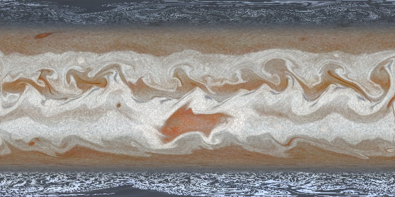 low &middot; 0.1</td><td align="center">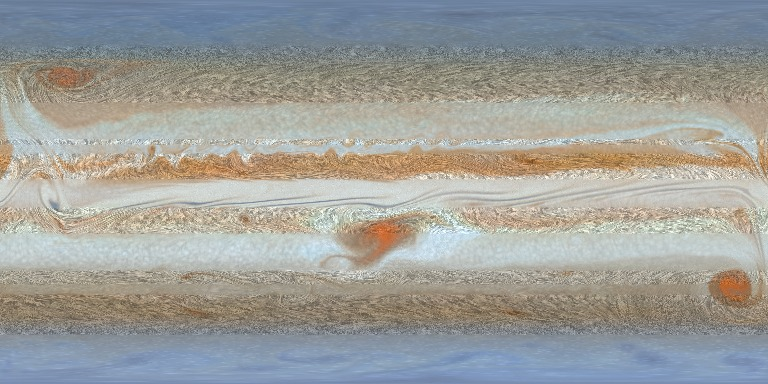 preset &middot; 2.5</td><td align="center">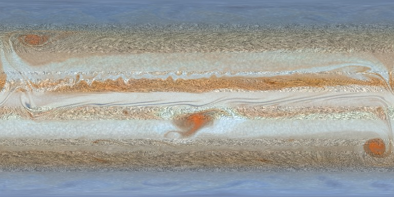 high &middot; 4</td>
</tr></table>

### Churn strength

`solver.vort_inject` &mdash; range **0 to 5**, default **0**, tier `restart`.

Feeds fresh churn into the flow every step, which the jet shear then folds into filaments. Higher = busier, more turbulent bands; 0 = off, and the jets stay smooth and east-west (broadband eddy-vorticity injection amplitude per step — the emergent-turbulence source). Vorticity mode.

_Rendered against the `vorticity` solver baseline (inert under the default kinematic solver)._

<table><tr>
<td align="center">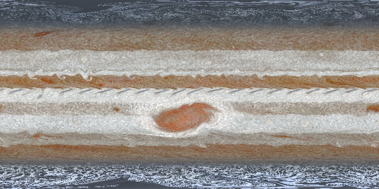 low &middot; 0</td><td align="center"> preset &middot; 1.8</td><td align="center">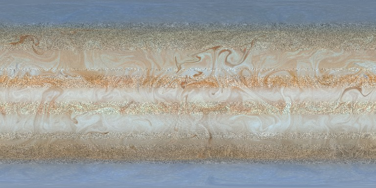 high &middot; 5</td>
</tr></table>

### Eddy brake (all scales, jets spared)

`solver.vort_eddy_drag` &mdash; range **0 to 0.3**, default **0**, tier `restart`.

Brake on everything that is not part of the east-west jets. It leaves the jets themselves intact, but damps mid-size features (festoons, band-edge waves) as hard as the gravest-mode planet-scale swirl, so the field over-flattens — prefer vort_psi_drag, which is scale-selective. 0 = off (byte-identical). Equirect only (linear drag fraction per step on the EDDY vorticity q - <q>_x, the deviation from the per-latitude zonal mean; FLAT in wavenumber). Vorticity mode.

<table><tr>
<td align="center"> preset &middot; 0</td><td align="center"> high &middot; 0.3</td>
</tr></table>

### enabled

`solver.baroclinic.enabled` &mdash; toggle (on/off), default **`False`**, tier `restart`.

Adds physically-grounded mid-latitude storms, grown by a baroclinic instability model, in addition to the hand-seeded ones. Off = plain v1.6; requires solver type=vorticity (injects the evolving baroclinic vorticity source into the solver). No rand: randomize() must never silently enable it.

_Boolean toggle (GUI checkbox) &mdash; documented as text; no rendered example._

### Fine smoothing

`solver.vort_hypervisc` &mdash; range **0 to 10**, default **1**, tier `restart`.

Fine-scale smoothing: cleans up pixel-level crackle; too high blurs away the thinnest filaments (scale-selective biharmonic hyperviscosity; vorticity mode)

_Rendered against the `vorticity` solver baseline (inert under the default kinematic solver)._

<table><tr>
<td align="center">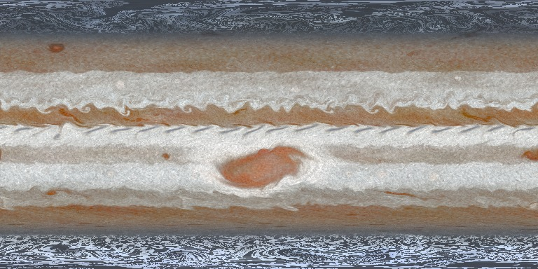 low &middot; 0</td><td align="center"> preset &middot; 0.6</td><td align="center">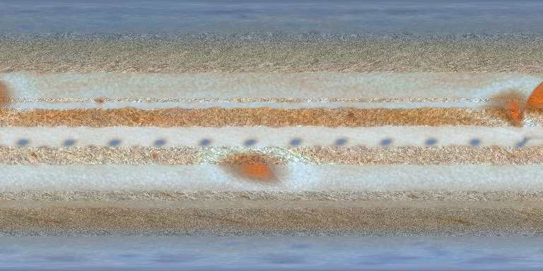 high &middot; 10</td>
</tr></table>

### Flow leash

`solver.vort_relax_tau` &mdash; range **20 to 2000**, default **120**, tier `restart`, log scale.

How tightly the flow is leashed to the painted jets and storms: low = tidy and band-locked, high = free-running turbulence that can wander off the template (nudging timescale in steps; vorticity mode)

_Rendered against the `vorticity` solver baseline (inert under the default kinematic solver)._

<table><tr>
<td align="center">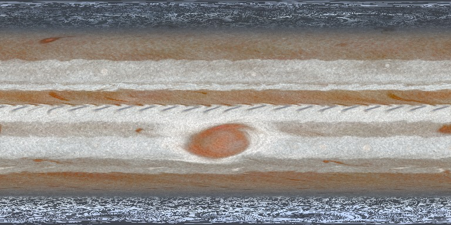 low &middot; 20</td><td align="center"> preset &middot; 600</td><td align="center">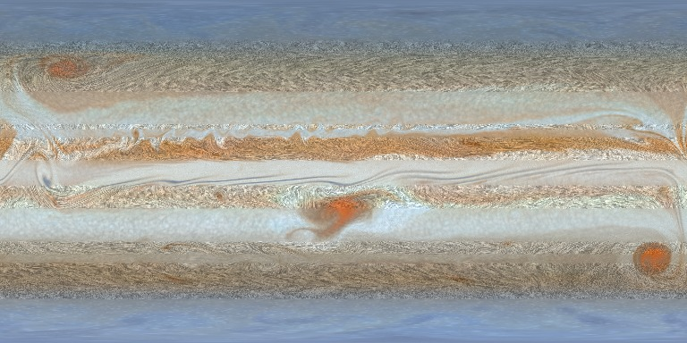 high &middot; 2000</td>
</tr></table>

### gain

`solver.baroclinic.gain` &mdash; range **0 to 8**, default **2**, tier `restart`.

Baroclinic source amplitude as a fraction of coriolis_f0 (~3). The source is injected into the Poisson RHS (NOT the vorticity state), so it is bounded (no accumulation) and coherent (never folded by advection -- it is read fresh from the source each step and never enters the advected q state), enriching mid-latitude belt texture. ~2 = subtle; high gain over-boils. No rand.

_Rendered against the `baroclinic` solver baseline (inert under the default kinematic solver)._

<table><tr>
<td align="center">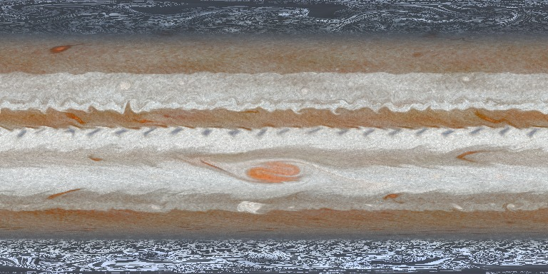 low &middot; 0</td><td align="center">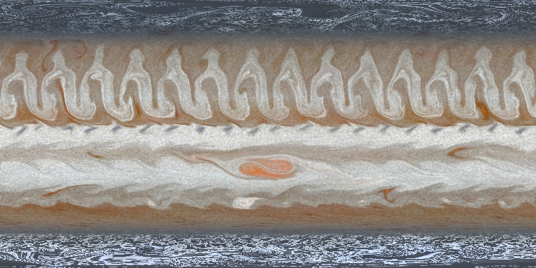 preset &middot; 2</td><td align="center">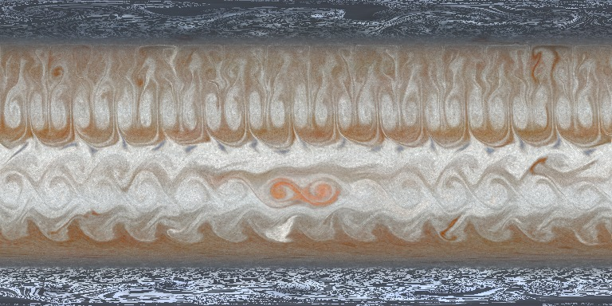 high &middot; 8</td>
</tr></table>

### Rotation strength

`solver.coriolis_f0` &mdash; range **0 to 20**, default **2**, tier `restart`.

Planet-rotation strength: higher = more, narrower bands and flatter storms; lower = fewer, fatter bands (f0 in f = f0*sin(lat), sets the Rhines/band scale; vorticity mode)

_Rendered against the `vorticity` solver baseline (inert under the default kinematic solver)._

<table><tr>
<td align="center">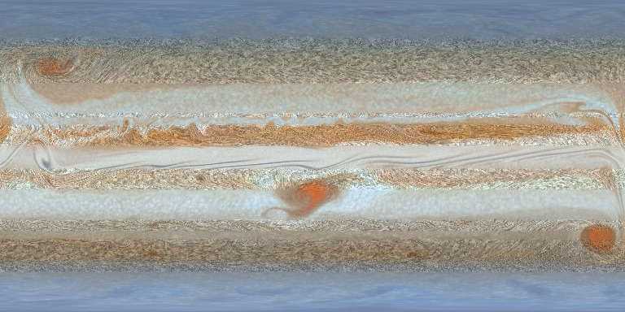 low &middot; 0</td><td align="center"> preset &middot; 3</td><td align="center">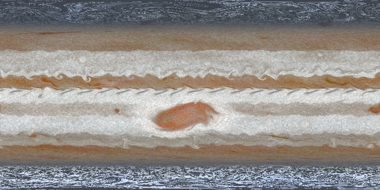 high &middot; 20</td>
</tr></table>

### Solver accuracy

`solver.poisson_iters` &mdash; range **8 to 512**, default **48**, tier `restart`.

Solver accuracy per step: too low leaves smeared, laggy swirls; higher is slower with diminishing returns (fixed red-black SOR iterations; vorticity mode)

_Passed to the Blender importer / controls the output file, not the texture appearance &mdash; no visual example._

### Solver convergence speed

`solver.sor_omega` &mdash; range **1 to 2**, default **1.7**, tier `restart`.

Solver convergence speed — leave at 1.7: it changes solve time, not the picture, unless set so low the swirls lag (SOR over-relaxation factor, must be in (1,2) exclusive; vorticity mode)

_Passed to the Blender importer / controls the output file, not the texture appearance &mdash; no visual example._

### Storm reach (0 = unlimited)

`solver.deformation_radius` &mdash; range **0 to 3.14**, default **0**, tier `restart`.

Storm locality — how far each vortex's swirl reaches. Smaller = more local — a dominant hero stirs its own band without destabilizing the rest of the map; 0 = off (infinite reach, plain 2D, byte-identical). Values in the (0, 0.05) rad band are rejected (degenerate solve). (Physics: Rossby deformation radius L_d in RADIANS, 1 rad = 57.3 deg; vorticity mode. Screens the inversion to (nabla^2 - 1/L_d^2)psi = omega — equivalent-barotropic / 1.5-layer reduced gravity — so induced velocity decays ~exp(-r/L_d) beyond L_d instead of the 2D ~1/r tail; real Jupiter has L_d << the GRS. With screening on, the advected q is equivalent-barotropic QGPV, so vortex/inject/relax strengths tuned for the plain 2D path read weaker and more localized -- expect to re-tune. No rand.)

<table><tr>
<td align="center"> preset &middot; 0</td><td align="center"> high &middot; 3.14</td>
</tr></table>

### Swirl brake (all scales)

`solver.vort_drag` &mdash; range **0 to 0.3**, default **0**, tier `restart`.

Global brake on swirling: tames runaway planet-scale swirl but also weakens every storm — prefer vort_psi_drag, which targets only the oversized swirl (linear Rayleigh drag fraction on relative vorticity per step, absorbing the 2D inverse-cascade pileup at large scales; 0 = off; vorticity mode)

_Rendered against the `vorticity` solver baseline (inert under the default kinematic solver)._

<table><tr>
<td align="center"> preset &middot; 0</td><td align="center">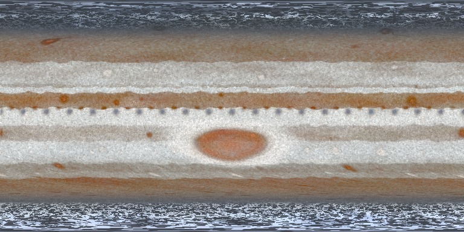 high &middot; 0.3</td>
</tr></table>

### Swirl brake (large only)

`solver.vort_psi_drag` &mdash; range **0 to 20**, default **0**, tier `restart`.

Removes oversized planet-scale swirl while PRESERVING festoons, band-edge waves, and mid-size vortices — the scale-selective brake to reach for before vort_drag or vort_eddy_drag. 0 = off (byte-identical). (Physics: large-scale hypofriction — a vorticity sink proportional to the EDDY STREAMFUNCTION psi - <psi>_x; because psi ~ omega/(k^2 + 1/L_d^2), the effective drag rate ~1/(k^2+1/L_d^2) hits the gravest-mode inverse-cascade swirl far harder than medium eddies, unlike the flat-in-k vort_eddy_drag. Reuses the screened-Poisson psi the solver already computes (one step stale); coefficient runs numerically larger than vort_eddy_drag since psi << omega. Equirect only. Vorticity mode.)

<table><tr>
<td align="center"> preset &middot; 0</td><td align="center"> high &middot; 20</td>
</tr></table>

### type

`solver.type` &mdash; dropdown, one of `kinematic` / `vorticity`, default **`kinematic`**, tier `restart`.

How clouds move: kinematic = fast and painterly, bands stay where they are painted (analytic streamfunction, v1.5); vorticity = a real fluid sim — storms interact and shed filaments, slower, and required by the solid-core storm levers (prognostic vorticity, v1.6+)

_Choice field (GUI dropdown) &mdash; documented as text; no rendered example._

### update every

`solver.baroclinic.update_every` &mdash; range **1 to 512**, default **32**, tier `restart`.

Internal pacing of the baroclinic storm generator; leave at default (main-solver steps between source refreshes; fixed cadence, no rand)

_Passed to the Blender importer / controls the output file, not the texture appearance &mdash; no visual example._

### warmup steps

`solver.baroclinic.warmup_steps` &mdash; range **500 to 20000**, default **8000**, tier `restart`.

Internal pacing of the baroclinic storm generator — leave at default; only affects how the extra mid-latitude storms mature (spin-up steps before coupling; fixed cadence, no rand; hi=20000 leaves headroom past the ~12500 lower-layer blow-up so tests can force it)

_Passed to the Blender importer / controls the output file, not the texture appearance &mdash; no visual example._

## Bands

### Band detail scale

`bands.detail_freq` &mdash; range **2 to 64**, default **12**, tier `restart`, log scale.

Size of the fine color mottling inside each band (the amount of it is bands.detail_amount). Higher = finer grain; lower = broader blotches (small-scale noise spatial frequency)

<table><tr>
<td align="center">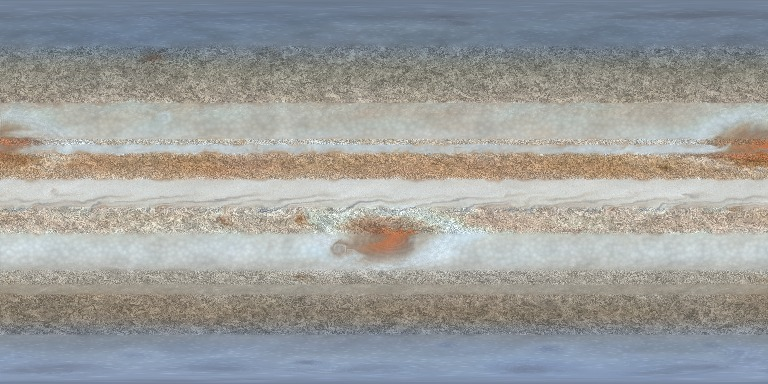 low &middot; 2</td><td align="center"> preset &middot; 14</td><td align="center">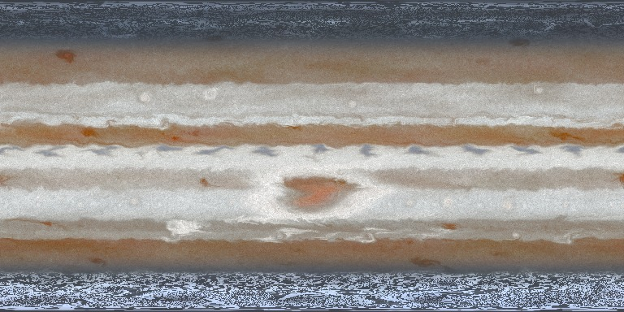 high &middot; 64</td>
</tr></table>

### Band meander scale

`bands.warp_freq` &mdash; range **0.5 to 16**, default **3**, tier `restart`, log scale.

How often the band boundaries wander as they wrap the planet. Higher = tighter, more frequent meanders (band-boundary meander spatial frequency)

<table><tr>
<td align="center">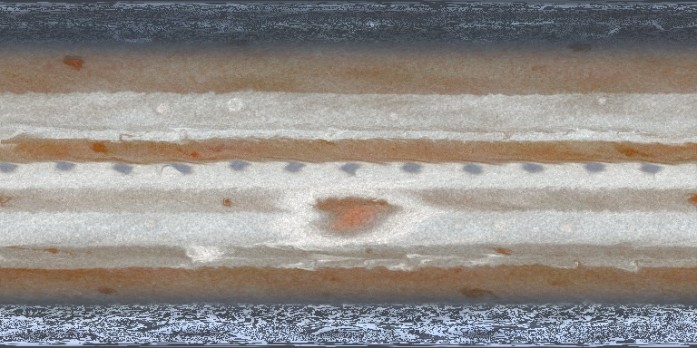 low &middot; 0.5</td><td align="center"> preset &middot; 3.5</td><td align="center">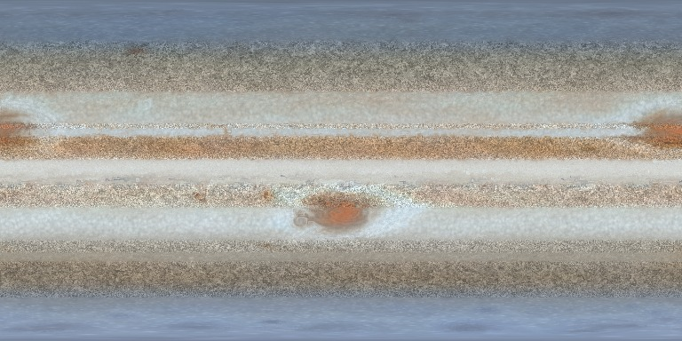 high &middot; 16</td>
</tr></table>

### belt fade

`bands.belt_fade` &mdash; range **0 to 1**, default **0**, tier `restart`.

Whole-belt fade (the SEB-fade epoch): blends the target band's stamped color toward the mean of its neighboring bands, all the way around the planet -- at 1.0 a faded belt reads as a pale ghost band at zone level. VISUAL only (recorded LIMIT): the belt keeps belt-like churn/dynamics and stays a storm host and outbreak candidate, which is the real SEB-fade phenomenology (revival outbreaks erupt IN the faded belt). Target band = faded_band_index, or the widest low/mid belt when that is unset. 0 = off (byte-identical)

<table><tr>
<td align="center"> preset &middot; 0</td><td align="center">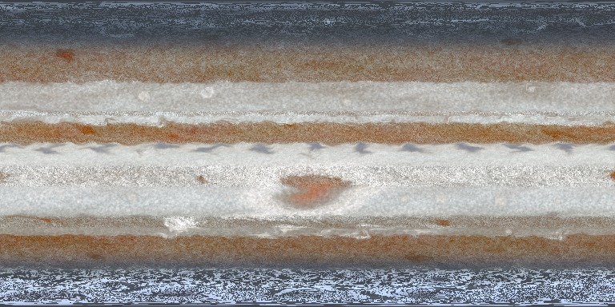 high &middot; 1</td>
</tr></table>

### contrast envelope

`bands.contrast_envelope` &mdash; range **0 to 1**, default **0**, tier `restart`.

Fades the banding out toward the poles, into mottled texture. Higher = a more complete fade; 0 = off, bands stay crisp all the way up. The latitude window is fixed, so this sets how far the fade goes, not how far down it reaches (contrast collapse poleward of ~45 deg — the real latitude-contrast profile)

<table><tr>
<td align="center">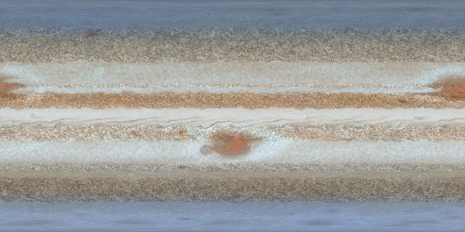 low &middot; 0</td><td align="center"> preset &middot; 0.25</td><td align="center">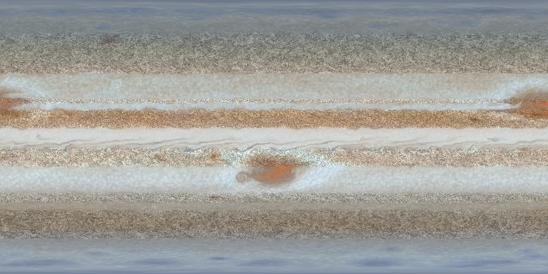 high &middot; 1</td>
</tr></table>

### count

`bands.count` &mdash; range **2 to 40**, default **14**, tier `restart`.

How many bands circle the planet from pole to pole, counting zones and belts together. Higher = narrower bands

<table><tr>
<td align="center"> low &middot; 2</td><td align="center"> preset &middot; 16</td><td align="center"> high &middot; 40</td>
</tr></table>

### detail amount

`bands.detail_amount` &mdash; range **0 to 0.5**, default **0.1**, tier `restart`.

How much fine color mottling breaks up each band. Higher = a grainier, less flat band; 0 = flat color (small-scale color-index noise amplitude)

<table><tr>
<td align="center"> low &middot; 0</td><td align="center"> preset &middot; 0.12</td><td align="center">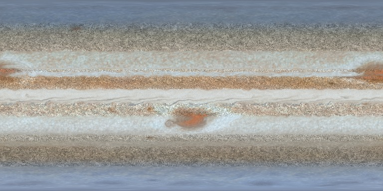 high &middot; 0.5</td>
</tr></table>

### edge diversity

`bands.edge_diversity` &mdash; range **0 to 1**, default **0**, tier `restart`.

Varies softness edge by edge, so some band edges are diffuse and some sharp. Higher = a wider spread of edge styles; 0 = off, every edge shares one softness (per-edge softness variation; uniform edges are a procedural tell)

<table><tr>
<td align="center">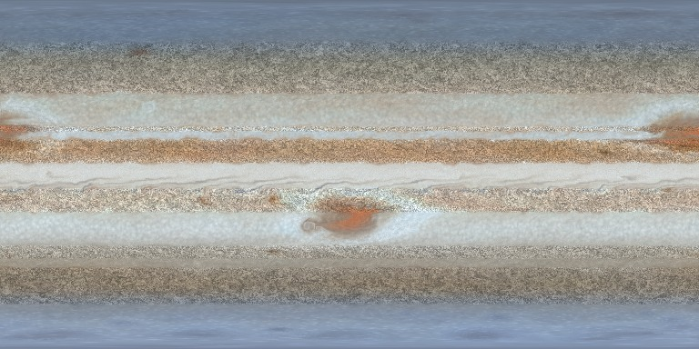 low &middot; 0</td><td align="center"> preset &middot; 0.55</td><td align="center"> high &middot; 1</td>
</tr></table>

### edge softness

`bands.edge_softness` &mdash; range **0.001 to 0.1**, default **0.012**, tier `restart`, log scale.

How sharply one band gives way to the next. Higher = softer, more diffuse edges; low = a hard line (half-width of the band-edge transition, in radians of latitude; 1 rad = 57.3 deg, and the default 0.012 rad is about 0.7 deg)

<table><tr>
<td align="center"> low &middot; 0.001</td><td align="center"> preset &middot; 0.012</td><td align="center">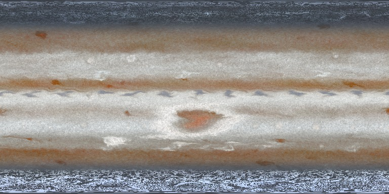 high &middot; 0.1</td>
</tr></table>

### faded band index

`bands.faded_band_index` &mdash; optional; pin range **0 to 39**, default **None (auto)**, tier `restart`.

Band targeted by belt_fade AND the faded_sector longitude window (index 0 = northernmost band). None = auto: the widest belt within ~52 deg of the equator -- note the shipped Jupiter template's SEB wins that pick by only 0.01 deg over the NEB, so set this explicitly when the target matters. Pointing it at a ZONE is allowed (the ochre-EZ recipe: the zone blends toward its belt neighbors). Validated against the band count

_Optional field: the GUI shows a **pin** checkbox &mdash; unpinned (None) keeps the automatic/seeded behavior, pinned uses the slider value verbatim. Documented as text; no rendered example._

### faded sector

`bands.faded_sector` &mdash; range **0 to 1**, default **0**, tier `restart`.

One belt gets a pale, desaturated sector spanning ~100 degrees of longitude. Higher = a more washed-out sector; 0 = off. Target band = faded_band_index, or the widest low/mid belt when that is unset (the SEB-fade epoch)

<table><tr>
<td align="center">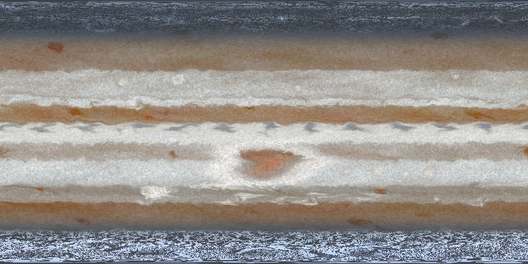 low &middot; 0</td><td align="center"> preset &middot; 0.55</td><td align="center">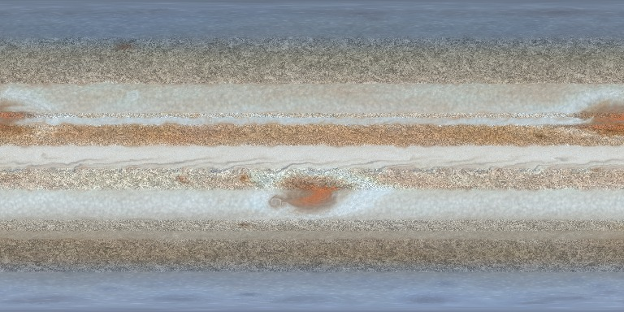 high &middot; 1</td>
</tr></table>

### hue jitter

`bands.hue_jitter` &mdash; range **0 to 0.15**, default **0**, tier `restart`.

Nudges each band's color along the palette, so neighbors do not share one hue. Higher = more variety band to band; 0 = off (per-band color-index offset — NEB-orange vs SEB-brown variation; seeded independently of the band layout)

<table><tr>
<td align="center"> low &middot; 0</td><td align="center"> preset &middot; 0.04</td><td align="center"> high &middot; 0.15</td>
</tr></table>

### lane density

`bands.lane_density` &mdash; range **0 to 1**, default **0**, tier `velocity`.

Thin dark lane lines running along the jet cores. Higher = more of them, though each lane's darkness is seeded and does not change; 0 = off (drawn analytically at derive time — a 1-3 px line cannot survive the sim grid)

<table><tr>
<td align="center"> preset &middot; 0</td><td align="center"> high &middot; 1</td>
</tr></table>

### value contrast

`bands.value_contrast` &mdash; range **0 to 2**, default **1**, tier `restart`.

How far apart the pale zones and dark belts sit in brightness. Higher = a bolder, higher-contrast planet; 1.0 = the palette's own separation (zone/belt brightness multiplier; inert on the band-template path)

<table><tr>
<td align="center"> low &middot; 0</td><td align="center"> preset &middot; 1.1</td><td align="center"> high &middot; 2</td>
</tr></table>

### variance amount

`bands.variance_amount` &mdash; range **0 to 0.3**, default **0**, tier `restart`.

Slow color drift along the length of each band. Higher = a band that lightens and darkens as it wraps the planet; 0 = off. For a hue-only drift at constant brightness use hue_variance (within-band longitudinal drift along the palette, varying slowly with longitude)

<table><tr>
<td align="center">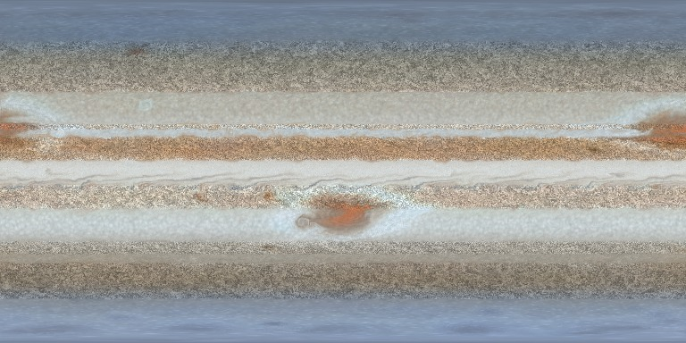 low &middot; 0</td><td align="center"> preset &middot; 0.18</td><td align="center">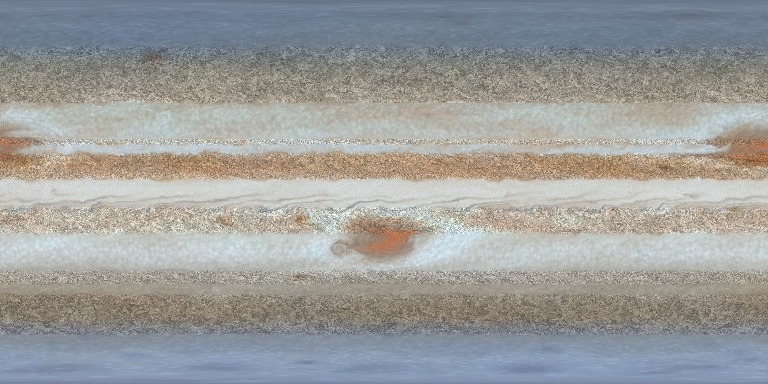 high &middot; 0.3</td>
</tr></table>

### warp amount

`bands.warp_amount` &mdash; range **0 to 0.3**, default **0.035**, tier `restart`.

How far the band boundaries wander north and south. Higher = wavier, less ruler-straight bands; 0 = perfectly straight (band-boundary meander amplitude, in radians of latitude; 1 rad = 57.3 deg, and the default 0.035 rad is about 2 deg)

<table><tr>
<td align="center">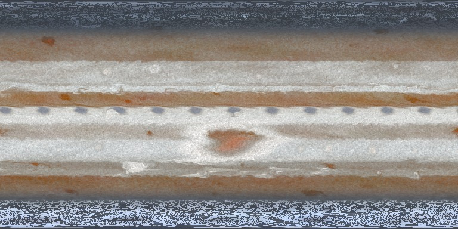 low &middot; 0</td><td align="center"> preset &middot; 0.04</td><td align="center">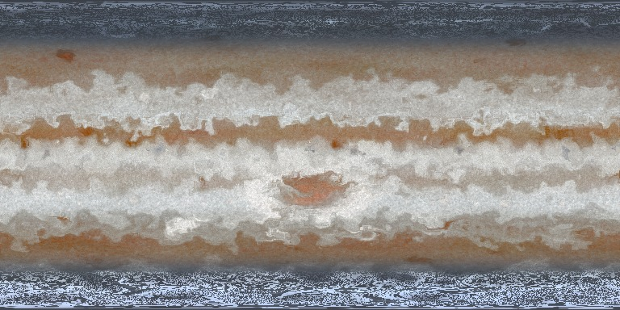 high &middot; 0.3</td>
</tr></table>

### width jitter

`bands.width_jitter` &mdash; range **0 to 1**, default **0.35**, tier `restart`.

How much the band widths vary from one another. Higher = a less regular, more natural mix of wide and narrow bands; 0 = every band the same size — equal-area, so the polar ones still read taller on a flat map (randomness of the band width distribution)

<table><tr>
<td align="center"> low &middot; 0</td><td align="center"> preset &middot; 0.4</td><td align="center"> high &middot; 1</td>
</tr></table>

### width tail

`bands.width_tail` &mdash; range **0 to 1**, default **0**, tier `restart`.

Pushes the band widths toward extremes, mixing very broad bands with thin ones. Higher = a more lopsided mix; 0 = off (a heavier-tailed width distribution — real maps mix very broad zones with thin strips)

<table><tr>
<td align="center"> low &middot; 0</td><td align="center"> preset &middot; 0.35</td><td align="center"> high &middot; 1</td>
</tr></table>

## Jets

### equatorial speed

`jets.equatorial_speed` &mdash; range **-3 to 4**, default **1.6**, tier `velocity`.

Peak speed of the equatorial jet. Higher = a faster, more sheared equator; negative = retrograde, flowing against the planet's rotation (the superrotation jet)

<table><tr>
<td align="center">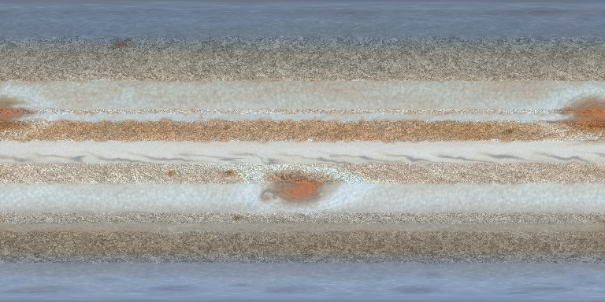 low &middot; -3</td><td align="center"> preset &middot; 1.6</td><td align="center">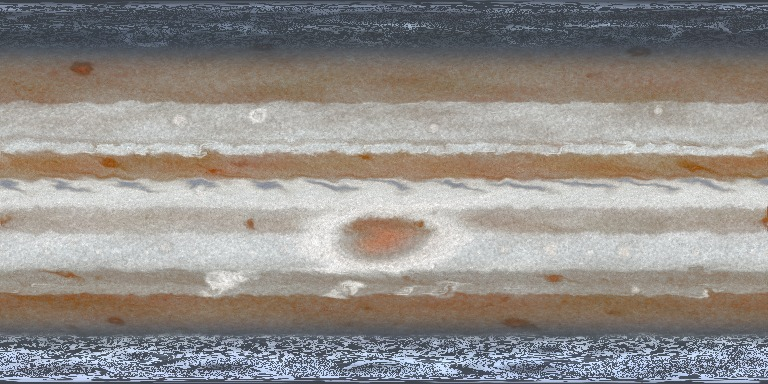 high &middot; 4</td>
</tr></table>

### equatorial width

`jets.equatorial_width` &mdash; range **0.03 to 0.4**, default **0.12**, tier `velocity`.

How far the equatorial jet spreads in latitude. Higher = a broader, gentler equator (jet half-width, in radians of latitude; 1 rad = 57.3 deg, and the default 0.12 rad is about 7 deg)

<table><tr>
<td align="center">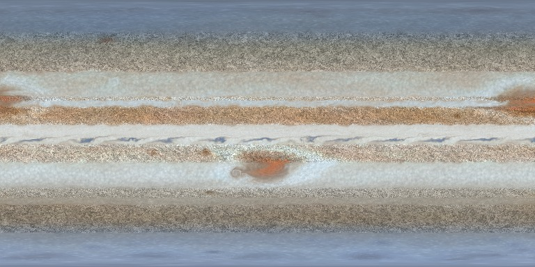 low &middot; 0.03</td><td align="center"> preset &middot; 0.12</td><td align="center">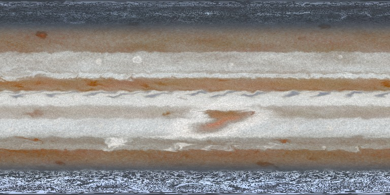 high &middot; 0.4</td>
</tr></table>

### hero bracket feather

`jets.hero_bracket_feather` &mdash; range **0.15 to 4**, default **1.4**, tier `restart`.

Smoothstep feather beyond the full window, in units of the hero core radius; a C1 (zero-derivative) taper so the carved jet adds no vorticity spike at the window edge

<table><tr>
<td align="center">low &middot; 0.15 (not rendered)</td><td align="center"> preset &middot; 1.4</td><td align="center">high &middot; 4 (not rendered)</td>
</tr></table>

### hero bracket north

`jets.hero_bracket_north` &mdash; range **-3 to 3**, default **0**, tier `restart`.

Carve-and-impose hero jet override: equatorward-flank jet strength (negative = westward, the anticyclone-seating sign). 0 = off, byte-identical. With hero_bracket_south, replaces the seeded band jets inside a feathered hero-centered window with an authored two-sided bracket; needs a pinned hero. 'north'/'south' name the flanks for the SOUTHERN-hemisphere GRS hero (the only one that ships): north = equatorward, south = poleward. Machinery lever -- not baked into any factory preset yet

<table><tr>
<td align="center">low &middot; -3 (not rendered)</td><td align="center"> preset &middot; 0</td><td align="center">high &middot; 3 (not rendered)</td>
</tr></table>

### hero bracket north offset

`jets.hero_bracket_north_offset` &mdash; range **0 to 4**, default **1**, tier `restart`.

Equatorward-flank jet center offset, in units of the hero CORE RADIUS (jet center latitude = hero_latitude + this * hero_radius). 1.0 puts the jet at the storm's edge; scales with hero_radius so the bracket keeps straddling the storm. KNOWN LIMITATION: lo=0 assumes a SOUTHERN hero (equatorward = +offset); a northern hero would need a negative offset (hemisphere-agnostic offsets deferred)

<table><tr>
<td align="center">low &middot; 0 (not rendered)</td><td align="center"> preset &middot; 1</td><td align="center">high &middot; 4 (not rendered)</td>
</tr></table>

### hero bracket north width

`jets.hero_bracket_north_width` &mdash; range **0.1 to 2**, default **0.8**, tier `restart`.

How wide the equatorward-flank jet spreads. Measured in units of the hero core radius, so it tracks storm size (gaussian half-width)

<table><tr>
<td align="center">low &middot; 0.1 (not rendered)</td><td align="center"> preset &middot; 0.8</td><td align="center">high &middot; 2 (not rendered)</td>
</tr></table>

### hero bracket south

`jets.hero_bracket_south` &mdash; range **-3 to 3**, default **0**, tier `restart`.

Carve-and-impose hero jet override: poleward-flank jet strength (positive = eastward, the anticyclone-seating sign). 0 = off, byte-identical

<table><tr>
<td align="center">low &middot; -3 (not rendered)</td><td align="center"> preset &middot; 0</td><td align="center">high &middot; 3 (not rendered)</td>
</tr></table>

### hero bracket south offset

`jets.hero_bracket_south_offset` &mdash; range **-4 to 0**, default **-1**, tier `restart`.

How far the poleward-flank jet sits from the storm center. Measured in units of the hero CORE RADIUS, so the bracket keeps straddling the storm as it is resized (jet center latitude = hero_latitude + this * hero_radius)

<table><tr>
<td align="center">low &middot; -4 (not rendered)</td><td align="center"> preset &middot; -1</td><td align="center">high &middot; 0 (not rendered)</td>
</tr></table>

### hero bracket south width

`jets.hero_bracket_south_width` &mdash; range **0.1 to 2**, default **0.8**, tier `restart`.

How wide the poleward-flank jet spreads. Measured in units of the hero core radius, so it tracks storm size (gaussian half-width)

<table><tr>
<td align="center">low &middot; 0.1 (not rendered)</td><td align="center"> preset &middot; 0.8</td><td align="center">high &middot; 2 (not rendered)</td>
</tr></table>

### hero bracket window

`jets.hero_bracket_window` &mdash; range **0 to 4**, default **1**, tier `restart`.

Full-override half-width, in units of the hero core radius: seeded jets are fully replaced within this many core radii of the hero

<table><tr>
<td align="center">low &middot; 0 (not rendered)</td><td align="center"> preset &middot; 1</td><td align="center">high &middot; 4 (not rendered)</td>
</tr></table>

### local jet latitude

`jets.local_jet_latitude` &mdash; range **-60 to 60**, default **-20**, tier `restart`.

Center latitude of the local zonal jet (degrees, north positive). Only used while local_jet_speed is nonzero

<table><tr>
<td align="center">low &middot; -60 (not rendered)</td><td align="center"> preset &middot; -20</td><td align="center">high &middot; 60 (not rendered)</td>
</tr></table>

### local jet speed

`jets.local_jet_speed` &mdash; range **-3 to 3**, default **0**, tier `restart`.

Extra local zonal jet, additive on top of the banded jet profile (0 = off, byte-identical). Negative = retrograde. Authors a westward SEBs-analog jet under an anticyclonic hero storm; the amplitude is applied PRE jets.strength and pre polar_fade (same convention as equatorial_speed), so the effective peak speed is speed * jets.strength -- a later jets.strength retune rescales it too. RESTART tier: the live-edit VELOCITY path rebuilds the jet profile without regenerating storms, which would flip the ambient shear sign under stale storm rotations

<table><tr>
<td align="center">low &middot; -3 (not rendered)</td><td align="center"> preset &middot; 0</td><td align="center">high &middot; 3 (not rendered)</td>
</tr></table>

### local jet width

`jets.local_jet_width` &mdash; range **0.01 to 0.3**, default **0.05**, tier `restart`.

Half-width of the local zonal jet, radians of latitude (1 rad = 57.3 deg; default 0.05 rad is about 2.9 deg). Only used while local_jet_speed is nonzero

<table><tr>
<td align="center">low &middot; 0.01 (not rendered)</td><td align="center"> preset &middot; 0.05</td><td align="center">high &middot; 0.3 (not rendered)</td>
</tr></table>

### polar decay

`jets.polar_decay` &mdash; range **0 to 1**, default **0.5**, tier `velocity`.

How much the jets weaken toward the poles. Higher = a calm, flat polar cap with the motion confined to low latitudes; 0 = no EXTRA weakening, though a separate polar fade always applies near the pole

<table><tr>
<td align="center">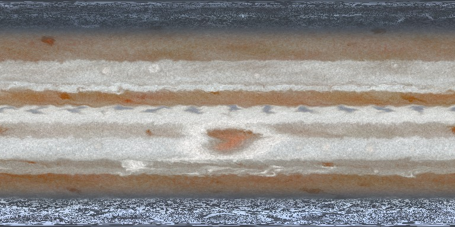 low &middot; 0</td><td align="center"> preset &middot; 0.5</td><td align="center">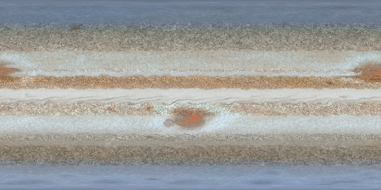 high &middot; 1</td>
</tr></table>

### strength

`jets.strength` &mdash; range **0 to 3**, default **1**, tier `velocity`.

Overall speed of every east-west jet. Higher = more shear, so the bands stretch and smear faster; 0 = no east-west jets, though storms and churn still move the clouds (global zonal jet speed multiplier)

<table><tr>
<td align="center">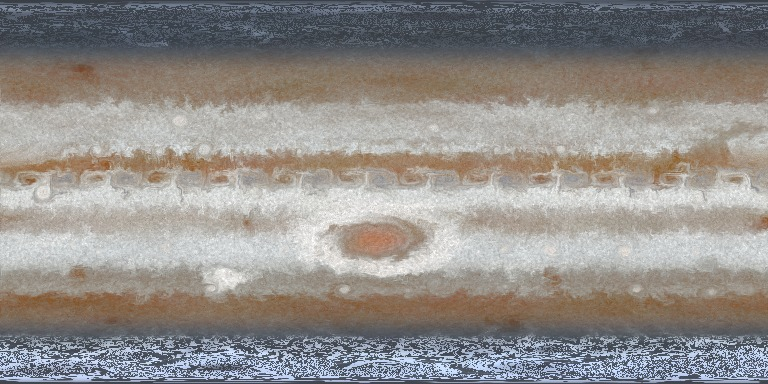 low &middot; 0</td><td align="center"> preset &middot; 1</td><td align="center">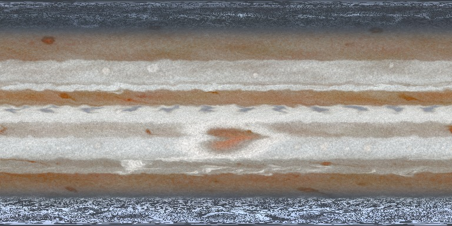 high &middot; 3</td>
</tr></table>

## Turbulence

### belt boost

`turbulence.belt_boost` &mdash; range **1 to 4**, default **1.6**, tier `velocity`.

Extra churn inside the dark belts only. Higher = the belts look rougher than the pale, calm zones; 1.0 = belts churn no differently from zones (turbulence multiplier for belts, which are cyclonic — spinning with the local planetary rotation — and are the storm-prone bands)

<table><tr>
<td align="center">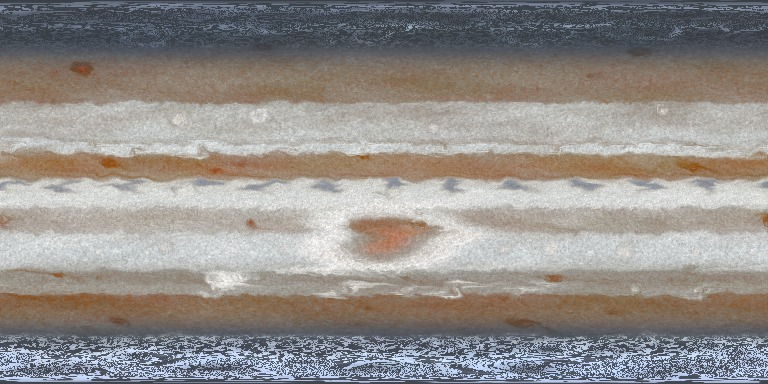 low &middot; 1</td><td align="center"> preset &middot; 1.6</td><td align="center">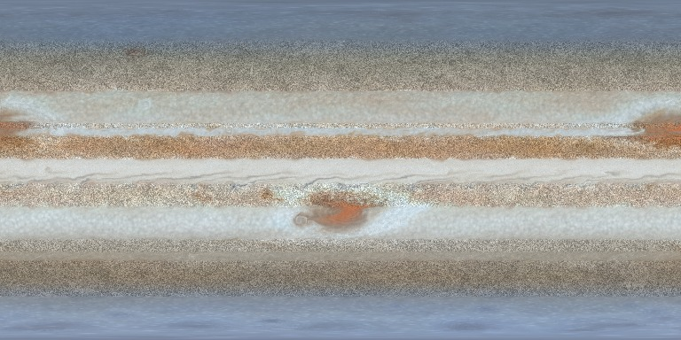 high &middot; 4</td>
</tr></table>

### belt replenish

`turbulence.belt_replenish` &mdash; range **0 to 0.08**, default **0**, tier `restart`.

Extra fine detail-noise fed to the belts alone per step, on top of replenish_rate, so belt texture keeps regenerating instead of smearing flat. Higher = more of it, so the belts read busier; 0 = off (belt_replenish_scale sets how fine it is)

<table><tr>
<td align="center">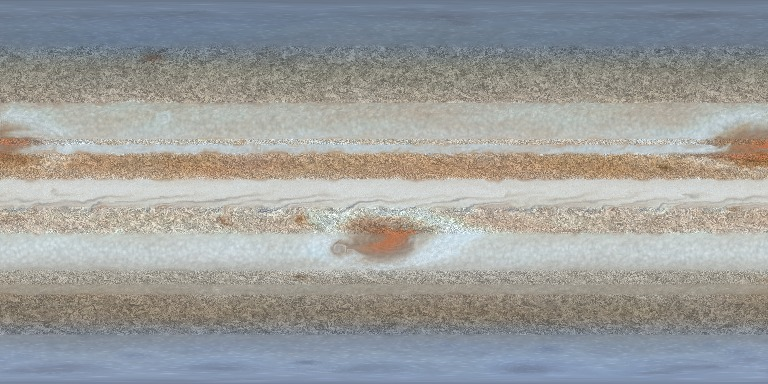 low &middot; 0</td><td align="center"> preset &middot; 0.07</td><td align="center">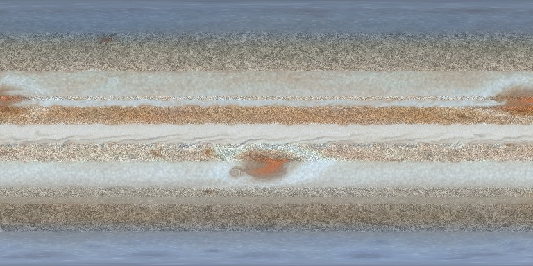 high &middot; 0.08</td>
</tr></table>

### belt replenish scale

`turbulence.belt_replenish_scale` &mdash; range **1 to 4**, default **2**, tier `restart`.

How fine that belt-only detail is next to the planet's base detail. Higher = finer filaments; 1.0 = the same size as everything else (belt replenishment frequency multiplier, relative to the base detail frequency; only bites when belt_replenish is above 0)

<table><tr>
<td align="center"> low &middot; 1</td><td align="center"> preset &middot; 2</td><td align="center">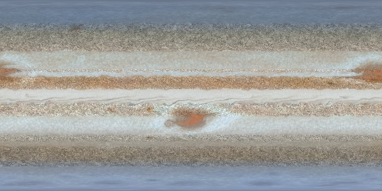 high &middot; 4</td>
</tr></table>

### Billow count

`turbulence.kh_wavenumber` &mdash; range **4 to 80**, default **24**, tier `velocity`.

How many billows fit around the planet along a band edge. Higher = more, tighter scallops (longitudinal wavenumber of the Kelvin-Helmholtz train)

<table><tr>
<td align="center">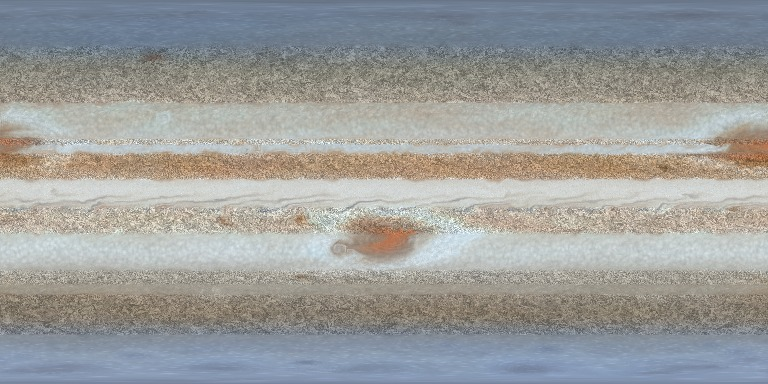 low &middot; 4</td><td align="center"> preset &middot; 24</td><td align="center">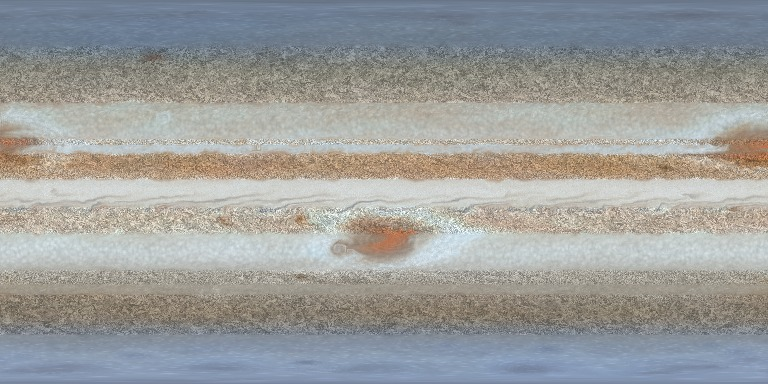 high &middot; 80</td>
</tr></table>

### Billow strength

`turbulence.kh_amplitude` &mdash; range **0 to 2**, default **0.35**, tier `velocity`.

How far a band edge billows where fast and slow jets meet. Higher = deeper scallops along the boundary; 0 = no billows, though the edge still meanders (see warp_amount) — Kelvin-Helmholtz wave amplitude along high-shear band boundaries

<table><tr>
<td align="center">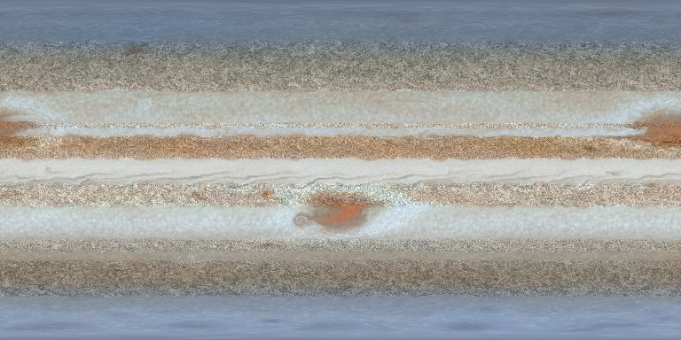 low &middot; 0</td><td align="center"> preset &middot; 0.6</td><td align="center">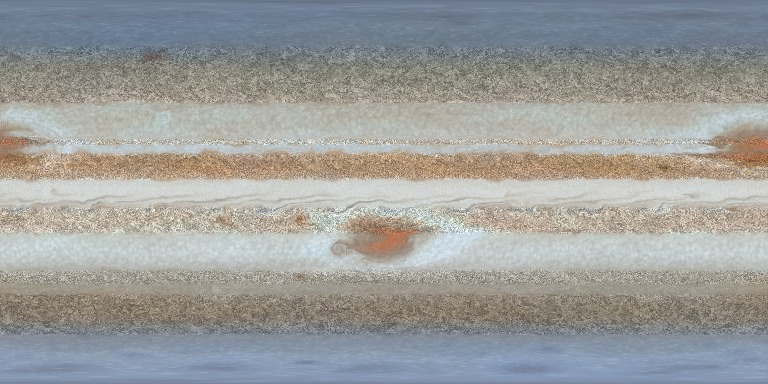 high &middot; 2</td>
</tr></table>

### evolution rate

`turbulence.evolution_rate` &mdash; range **0 to 0.1**, default **0.012**, tier `velocity`.

How fast the churn pattern reshuffles as the sim runs. Higher = the pattern never settles; 0 = a pattern frozen in place, which the clouds then drift through (per-step rate at which the turbulence decorrelates)

<table><tr>
<td align="center">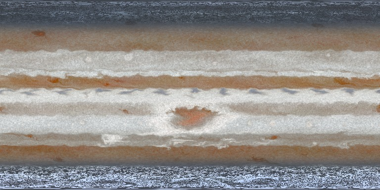 low &middot; 0</td><td align="center"> preset &middot; 0.012</td><td align="center">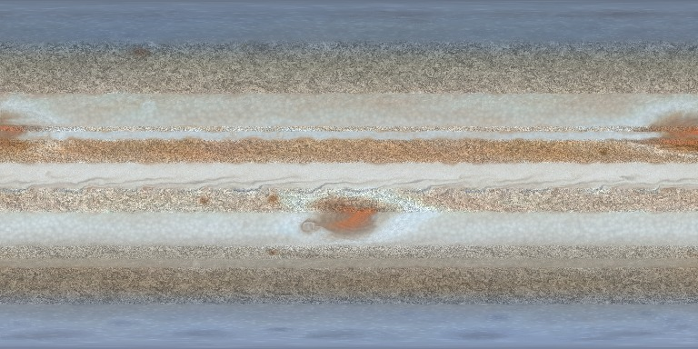 high &middot; 0.1</td>
</tr></table>

### intensity

`turbulence.intensity` &mdash; range **0 to 3**, default **1**, tier `velocity`.

Overall amount of churn everywhere on the planet. Higher = every band looks busier; 0 = no churn of its own, though band-edge billows and storms still stir the clouds (global turbulence amplitude, from curl noise)

<table><tr>
<td align="center">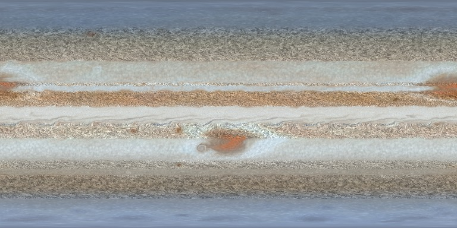 low &middot; 0</td><td align="center"> preset &middot; 1</td><td align="center">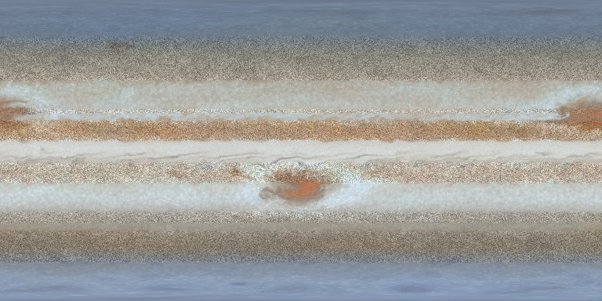 high &middot; 3</td>
</tr></table>

### replenish rate

`turbulence.replenish_rate` &mdash; range **0 to 0.5**, default **0.015**, tier `restart`.

Fresh detail-noise fed to the whole planet every step, so texture does not wash out as the flow stretches it. High values (~0.3) keep the quiet pale zone bands as detailed as the belts, which the east-west jets would otherwise smear away to ~half (blended into the detail tracer)

<table><tr>
<td align="center"> low &middot; 0</td><td align="center"> preset &middot; 0.35</td><td align="center">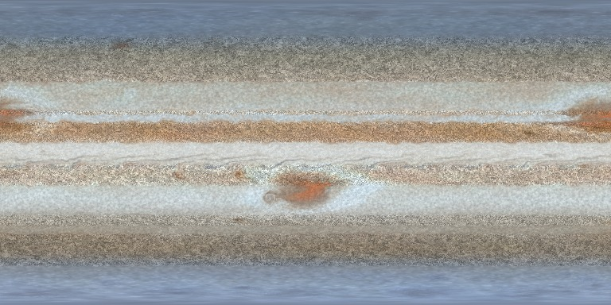 high &middot; 0.5</td>
</tr></table>

### scale

`turbulence.scale` &mdash; range **1 to 32**, default **6**, tier `velocity`, log scale.

Size of the churn features. Higher = smaller, busier stirring; lower = broad, coarse swirls (base spatial frequency of the turbulence noise)

<table><tr>
<td align="center">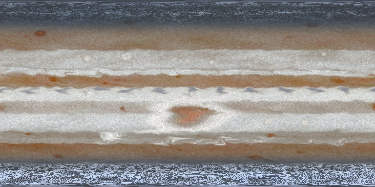 low &middot; 1</td><td align="center"> preset &middot; 6</td><td align="center">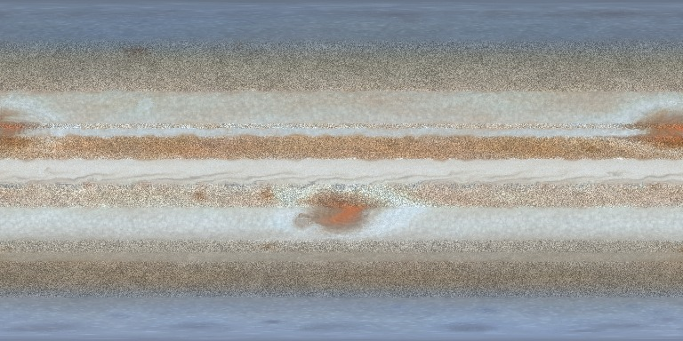 high &middot; 32</td>
</tr></table>

### shear coupling

`turbulence.shear_coupling` &mdash; range **0 to 3**, default **1**, tier `velocity`.

Extra churn where neighboring jets meet. Higher = band edges churn while band interiors stay calm; 0 = turbulence that ignores jet shear entirely (belt_boost still applies, so coverage is not perfectly even)

<table><tr>
<td align="center">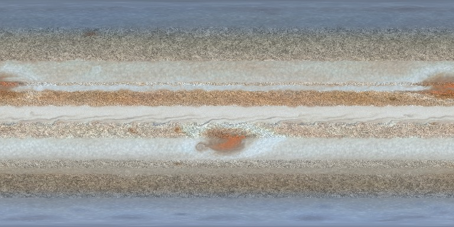 low &middot; 0</td><td align="center"> preset &middot; 1</td><td align="center"> high &middot; 3</td>
</tr></table>

### Turbulence leash

`turbulence.relax_tau` &mdash; range **50 to 2000**, default **350**, tier `restart`, log scale.

How hard the bands are pulled back to their painted look after the flow smears them. Higher = a longer leash, so churn stays visible for longer (relaxation time in steps, pulling band color and height back toward the stamp)

<table><tr>
<td align="center">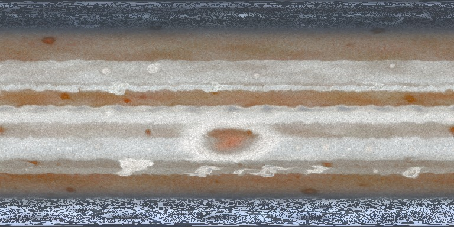 low &middot; 50</td><td align="center"> preset &middot; 350</td><td align="center">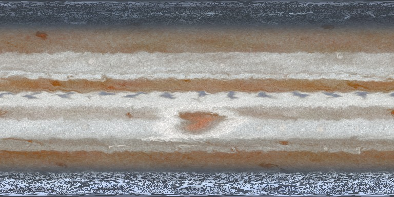 high &middot; 2000</td>
</tr></table>

## Storms

### accent aspect

`storms.accent_aspect` &mdash; range **1 to 5**, default **1**, tier `restart`.

Accent oval east-west elongation (lon:lat); 1.0 = round. Stretches the bright accent stamp into a wispy cirrus streak (Neptune bright-cloud / Scooter class) via the same generic aspect path as hero_aspect. 1.0 = round (byte-identical)

<table><tr>
<td align="center"> preset &middot; 1</td><td align="center"> high &middot; 5</td>
</tr></table>

### accent brightness

`storms.accent_brightness` &mdash; range **-0.5 to 0.5**, default **0.12**, tier `restart`.

Accent oval brightness (T0); negative = dark oval. Applied verbatim — accents bypass stamp_contrast

<table><tr>
<td align="center"> low &middot; -0.5</td><td align="center"> preset &middot; 0.12</td><td align="center"> high &middot; 0.5</td>
</tr></table>

### accent count

`storms.accent_count` &mdash; range **0 to 2**, default **0**, tier `restart`.

Places accent ovals — KIND_OVAL storms with an EXPLICIT color, the Oval BA 'second red spot' unlock (a red oval beside the white population). Seeded on their own substream after the population cap, so the base storm field is untouched; count=2 places a pair at offset longitudes with identical appearance. 0 = off (byte-identical)

<table><tr>
<td align="center"> preset &middot; 0</td><td align="center"> high &middot; 2</td>
</tr></table>

### accent latitude

`storms.accent_latitude` &mdash; optional; pin range **-55 to 55**, default **None (auto)**, tier `restart`.

Pin accent ovals to this latitude (degrees). None = seeded zone placement. Like hero_latitude, the effective range is radius-coupled (see validator) so the stamp stays clear of the 63 deg storm-free exchange band

_Optional field: the GUI shows a **pin** checkbox &mdash; unpinned (None) keeps the automatic/seeded behavior, pinned uses the slider value verbatim. Documented as text; no rendered example._

### accent longitude

`storms.accent_longitude` &mdash; optional; pin range **-180 to 180**, default **None (auto)**, tier `restart`.

Pin the accent ovals' RENDERED longitude (degrees, -180..180). Unpinned (None) = seeded Poisson-disc placement. The value is the end-of-run longitude of the FIRST accent: the generator inverse-compensates the shared zonal drift so it lands where you asked, and a count=2 pair is offset a fixed step (0.6 rad) downstream of it. Accents that get caught in a merger deviate (a recorded caveat)

_Optional field: the GUI shows a **pin** checkbox &mdash; unpinned (None) keeps the automatic/seeded behavior, pinned uses the slider value verbatim. Documented as text; no rendered example._

### accent radius

`storms.accent_radius` &mdash; range **0.02 to 0.12**, default **0.05**, tier `restart`.

Accent oval core radius (radians of arc; 1 rad = 57.3 deg, so default 0.05 ~ 2.9 deg). Default 0.05 sits above the 0.035 solid-body threshold (OVAL_SOLID_MIN_R in vortex_omega.glsl), so oval_solid_core>0 keeps accents coherent in vorticity mode; below 0.035 they stay Gaussian and can wind into eddies over a long dev run (F07)

<table><tr>
<td align="center"> low &middot; 0.02</td><td align="center"> preset &middot; 0.05</td><td align="center"> high &middot; 0.12</td>
</tr></table>

### accent tint

`storms.accent_tint` &mdash; range **-1 to 1**, default **0.9**, tier `restart`.

Accent oval tint (T3): positive = warm/red end of the storm_tints gradient (Oval BA red), negative = cool. Applied verbatim — accents bypass stamp_contrast/stamp_tint_contrast

<table><tr>
<td align="center"> low &middot; -1</td><td align="center"> preset &middot; 0.9</td><td align="center"> high &middot; 1</td>
</tr></table>

### barge density

`storms.barge_density` &mdash; range **0 to 3**, default **1**, tier `restart`.

How many brown barges populate the belts. Higher = more of these dark elongated cyclones; 0 = none (brown-barge cyclone population multiplier)

<table><tr>
<td align="center">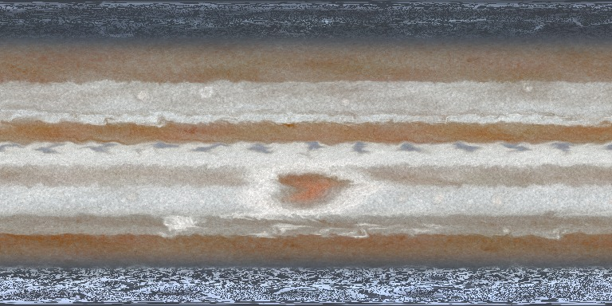 low &middot; 0</td><td align="center"> preset &middot; 2.989</td><td align="center"> high &middot; 3</td>
</tr></table>

### cast

`storms.cast` &mdash; list editor, default **empty list**, tier `restart`.

Cast list — storms placed by hand: kind, rendered position, size, and optional color. Each entry is stamped verbatim after the seeded populations, exempt from the population cap and runtime mergers, so a director's storm survives the whole run where it was placed. Empty (the default) = no cast, byte-identical to the seeded-only field. Capped at 16 entries

_List of hand-placed sub-records edited in a dedicated GUI panel &mdash; documented as text; no rendered example._

### companion aspect

`storms.companion_aspect` &mdash; range **1 to 5**, default **1**, tier `restart`.

East-west elongation (lon:lat) of the bright companion clouds; 1.0 = round. Stretches each KIND_PEARL companion into a wispy cirrus streak beside the hero (real Neptune's GDS companion clouds are sheared streaks, not round dots), via the same generic aspect path as hero_aspect. 1.0 = round (byte-identical)

<table><tr>
<td align="center"> preset &middot; 1</td><td align="center"> high &middot; 5</td>
</tr></table>

### companion brightness

`storms.companion_brightness` &mdash; range **0 to 0.8**, default **0.32**, tier `restart`.

T0 brightness of the hero companion clouds. 0.32 = the pre-lever constant (byte-identical). Reference flank clouds are among the brightest pixels in the GRS neighborhood — on a pale-moat placement the default reads as a faint smudge

<table><tr>
<td align="center">low &middot; 0 (not rendered)</td><td align="center"> preset &middot; 0.32</td><td align="center">high &middot; 0.8 (not rendered)</td>
</tr></table>

### hero aspect

`storms.hero_aspect` &mdash; range **1 to 3**, default **1**, tier `restart`.

Hero storm lon:lat elongation (real GRS ~2:1); 1.0 = round. Stretches the stamp, perimeter ring, collar, spiral lanes and detail mask along longitude. Wake across-width and merge capture stay isotropic (recorded LIMITs)

<table><tr>
<td align="center">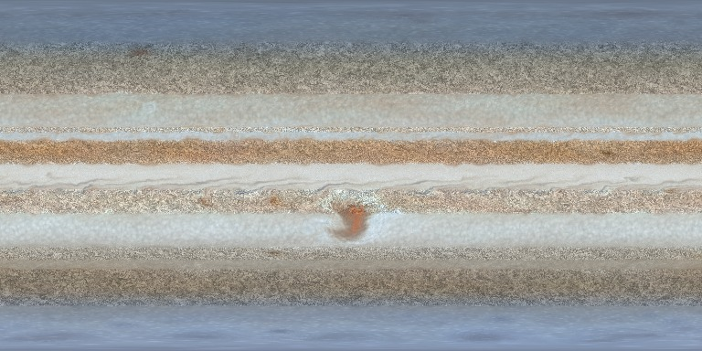 low &middot; 1</td><td align="center"> preset &middot; 2</td><td align="center">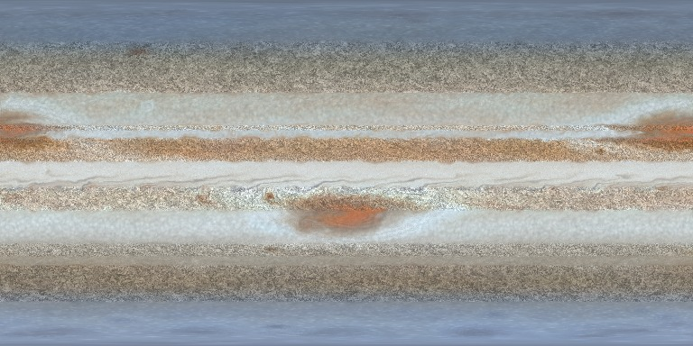 high &middot; 3</td>
</tr></table>

### hero brightness

`storms.hero_brightness` &mdash; range **-0.5 to 0.5**, default **0.05**, tier `restart`.

Hero storm brightness (T0) stamped at generation. 0.05 = the previously hardwired GRS value (byte-identical default). NEGATIVE = dark storm — the Neptune Great-Dark-Spot one-slider (barges use -0.28, polar vortices -0.22, so dark stamps are a supported axis). Exempt from stamp_contrast (KIND_HERO exclusion)

<table><tr>
<td align="center">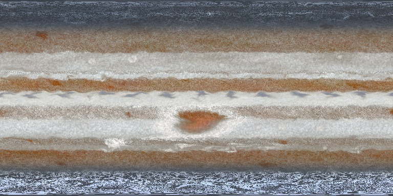 low &middot; -0.5</td><td align="center"> preset &middot; 0.05</td><td align="center">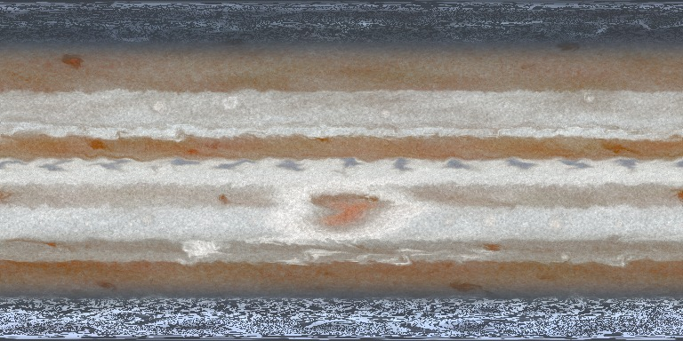 high &middot; 0.5</td>
</tr></table>

### hero companions

`storms.hero_companions` &mdash; range **0 to 3**, default **0**, tier `restart`.

Bright companion clouds pinned beside each hero storm (Neptune GDS companion / Scooter class): KIND_PEARL stamps offset a few core radii from the hero on its wake-free flank, seeded on their own substream after the population cap. 0 = off (byte-identical)

<table><tr>
<td align="center"> preset &middot; 0</td><td align="center"> high &middot; 3</td>
</tr></table>

### hero count

`storms.hero_count` &mdash; range **0 to 3**, default **1**, tier `restart`.

How many Great Red Spot (GRS) class storms to place. These are the giant, planet-dominating bright/red oval anticyclones; 0 = none (each co-rotates with the local ambient shear vorticity of the zone it sits in, which is what lets it persist against differential shear instead of getting torn apart)

<table><tr>
<td align="center">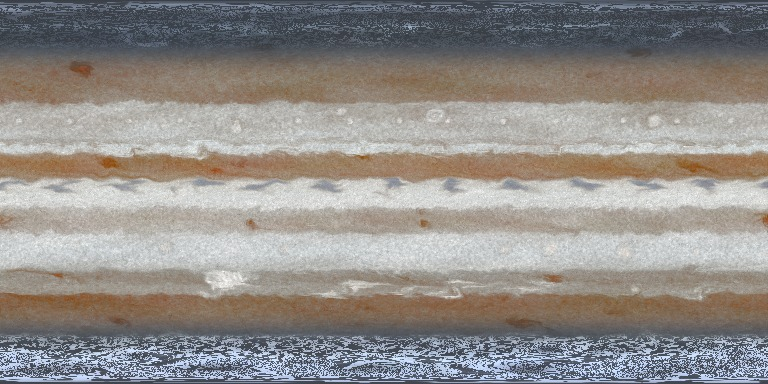 low &middot; 0</td><td align="center"> preset &middot; 1</td><td align="center">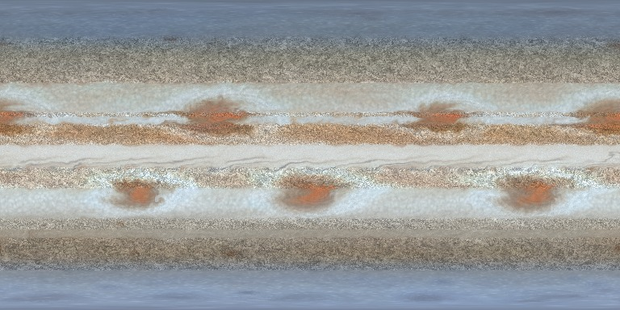 high &middot; 3</td>
</tr></table>

### hero emergence

`storms.hero_emergence` &mdash; range **0 to 1**, default **0**, tier `restart`.

GRS-realism pack for hero storms (Juno/Voyager-anchored). Morphs the hero from a soft stamped whirlpool to the real storm architecture: (1) the vorticity becomes an ANNULAR RING — the ~430 km/h winds live at the periphery while the interior is stagnant, so the quiescent core HOLDS its fill instead of winding into a dark-eye pinwheel — wrapped in a partial opposite-signed shield skirt so the ring's net circulation cannot wind the far neighborhood into a pinwheel; (2) the tint/brightness stamp becomes a FILLED PLATEAU (the GRS is a near-uniform red oval, not a Gaussian stain); (3) the prognostic core is ANCHORED to the registry position so the red fill lands on the visible vortex; (4) tracer relaxation fades in the ring band — the ring's shear folds a ragged, filament-shedding boundary that exchanges material with the jets — and BOOSTS in the outer annulus so the bands re-assert parallel within ~2 spot radii; (5) the render detail layer goes QUIET over the spot (the real interior is smooth tonal fields with faint wisps, not loud churn). Vorticity-mode levers (1)(3) need solver.type=vorticity; the rest act in both modes. Hero-local (nothing beyond ~3.6 hero radii is touched; the visible oval edge sits AT hero_radius). 0 = legacy stamped hero (byte-identical, every path is compiled out)

<table><tr>
<td align="center"> preset &middot; 0</td><td align="center">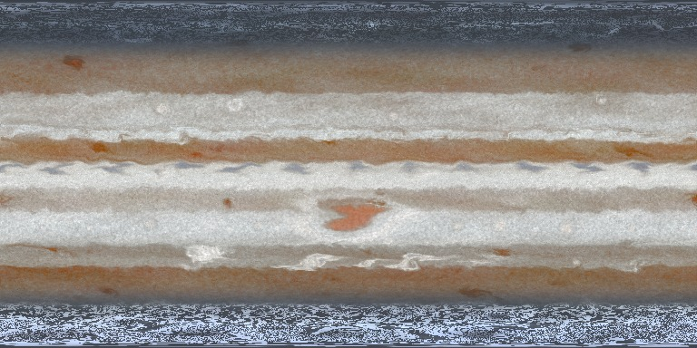 high &middot; 1</td>
</tr></table>

### hero flow aspect

`storms.hero_flow_aspect` &mdash; range **1 to 2.5**, default **1**, tier `restart`.

Flow-field elongation multiplier over hero_aspect: the streamfunction the vorticity ring induces is intrinsically rounder than the ring (Poisson low-pass), so the developed storm reads rounder than authored; >1 widens only the FLOW's east-west footprint. Calibration verdict: raising this stretches the pale ENVELOPE while the interior erasure machinery (still sized to the anatomy) dilutes the red core — for a more elongated STORM raise hero_aspect itself. Vorticity mode only; inert in kinematic mode, and wherever a hero's EFFECTIVE emergence or solid_core is 0 (either global, or that storm's own override)

<table><tr>
<td align="center"> preset &middot; 1</td><td align="center">high &middot; 2.5 (not rendered)</td>
</tr></table>

### hero latitude

`storms.hero_latitude` &mdash; optional; pin range **-55 to 55**, default **None (auto)**, tier `restart`.

Pin the hero storm to this latitude (degrees; the 'pin' checkbox toggles it). Unpinned (None) = seeded tropical-zone placement. The effective range is further limited by hero_radius (see validator) so the stamp stays clear of the 63 deg exchange band

_Optional field: the GUI shows a **pin** checkbox &mdash; unpinned (None) keeps the automatic/seeded behavior, pinned uses the slider value verbatim. Documented as text; no rendered example._

### hero longitude

`storms.hero_longitude` &mdash; optional; pin range **-180 to 180**, default **None (auto)**, tier `restart`.

Pin the hero storm's RENDERED longitude (degrees, -180..180; the 'pin' checkbox toggles it). Unpinned (None) = seeded placement. The value is the end-of-run longitude, not the seed: the generator inverse-compensates the storm's eastward zonal drift over the whole development run so the spot lands where you asked when the snapshot is taken. A hero that merges with or absorbs another storm deviates (a recorded caveat)

_Optional field: the GUI shows a **pin** checkbox &mdash; unpinned (None) keeps the automatic/seeded behavior, pinned uses the slider value verbatim. Documented as text; no rendered example._

### hero mottle

`storms.hero_mottle` &mdash; range **0 to 1**, default **0**, tier `restart`.

Turbulent interior churn inside hero storms: a flow-scale fbm breaks up the smooth Gaussian core so the spot reads as churning cloud, not an airbrushed blob. Windowed to the interior so the perimeter ring/collar stay clean; stamped into the relaxation target so the solver folds it into filaments. 0 = smooth v1 core (byte-identical)

<table><tr>
<td align="center"> preset &middot; 0</td><td align="center"> high &middot; 1</td>
</tr></table>

### hero radius

`storms.hero_radius` &mdash; range **0.03 to 0.25**, default **0.1**, tier `restart`.

How big the hero storm's core is. Higher = a larger spot, and the hero jet bracket scales with it (hero vortex core radius, in radians of arc; 1 rad = 57.3 deg, and the default 0.10 rad is about 5.7 deg — GRS-scale)

<table><tr>
<td align="center">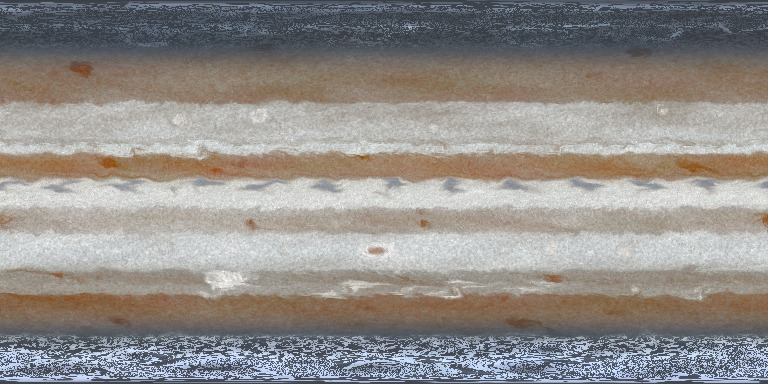 low &middot; 0.03</td><td align="center"> preset &middot; 0.15</td><td align="center">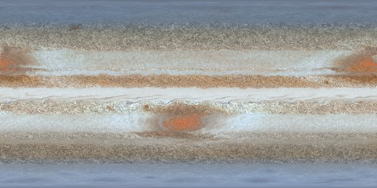 high &middot; 0.25</td>
</tr></table>

### hero rim tint

`storms.hero_rim_tint` &mdash; range **0 to 1**, default **0**, tier `restart`.

Dark reddish collar (the GRS 'Red Spot Hollow' rim): the perimeter currently only darkens; this reddens (raises the warm-red tint) and darkens the perimeter annulus so the oval reads as a discrete vortex with a dark-red rim rather than a soft stain on the band. 0 = no rim tint (byte-identical)

<table><tr>
<td align="center"> preset &middot; 0</td><td align="center">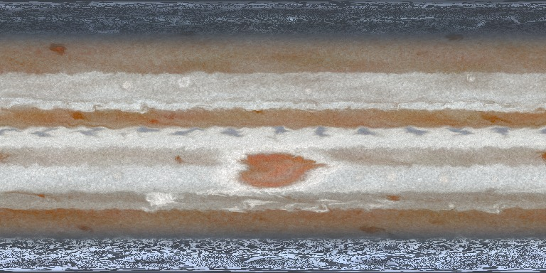 high &middot; 1</td>
</tr></table>

### hero rim warp

`storms.hero_rim_warp` &mdash; range **0 to 1**, default **0**, tier `restart`.

Lumpy-oval boundary: warps the hero's dark perimeter ring + bright collar with a low-azimuthal-wavenumber (few-lobe) per-hero perturbation, so the spot edge reads as a naturally irregular oval instead of a flawless azimuthally-symmetric ring (the 'over-regular' look). Scale-invariant lobes (not pixel-frequency noise) so it holds up at full-disk and close-up; rim and collar warp independently. 0 = perfect oval (byte-identical, the fbm is never evaluated)

<table><tr>
<td align="center"> preset &middot; 0</td><td align="center">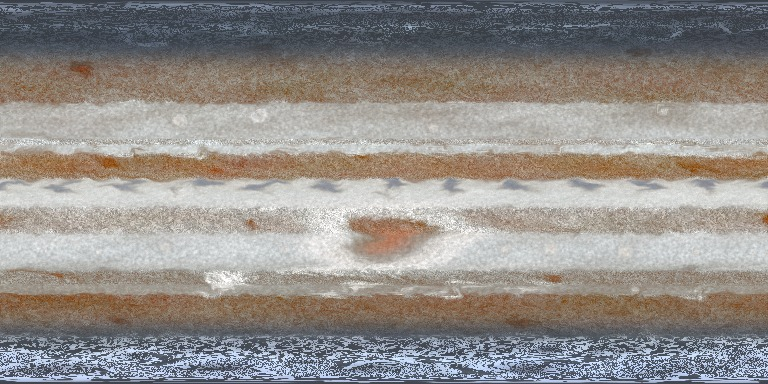 high &middot; 1</td>
</tr></table>

### hero shape

`storms.hero_shape` &mdash; range **0 to 1.5**, default **1**, tier `restart`.

Low-order deformation of the hero's outline away from a perfect ellipse: equatorward flattening (the belt presses the rim flat) plus seeded lobes so aspect and curvature drift around the arc. 0 = exact analytic oval, 1 = the calibrated GRS egg (the ships-at-1.0 exception to the default=off lever convention: the deformation is part of the emergence pack's calibration; the OFF state is 0). Rides the emergence variant — inert wherever a hero's EFFECTIVE emergence is 0 (the global, or that storm's own storms.cast[].emergence override). Past ~1.4 the ragged-release band drifts onto the bright annulus

<table><tr>
<td align="center">low &middot; 0 (not rendered)</td><td align="center"> preset &middot; 1</td><td align="center">high &middot; 1.5 (not rendered)</td>
</tr></table>

### hero shape seed

`storms.hero_shape_seed` &mdash; range **0 to 99999**, default **0**, tier `restart`.

Re-rolls the hero's seeded shape lobes. Change it to try a different silhouette; it runs on its own substream of the master seed, so changing it never perturbs any other seeded draw

<table><tr>
<td align="center"> preset &middot; 0</td><td align="center">high &middot; 99999 (not rendered)</td>
</tr></table>

### hero solid core

`storms.hero_solid_core` &mdash; range **0 to 1**, default **0**, tier `restart`.

Solid-body hero rotation (vorticity mode): blends the hero's vorticity from the Gaussian profile (center-peaked -> differential rotation -> the interior winds into a center-draining whirlpool) toward a near-uniform vorticity patch (rigid solid-body interior rotation -> a coherent GRS-like oval with spiral arms only OUTSIDE it). 0 = Gaussian (byte-identical); 1 = full patch. Pairs with a larger hero_radius and lower hero_strength.

<table><tr>
<td align="center"> preset &middot; 0</td><td align="center"> high &middot; 1</td>
</tr></table>

### hero strength

`storms.hero_strength` &mdash; range **0.2 to 3**, default **1**, tier `restart`.

How strongly the hero storm spins. Higher = a tighter, faster-whirling spot; the slider bottoms out at 0.2, so the hero always carries some circulation (GRS-class hero storm vorticity amplitude)

<table><tr>
<td align="center">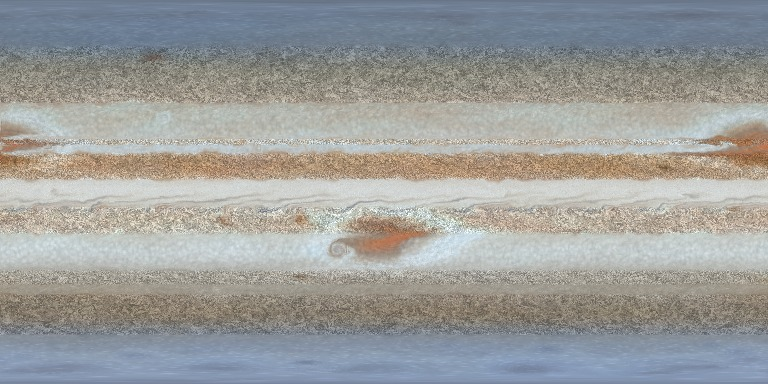 low &middot; 0.2</td><td align="center"> preset &middot; 1</td><td align="center">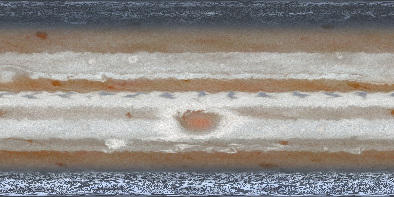 high &middot; 3</td>
</tr></table>

### hero taper

`storms.hero_taper` &mdash; range **0 to 1.5**, default **0**, tier `restart`.

Upstream-end wedge taper: the reference GRS's boundary converges toward a point on the side the flow arrives from (measured 20-40% of local radius), while the wake end stays blunt. Higher = a sharper wedge; 0 = off. Deterministic (no seed), follows hero_wake_dir, deepest at ~35 deg off the upstream tip in the aspect-squashed frame (physically closer to the tip on an elongated hero — ~14 deg at aspect 2.9); the tip, the flanks and the whole downstream half are untouched. Inert wherever a hero's EFFECTIVE emergence is 0 (the global, or that storm's own override)

<table><tr>
<td align="center"> preset &middot; 0</td><td align="center">high &middot; 1.5 (not rendered)</td>
</tr></table>

### hero tint

`storms.hero_tint` &mdash; range **-1 to 1**, default **0.9**, tier `restart`.

Hero storm tint (T3) stamped at generation: positive pulls toward the warm/red end of the storm_tints gradient, negative toward the cool end. 0.9 = the previously hardwired GRS red (byte-identical default). Capped at 1.0: the storm-tint LUT lookup clamps at the sampler edge (derive.comp indexes it at (T3+1)/2 clamped to [0,1]), so values past 1.0 saturate and buy nothing. Exempt from stamp_contrast (KIND_HERO exclusion)

<table><tr>
<td align="center">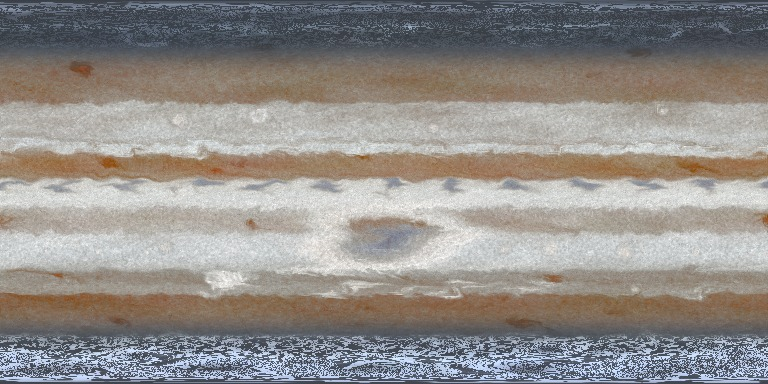 low &middot; -1</td><td align="center"> preset &middot; 0.9</td><td align="center"> high &middot; 1</td>
</tr></table>

### hero tint var

`storms.hero_tint_var` &mdash; range **0 to 1**, default **0**, tier `restart`.

Interior color variation inside hero storms: a flow-scale fbm modulates the warm-red tint tracer (T3) toward salmon/white in the troughs, so the spot reads festooned rather than flat red. 0 = uniform v1 tint (byte-identical)

<table><tr>
<td align="center"> preset &middot; 0</td><td align="center"> high &middot; 1</td>
</tr></table>

### hero wake detail

`storms.hero_wake_detail` &mdash; range **0 to 1**, default **0**, tier `restart`.

Wake filament structure: the downstream wake is stamped as a smooth wedge into the relaxation target, so it reads as a blob even though the wake velocity is turbulent. This frays the wedge envelope and carves its interior with an anisotropic, intermittent, flow-aligned fbm so the wake reads as ragged folded filaments. Scale-invariant (rc-normalized); the velocity wake supplies the along-flow folding. 0 = smooth wedge (byte-identical, the fbm is never evaluated)

<table><tr>
<td align="center"> preset &middot; 0</td><td align="center">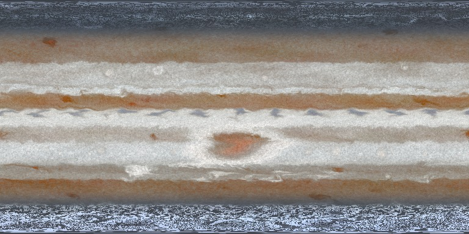 high &middot; 1</td>
</tr></table>

### hero wake dir

`storms.hero_wake_dir` &mdash; dropdown, one of `auto` / `east` / `west`, default **`auto`**, tier `restart`.

Which way the hero's wake trails. auto = follow the strongest jet near the wake lane when hero_emergence is on (the wake is real fluid machinery there — folds advect with the flow), legacy authored westward otherwise. east/west force the direction; forcing AGAINST the local jet reads weaker, because the flow drains the folds out of the wake window. Flips the moat's torn-open arc too (it is keyed to the wake side).

_Choice field (GUI dropdown) &mdash; documented as text; no rendered example._

### merge debris

`storms.merge_debris` &mdash; range **0 to 2**, default **1**, tier `restart`.

How bright the transient turbulent collar is that a fresh merger leaves behind. Higher = a more visible scar; inert while merge_rate is 0

<table><tr>
<td align="center">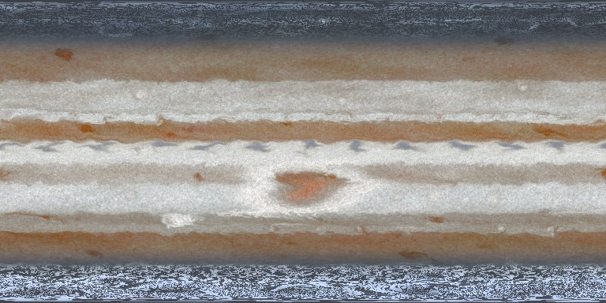 low &middot; 0</td><td align="center"> preset &middot; 1</td><td align="center">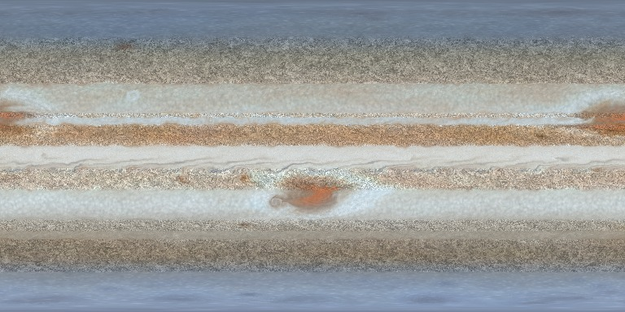 high &middot; 2</td>
</tr></table>

### merge rate

`storms.merge_rate` &mdash; range **0 to 1**, default **0**, tier `restart`.

Anticyclone merger aggressiveness: converging same-sign ovals coalesce when their gap falls under ~1.5*rate*(r1+r2), and generation seeds convergent pairs so mergers actually occur during the dev run (0 = off, the v1.1 behavior)

<table><tr>
<td align="center"> low &middot; 0</td><td align="center"> preset &middot; 0.7</td><td align="center"> high &middot; 1</td>
</tr></table>

### outbreak count

`storms.outbreak_count` &mdash; range **0 to 3**, default **0**, tier `restart`.

How many convective outbreaks erupt during the development run. Higher = more; 0 = off (Great-White-Spot events)

<table><tr>
<td align="center">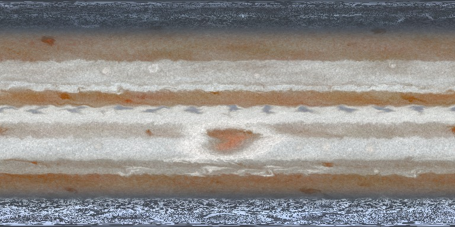 low &middot; 0</td><td align="center"> preset &middot; 1</td><td align="center">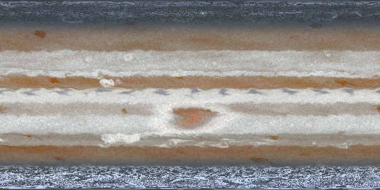 high &middot; 3</td>
</tr></table>

### outbreak lat min

`storms.outbreak_lat_min` &mdash; range **0 to 1**, default **0.2**, tier `restart`.

Minimum |latitude| for AUTO outbreak-belt selection, radians of latitude (1 rad = 57.3 deg; default 0.20 rad is about 11.5 deg). The floor keeps seeded eruptions off the equatorial zone where white-on-white plumes vanish; lower it to admit equatorial belts to the candidate pool, or use outbreak_latitude to pin exactly

<table><tr>
<td align="center"> low &middot; 0</td><td align="center"> preset &middot; 0.2</td><td align="center"> high &middot; 1</td>
</tr></table>

### outbreak latitude

`storms.outbreak_latitude` &mdash; optional; pin range **-55 to 55**, default **None (auto)**, tier `restart`.

Pin convective outbreaks to this latitude (degrees; the 'pin' checkbox toggles it) -- the 2010 Saturn Great White Spot erupted at ~35 N, the 1990 event on the equator. None = seeded placement in a dark belt. A pin bypasses the belt-candidate selection entirely (including the outbreak_lat_min floor), so equatorial eruptions work

_Optional field: the GUI shows a **pin** checkbox &mdash; unpinned (None) keeps the automatic/seeded behavior, pinned uses the slider value verbatim. Documented as text; no rendered example._

### outbreak longitude

`storms.outbreak_longitude` &mdash; optional; pin range **-180 to 180**, default **None (auto)**, tier `restart`.

Pin the outbreak train's RENDERED longitude (degrees, -180..180; the 'pin' checkbox toggles it). Unpinned (None) = seeded placement. The value is where the eruption head sits at the final snapshot: since the plume knots carry no circulation, the sim velocity advects them at roughly the zonal rate, so the generator inverse-compensates that drift over the post-eruption life (best-effort -- the belt shear folds the tail into a streak, so only the head lands precisely)

_Optional field: the GUI shows a **pin** checkbox &mdash; unpinned (None) keeps the automatic/seeded behavior, pinned uses the slider value verbatim. Documented as text; no rendered example._

### outbreak phase

`storms.outbreak_phase` &mdash; optional; pin range **0 to 1**, default **None (auto)**, tier `restart`.

Pin WHEN outbreaks erupt: eruption start as a fraction of the development run (0 = at init, 1 = at the final snapshot). None = seeded 0.55..0.85 draw per eruption, which catches plumes across their life. ~0.6 shows a fresh mid-eruption train at the snapshot; early values leave only the sheared-out streak

_Optional field: the GUI shows a **pin** checkbox &mdash; unpinned (None) keeps the automatic/seeded behavior, pinned uses the slider value verbatim. Documented as text; no rendered example._

### outbreak strength

`storms.outbreak_strength` &mdash; range **0.2 to 3**, default **1**, tier `restart`.

How violently each outbreak erupts. Higher = a bigger, brighter plume; the floor is 0.2, so an outbreak always carries some circulation (convective outbreak vorticity amplitude)

<table><tr>
<td align="center"> low &middot; 0.2</td><td align="center"> preset &middot; 1</td><td align="center"> high &middot; 3</td>
</tr></table>

### oval density

`storms.oval_density` &mdash; range **0 to 4**, default **1**, tier `restart`.

How many white ovals populate the zones. Higher = a more crowded field of these bright anticyclones; 0 = none (white-oval population multiplier)

<table><tr>
<td align="center">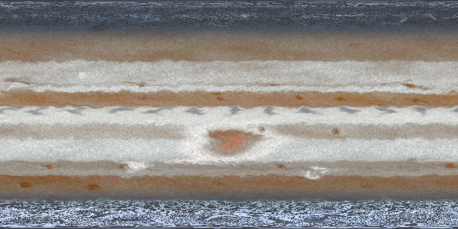 low &middot; 0</td><td align="center"> preset &middot; 3</td><td align="center">high &middot; 4 (not rendered)</td>
</tr></table>

### oval solid core

`storms.oval_solid_core` &mdash; range **0 to 1**, default **0**, tier `restart`.

Solid-body rotation for LARGE white ovals (vorticity mode): the same anti-whirlpool patch as hero_solid_core, applied to ovals with core radius >= 0.035 rad. A Gaussian oval is center-peaked -> differential rotation -> at long dev_steps it winds the tracer into a mini-bullseye; this blends its vorticity toward a near-uniform disk (rigid interior rotation) so it stays a coherent spot. 0 = Gaussian (byte-identical); 1 = full patch. Ovals/small storms below the radius threshold are unaffected. Pairs with hero_solid_core to de-bullseye the whole field without lowering dev_steps or oval_density.

<table><tr>
<td align="center"> preset &middot; 0</td><td align="center"> high &middot; 1</td>
</tr></table>

### pearls count

`storms.pearls_count` &mdash; range **0 to 14**, default **7**, tier `restart`.

How many string-of-pearls ovals sit on one seeded latitude. Higher = a longer chain; 0 = off

<table><tr>
<td align="center">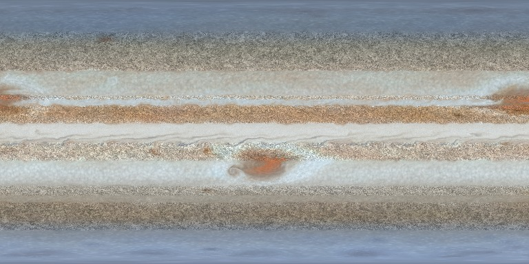 low &middot; 0</td><td align="center"> preset &middot; 14</td>
</tr></table>

### rim contrast

`storms.rim_contrast` &mdash; range **0 to 2.5**, default **1**, tier `restart`.

Scales the hero storm's dark perimeter ring + bright collar (the Red Spot Hollow) amplitude; 1.0 = default, >1 deepens the rim contrast, 0 removes the ring/collar

<table><tr>
<td align="center">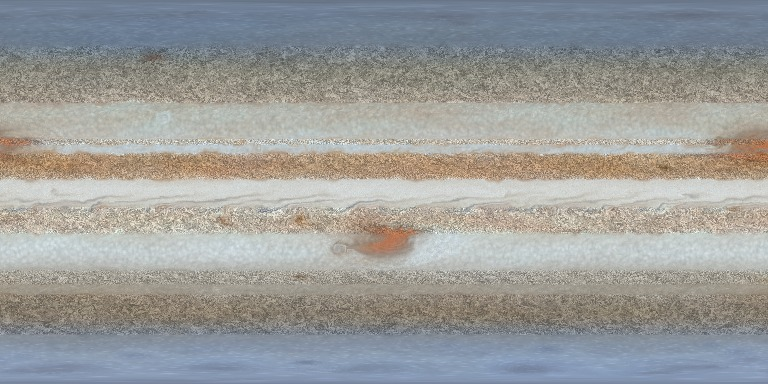 low &middot; 0</td><td align="center"> preset &middot; 2</td><td align="center">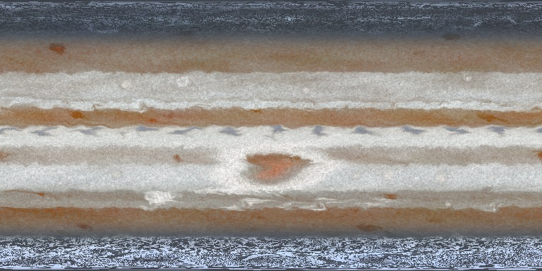 high &middot; 2.5</td>
</tr></table>

### small density

`storms.small_density` &mdash; range **0 to 4**, default **0**, tier `restart`.

Small-storm field: sub-oval white spots and dark spots scattered in loose latitude rows (0 = off, the pre-v1.1 look)

<table><tr>
<td align="center">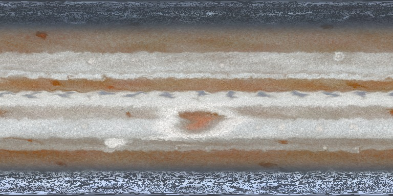 low &middot; 0</td><td align="center"> preset &middot; 3</td><td align="center">high &middot; 4 (not rendered)</td>
</tr></table>

### stamp contrast

`storms.stamp_contrast` &mdash; range **0 to 3**, default **1**, tier `restart`.

How strongly the small storms stamp into the tracer. Higher = crisper ovals, barges and pearls against the band; 1 = the v1 look (tracer-stamp contrast)

<table><tr>
<td align="center">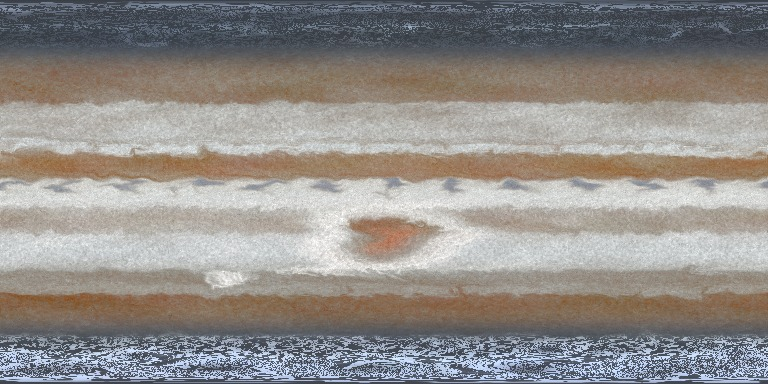 low &middot; 0</td><td align="center"> preset &middot; 2</td><td align="center">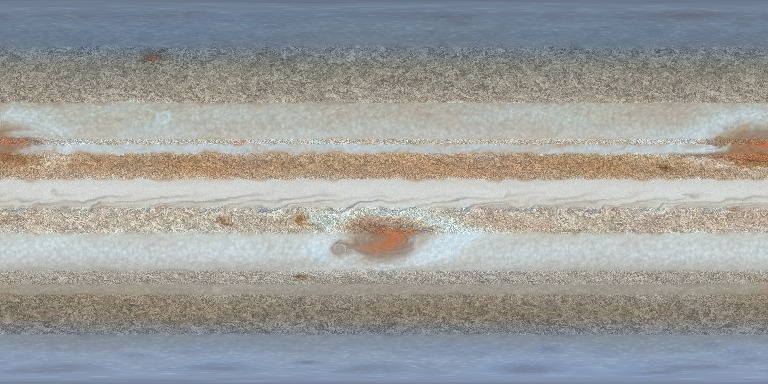 high &middot; 3</td>
</tr></table>

### stamp tint contrast

`storms.stamp_tint_contrast` &mdash; optional; pin range **0 to 3**, default **None (auto)**, tier `restart`.

Tint amplitude of ovals/barges/pearls/small storms, split from the brightness amplitude (review B5-7): stamp_contrast scales brightness, this scales tint. None = follow stamp_contrast (byte-identical legacy coupling). Like stamp_contrast it EXCLUDES the hero (use hero_tint) and does not touch accents (explicit color)

_Optional field: the GUI shows a **pin** checkbox &mdash; unpinned (None) keeps the automatic/seeded behavior, pinned uses the slider value verbatim. Documented as text; no rendered example._

### wake turbulence

`storms.wake_turbulence` &mdash; range **0 to 5**, default **1.8**, tier `restart`.

Extra churn in the wake wedge downstream of the hero storm. Higher = a rougher, more disturbed trail; 0 = no boost at all (turbulence boost; the default 1.8 is already a strong one)

<table><tr>
<td align="center"> low &middot; 0</td><td align="center"> preset &middot; 1.8</td><td align="center">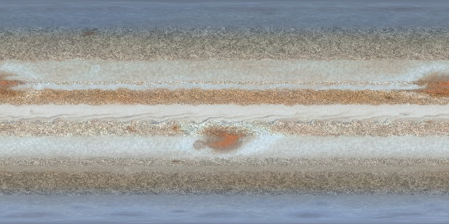 high &middot; 5</td>
</tr></table>

## Waves

### Festoon count

`waves.festoon_wavenumber` &mdash; range **4 to 24**, default **12**, tier `restart`.

How many festoon plumes fit around the equator. Higher = more, smaller plumes (the Rossby wavenumber of the train)

<table><tr>
<td align="center">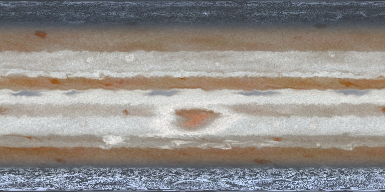 low &middot; 4</td><td align="center"> preset &middot; 12</td><td align="center"> high &middot; 24</td>
</tr></table>

### Festoon count (hero)

`waves.festoon_hero_wavenumber` &mdash; range **4 to 24**, default **11**, tier `restart`.

How many plumes fit in the hero-adjacent festoon train. Keep it different from festoon_wavenumber — two trains at matching spacing read as a mechanical comb, which is why the default deliberately differs (the train's wavenumber)

<table><tr>
<td align="center">low &middot; 4 (not rendered)</td><td align="center"> preset &middot; 11</td><td align="center">high &middot; 24 (not rendered)</td>
</tr></table>

### festoon hero strength

`waves.festoon_hero_strength` &mdash; range **0 to 3**, default **0**, tier `restart`.

Second festoon train rooted on the band edge nearest the hero storm (plumes only, no hot spots): streamers weaving through the hero's wake lane, tails brushing the collar. 0 = off; a silent no-op without a hero, without a band edge within 0.15 rad of it, or when that edge IS the primary festoon's root (one edge is never double-trained)

<table><tr>
<td align="center"> preset &middot; 0</td><td align="center">high &middot; 3 (not rendered)</td>
</tr></table>

### festoon strength

`waves.festoon_strength` &mdash; range **0 to 3**, default **0.8**, tier `restart`.

Scalloped plumes and dark hot spots along the equatorial belt edge. Higher = deeper, more pronounced festoons; 0 = off

<table><tr>
<td align="center">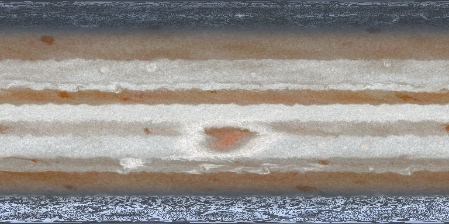 low &middot; 0</td><td align="center"> preset &middot; 2.6</td><td align="center"> high &middot; 3</td>
</tr></table>

### hotspot depth

`waves.hotspot_depth` &mdash; range **0 to 1**, default **0.6**, tier `restart`.

How dark the cloud-free hot spots read in the festoon wave troughs. Higher = deeper, higher-contrast gaps between the plumes; 0 = no gaps at all

<table><tr>
<td align="center"> low &middot; 0</td><td align="center"> preset &middot; 0.7</td><td align="center"> high &middot; 1</td>
</tr></table>

### ribbon strength

`waves.ribbon_strength` &mdash; range **0 to 3**, default **0**, tier `restart`.

Saturn-style ribbon wave running along one mid-latitude jet. Higher = a stronger meander in that jet's edge; 0 = off

<table><tr>
<td align="center"> preset &middot; 0</td><td align="center">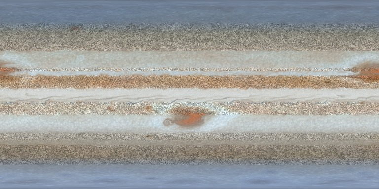 high &middot; 3</td>
</tr></table>

### Ribbon wave count

`waves.ribbon_wavenumber` &mdash; range **4 to 30**, default **12**, tier `restart`.

How many meanders the ribbon wave makes around the planet. Higher = tighter, more frequent meanders (wavenumber of the Saturn-style ribbon wave)

<table><tr>
<td align="center"> low &middot; 4</td><td align="center"> preset &middot; 12</td><td align="center"> high &middot; 30</td>
</tr></table>

## Poles

### cyclone count

`poles.north.cyclone_count` &mdash; range **3 to 9**, default **6**, tier `restart`.

How many cyclones ring the central one. Higher = a denser rosette around the pole (cyclone_cluster style only)

<table><tr>
<td align="center">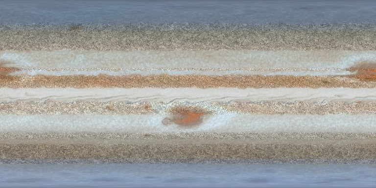 low &middot; 3</td><td align="center"> preset &middot; 8</td><td align="center">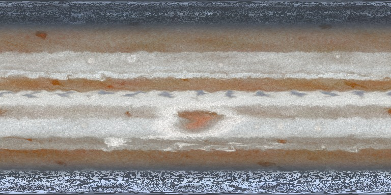 high &middot; 9</td>
</tr></table>

### cyclone count

`poles.south.cyclone_count` &mdash; range **3 to 9**, default **6**, tier `restart`.

How many cyclones ring the central one. Higher = a denser rosette around the pole (cyclone_cluster style only)

<table><tr>
<td align="center">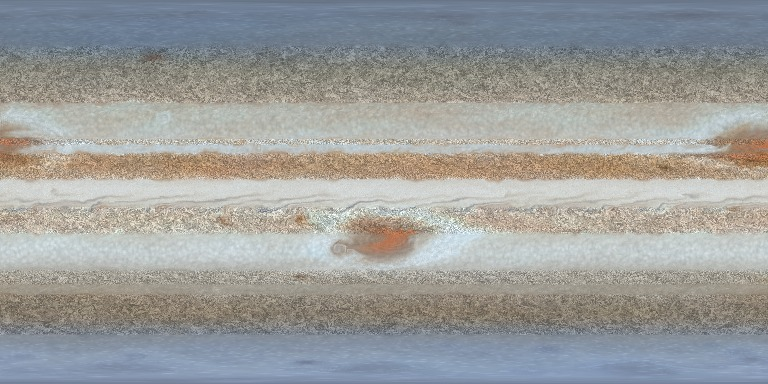 low &middot; 3</td><td align="center"> preset &middot; 5</td><td align="center">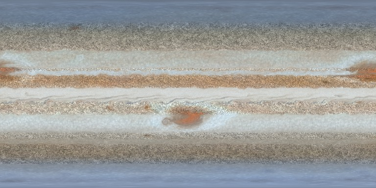 high &middot; 9</td>
</tr></table>

### field density

`poles.north.field_density` &mdash; range **0 to 2**, default **0**, tier `restart`.

Fills the cap poleward of 70 deg with a background of small cyclones. Higher = a busier, more crowded pole; 0 = off (the dense cyclone hierarchy of PIA21641)

<table><tr>
<td align="center">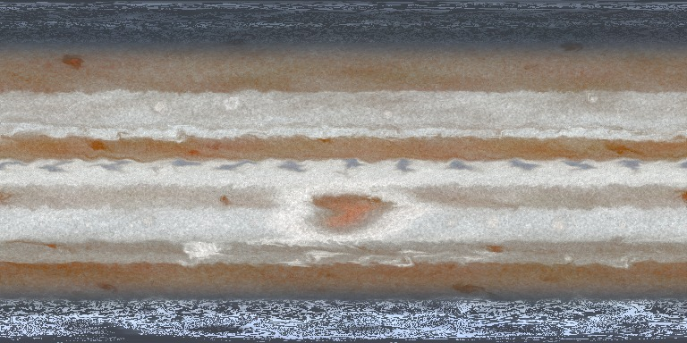 low &middot; 0</td><td align="center"> preset &middot; 1.4</td><td align="center">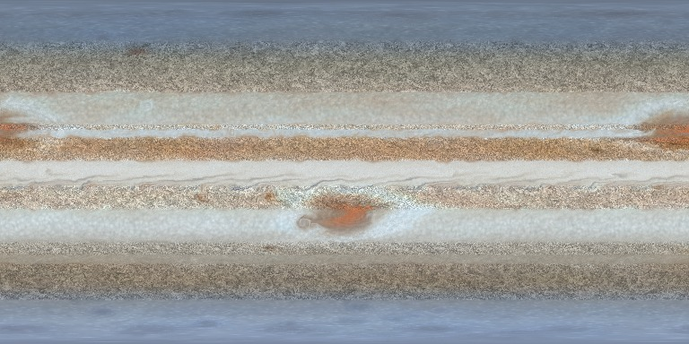 high &middot; 2</td>
</tr></table>

### field density

`poles.south.field_density` &mdash; range **0 to 2**, default **0**, tier `restart`.

Fills the cap poleward of 70 deg with a background of small cyclones. Higher = a busier, more crowded pole; 0 = off (the dense cyclone hierarchy of PIA21641)

<table><tr>
<td align="center">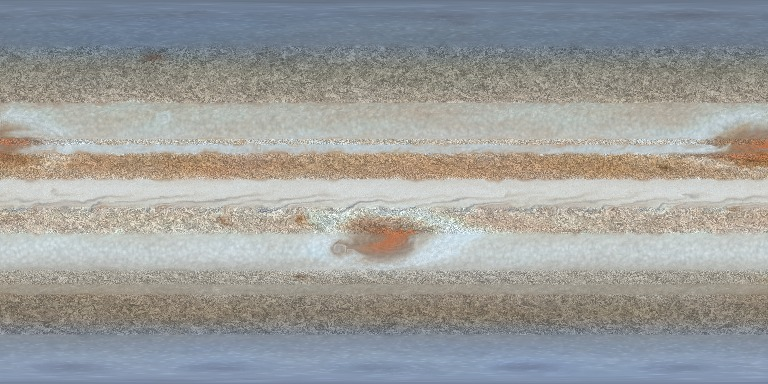 low &middot; 0</td><td align="center"> preset &middot; 1.4</td><td align="center">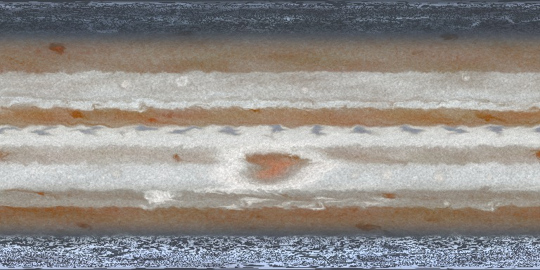 high &middot; 2</td>
</tr></table>

### polygon sides

`poles.north.polygon_sides` &mdash; range **3 to 9**, default **6**, tier `restart`.

How many sides the polar jet's polygon has. 6 = Saturn's hexagon (polygon wavenumber; polygon_jet style only)

<table><tr>
<td align="center"> low &middot; 3</td><td align="center"> preset &middot; 6</td><td align="center"> high &middot; 9</td>
</tr></table>

### polygon sides

`poles.south.polygon_sides` &mdash; range **3 to 9**, default **6**, tier `restart`.

How many sides the polar jet's polygon has. 6 = Saturn's hexagon (polygon wavenumber; polygon_jet style only)

<table><tr>
<td align="center"> low &middot; 3</td><td align="center"> preset &middot; 6</td><td align="center"> high &middot; 9</td>
</tr></table>

### strength

`poles.north.strength` &mdash; range **0 to 3**, default **1**, tier `restart`.

How strongly the polar feature swirls. Higher = a tighter, better-defined cap; 0 = flat (vorticity amplitude of the central cyclone / polygon jet)

<table><tr>
<td align="center">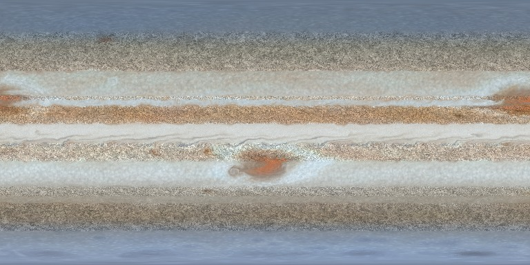 low &middot; 0</td><td align="center"> preset &middot; 1.35</td><td align="center">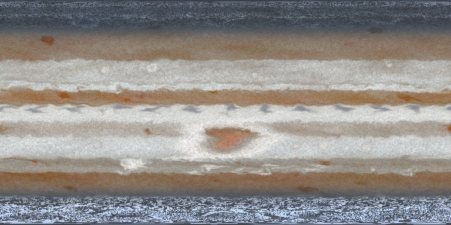 high &middot; 3</td>
</tr></table>

### strength

`poles.south.strength` &mdash; range **0 to 3**, default **1**, tier `restart`.

How strongly the polar feature swirls. Higher = a tighter, better-defined cap; 0 = flat (vorticity amplitude of the central cyclone / polygon jet)

<table><tr>
<td align="center">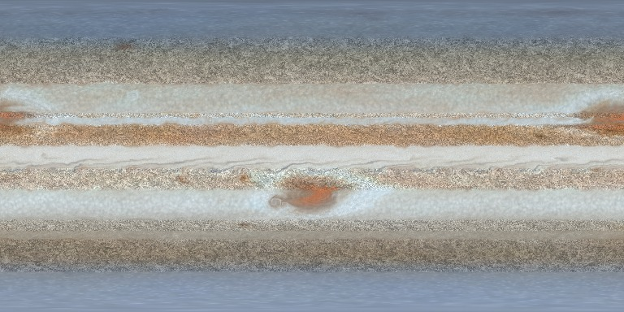 low &middot; 0</td><td align="center"> preset &middot; 1.35</td><td align="center">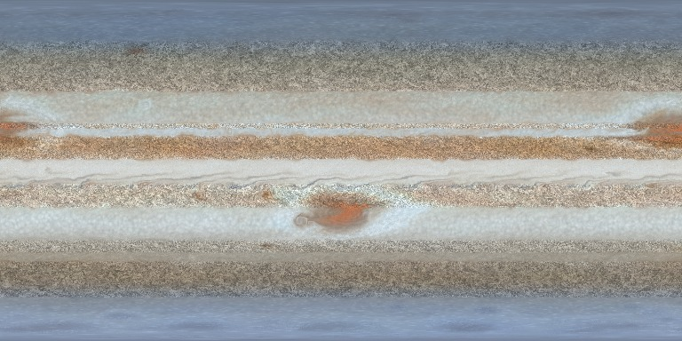 high &middot; 3</td>
</tr></table>

### style

`poles.north.style` &mdash; dropdown, one of `cyclone_cluster` / `polygon_jet` / `plain_vortex` / `calm`, default **`cyclone_cluster`**, tier `restart`.

Which polar feature sits over this pole. cyclone_cluster = a central cyclone ringed by others (Jupiter); polygon_jet = a hexagonal jet (Saturn); plain_vortex = one tight swirl; calm = nothing at all

_Choice field (GUI dropdown) &mdash; documented as text; no rendered example._

### style

`poles.south.style` &mdash; dropdown, one of `cyclone_cluster` / `polygon_jet` / `plain_vortex` / `calm`, default **`plain_vortex`**, tier `restart`.

Which polar feature sits over this pole. cyclone_cluster = a central cyclone ringed by others (Jupiter); polygon_jet = a hexagonal jet (Saturn); plain_vortex = one tight swirl; calm = nothing at all

_Choice field (GUI dropdown) &mdash; documented as text; no rendered example._

## Appearance

### band tint strength

`appearance.band_tint_strength` &mdash; range **0 to 1**, default **0**, tier `post`.

How strongly the per-latitude band_tint_stops override the planet color (0 = off, byte-identical; 1 = the tint fully replaces the graded color). Blended in after the post chain and chroma FX so the tint is not re-graded by contrast/saturation

<table><tr>
<td align="center"> preset &middot; 0</td><td align="center"> high &middot; 1</td>
</tr></table>

### chroma aging

`appearance.chroma_aging` &mdash; range **0 to 0.6**, default **0**, tier `post`.

Chromophore aging: ties color saturation to the dynamical freshness tracer (T2). Aged/stagnant air holds more reddish-brown chromophore (more saturated); fresh upwelling air is whiter (less saturated). Chroma-only -- the latitude palette's HUE is untouched, so the band browns/creams just deepen where air is old and pale where it is fresh, tying color to the flow instead of latitude alone. 0 = off (byte-identical)

<table><tr>
<td align="center">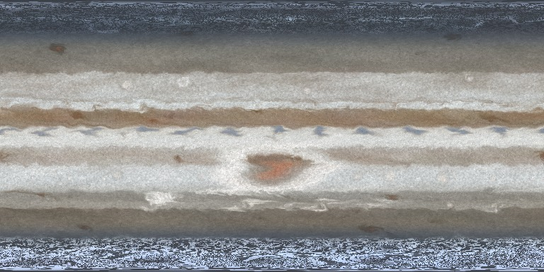 low &middot; 0</td><td align="center"> preset &middot; 0.35</td><td align="center">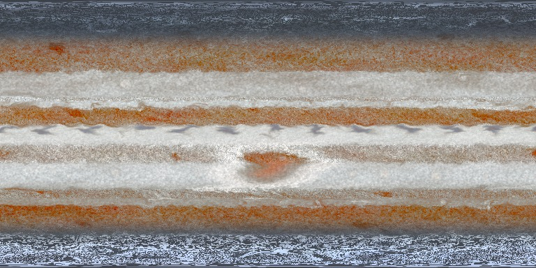 high &middot; 0.6</td>
</tr></table>

### chroma scale

`appearance.chroma_scale` &mdash; range **0 to 2**, default **1**, tier `post`.

How saturated the final color reads. Higher = richer color, lower = toward gray; 1 = off. Recommended over 'saturation', which is an sRGB luma mix (Oklab chroma multiplier — perceptual saturation). No rand: adding a draw would reshuffle every later randomize draw

<table><tr>
<td align="center">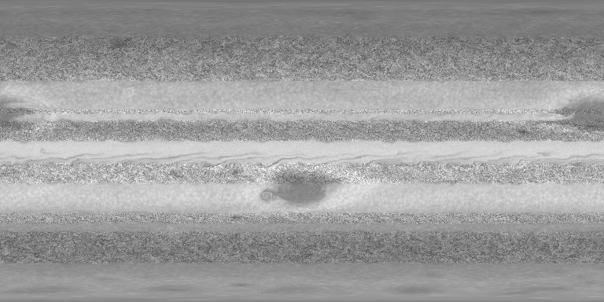 low &middot; 0</td><td align="center"> preset &middot; 1</td><td align="center">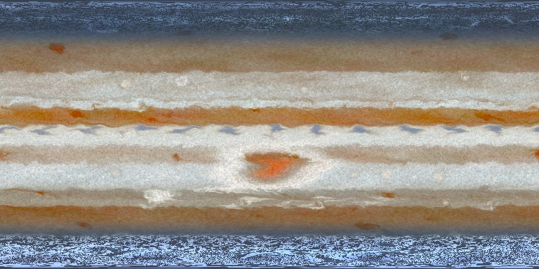 high &middot; 2</td>
</tr></table>

### chroma variance

`appearance.chroma_variance` &mdash; range **0 to 0.5**, default **0**, tier `post`.

Slow saturation drift along each band, so it holds pockets of richer and duller material. Higher = more obvious pockets; 0 = off (longitudinal within-band chroma drift, varying slowly with longitude — the reference's saturated-pocket texture)

<table><tr>
<td align="center">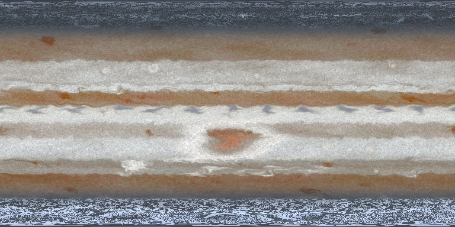 low &middot; 0</td><td align="center"> preset &middot; 0.35</td><td align="center">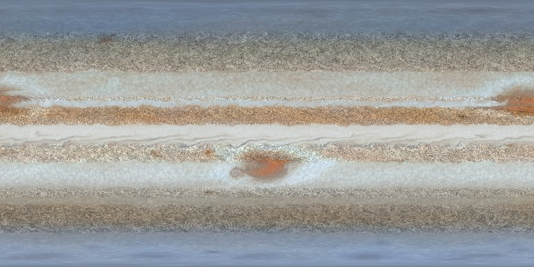 high &middot; 0.5</td>
</tr></table>

### contrast

`appearance.contrast` &mdash; range **0.2 to 2**, default **1**, tier `post`.

Overall image contrast. Higher = punchier darks and brights; 1.0 = off (color contrast multiplier about mid-gray)

<table><tr>
<td align="center">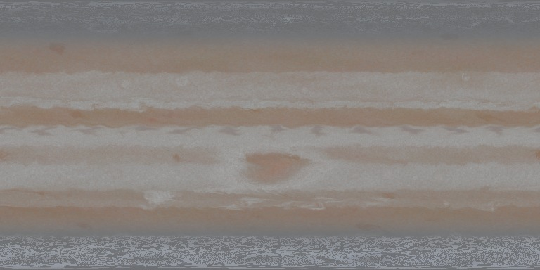 low &middot; 0.2</td><td align="center"> preset &middot; 0.8</td><td align="center">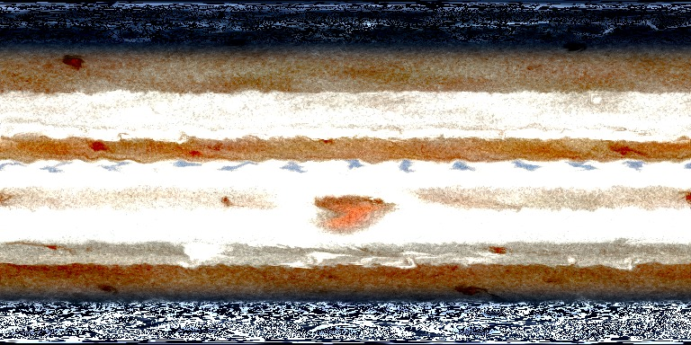 high &middot; 2</td>
</tr></table>

### detail chroma

`appearance.detail_chroma` &mdash; range **0 to 1**, default **0**, tier `post`.

Two-material tint for synthesized detail: bright detail excursions shade toward a cool pale-cloud material, dark excursions (weaker) toward warm belt material -- the reference's interleaved cool/warm texture read, which a luminance-only detail multiply cannot express. L-preserving (Oklab a/b push), palette-independent. Needs detail.intensity > 0 (the Detail panel); inert without it. 0 = off (byte-identical)

<table><tr>
<td align="center"> preset &middot; 0</td><td align="center">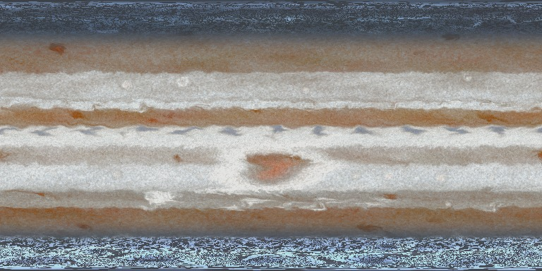 high &middot; 1</td>
</tr></table>

### gamma

`appearance.gamma` &mdash; range **0.4 to 2.5**, default **1**, tier `post`.

Final brightness curve on the color map. Higher = brighter midtones, lower = darker; 1.0 = off (tone-curve gamma, applied as pow(color, 1/gamma))

<table><tr>
<td align="center">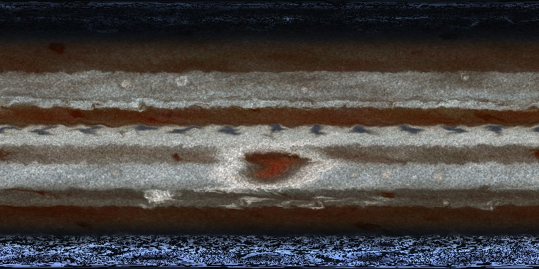 low &middot; 0.4</td><td align="center"> preset &middot; 1</td><td align="center">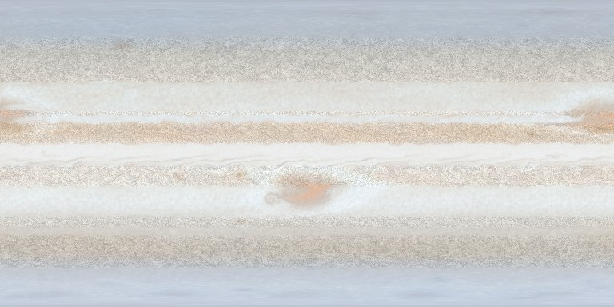 high &middot; 2.5</td>
</tr></table>

### haze amount

`appearance.haze_amount` &mdash; range **0 to 1**, default **0**, tier `post`.

Milky overhead haze washing the whole planet. Higher = softer and creamier, the Saturn end (~0.6); 0 = off, the crisp Jupiter look (the global haze axis)

<table><tr>
<td align="center"> low &middot; 0</td><td align="center"> preset &middot; 0.05</td><td align="center"> high &middot; 1</td>
</tr></table>

### hue variance

`appearance.hue_variance` &mdash; range **0 to 0.35**, default **0**, tier `post`.

Lets neighboring material differ in hue at the same brightness. Higher = a more varied, less monotone planet; 0 = off (iso-luminance Oklab hue drift, in radians of max rotation; 1 rad = 57.3 deg). Differently-hued material at the same lightness, which a luminance-keyed palette gradient cannot express -- the hue-diversity lever the realism metrics name

<table><tr>
<td align="center">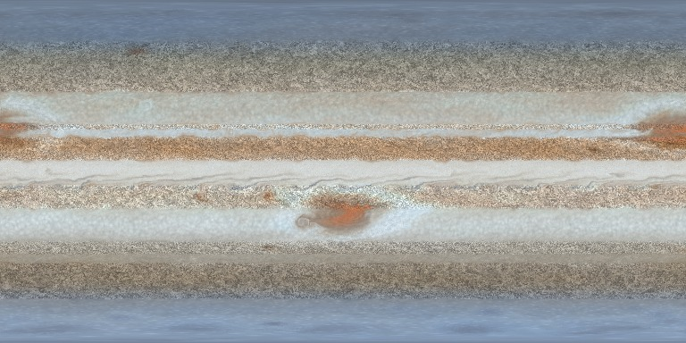 low &middot; 0</td><td align="center"> preset &middot; 0.3</td><td align="center"> high &middot; 0.35</td>
</tr></table>

### polar canvas value

`appearance.polar_canvas_value` &mdash; range **0 to 1**, default **0**, tier `post`.

Deepens the polar cap canvas toward a dark blue-teal floor so the folded-filament lace and cyclones pop; 0 = off. Applied after the lace and keyed on low local luminance, so it darkens the dark inter-wisp floor while bright crests stay bright (raises contrast, does not flatten)

<table><tr>
<td align="center">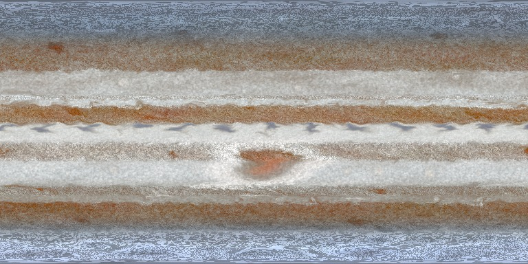 low &middot; 0</td><td align="center"> preset &middot; 0.85</td><td align="center">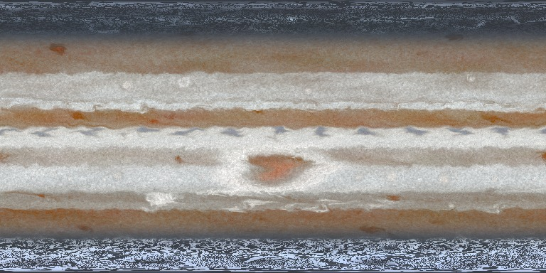 high &middot; 1</td>
</tr></table>

### polar tint start lat

`appearance.polar_tint_start_lat` &mdash; range **30 to 80**, default **55**, tier `post`.

Latitude where the polar tint starts to come in, in degrees. Higher = a smaller, tighter cap

<table><tr>
<td align="center">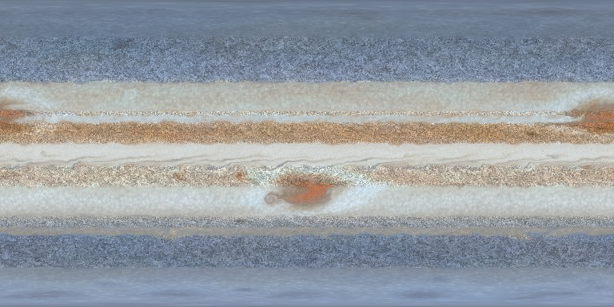 low &middot; 30</td><td align="center"> preset &middot; 56</td><td align="center">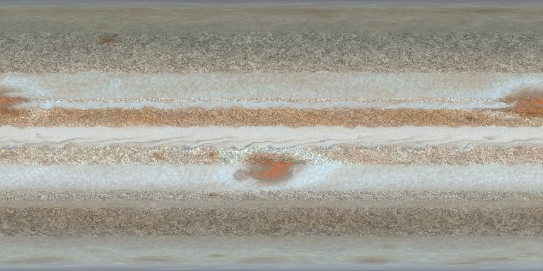 high &middot; 80</td>
</tr></table>

### polar tint strength

`appearance.polar_tint_strength` &mdash; range **0 to 1**, default **0**, tier `post`.

How strongly the polar cap tint is blended in. Higher = a bluer, more distinct cap; 0 = off, the pre-v1.1 look

<table><tr>
<td align="center">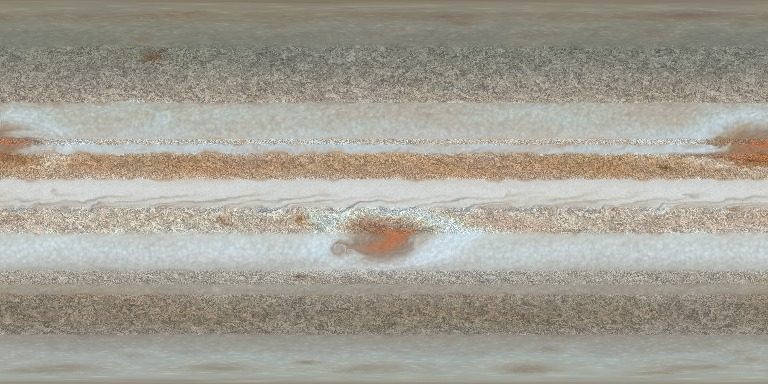 low &middot; 0</td><td align="center"> preset &middot; 0.68</td><td align="center">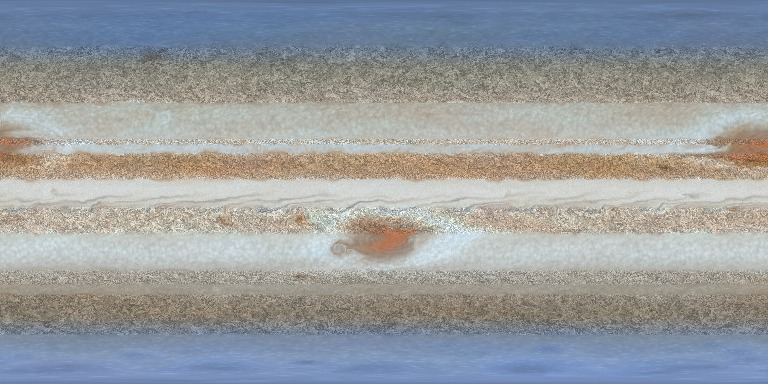 high &middot; 1</td>
</tr></table>

### saturation

`appearance.saturation` &mdash; range **0 to 2**, default **1**, tier `post`.

Color intensity of the final image. Higher = more vivid, lower = toward gray; 1.0 = off. Prefer chroma_scale, which is perceptual (sRGB saturation multiplier, a luma-preserving mix toward gray; chroma_scale is the Oklab equivalent)

<table><tr>
<td align="center"> low &middot; 0</td><td align="center"> preset &middot; 1</td><td align="center">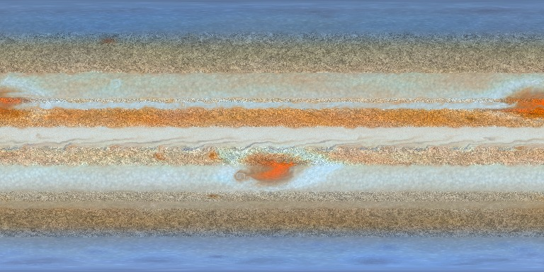 high &middot; 2</td>
</tr></table>

## Detail

### belt texture

`detail.belt_texture` &mdash; range **0 to 2.5**, default **0**, tier `post`.

Storm-scale folded structure inside the belts, at 0.5-3 deg across. Higher = a busier, more mottled belt interior; 0 = off (folded luminance structure, flow-backtraced so patches fold with the flow, plus a belt floor for the fine filaments — the v1.4 audit's dominant texture gap on broad-band layouts)

<table><tr>
<td align="center"> low &middot; 0</td><td align="center"> preset &middot; 1.2</td><td align="center"> high &middot; 2.5</td>
</tr></table>

### belt texture fine

`detail.belt_texture_fine` &mdash; range **0 to 2.5**, default **0**, tier `post`.

A finer second octave of that belt fold, below the sim grid scale. Higher = denser belt texture at matched scale; 0 = off (a finer sub-grid octave: a second flow-aligned backtrace hop, folding mid-frequency noise)

<table><tr>
<td align="center"> low &middot; 0</td><td align="center"> preset &middot; 1.4</td><td align="center">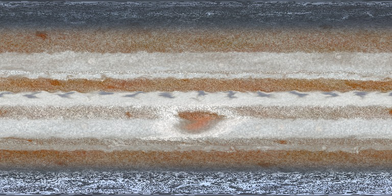 high &middot; 2.5</td>
</tr></table>

### cellular amount

`detail.cellular_amount` &mdash; range **0 to 2**, default **0.6**, tier `post`.

Popcorn-like convective cell texture in the quiet zones. Higher = a more granular, cauliflower zone; 0 = off (closed-cell texture)

<table><tr>
<td align="center"> low &middot; 0</td><td align="center"> preset &middot; 0.9</td><td align="center"> high &middot; 2</td>
</tr></table>

### Cirrus fiber scale

`detail.cirrus_fiber_freq` &mdash; range **2 to 24**, default **6**, tier `post`, log scale.

Strand density of the cirrus fibers: strands across each bright-cloud streak half-width. Amplitude is attenuated when strands approach the output pixel size (spacing ~ cloud_radius/freq radians), so high values need high export resolution. Inert unless cirrus_fibers > 0

<table><tr>
<td align="center"> low &middot; 2</td><td align="center"> preset &middot; 6</td><td align="center"> high &middot; 24</td>
</tr></table>

### cirrus fibers

`detail.cirrus_fibers` &mdash; range **0 to 2**, default **0**, tier `post`.

Render-time combed-fiber synthesis over the ELONGATED bright-cloud stamps (companion/accent storms with aspect > 1, the Neptune methane-cirrus class): carves dark inter-strand lanes + gentle bright ridges into each streak, flow-oriented and flow-warped. Stamping fibers into the tracer was falsified (they smear over the dev run; docs/roadmap.md) — this synthesizes them post-advection. Requires detail.intensity > 0. No rand: a draw here would reshuffle every later randomize draw. 0 = off (byte-identical)

<table><tr>
<td align="center"> preset &middot; 0</td><td align="center"> high &middot; 2</td>
</tr></table>

### flow phases

`detail.flow_phases` &mdash; range **1 to 4**, default **3**, tier `post`.

How many staggered noise phases the detail is built from. More = richer, more layered filaments (staggered advected-noise phases)

<table><tr>
<td align="center"> low &middot; 1</td><td align="center"> preset &middot; 4</td>
</tr></table>

### flow stretch

`detail.flow_stretch` &mdash; range **0.1 to 4**, default **1**, tier `post`.

How far the detail noise is smeared along the flow. Higher = longer, more drawn-out streaks (advection distance for the detail noise)

<table><tr>
<td align="center">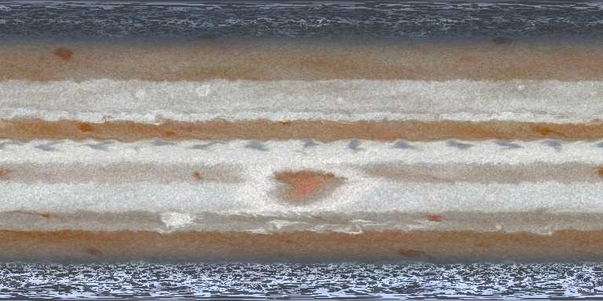 low &middot; 0.1</td><td align="center"> preset &middot; 1.3</td><td align="center">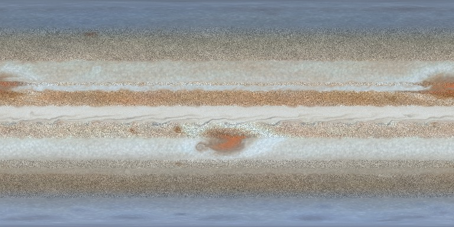 high &middot; 4</td>
</tr></table>

### frequency

`detail.frequency` &mdash; range **8 to 256**, default **48**, tier `post`, log scale.

Size of the synthesized detail. Higher = finer grain; lower = coarser, broader texture (base spatial frequency of the detail noise)

<table><tr>
<td align="center">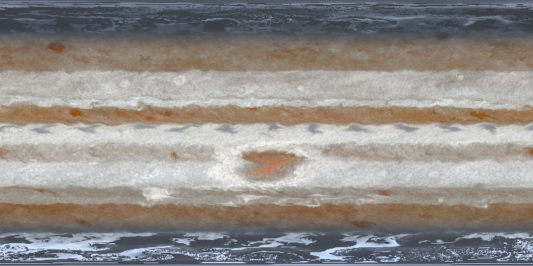 low &middot; 8</td><td align="center"> preset &middot; 64</td><td align="center">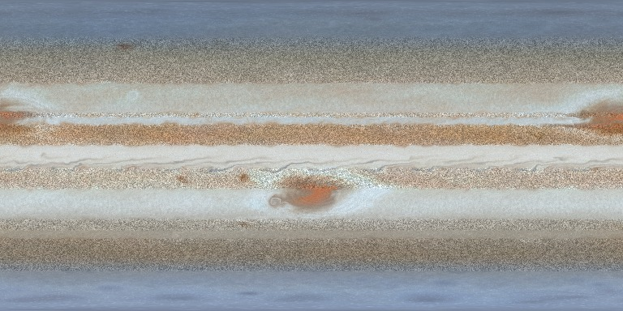 high &middot; 256</td>
</tr></table>

### hero calm

`detail.hero_calm` &mdash; range **0 to 1**, default **0**, tier `post`.

Calm the band-aligned grain inside hero storms: the detail filament streak + striation are flow/band-aligned and are amplified near heroes, so they cross the GRS as straight 'wood-grain' that ignores the vortex rotation. This attenuates those two terms inside the hero (weighted by the hero mask) so the vortex-aligned spiral lanes and the sim-side hero_mottle churn carry the interior instead. 0 = full band grain (byte-identical)

<table><tr>
<td align="center"> preset &middot; 0</td><td align="center"> high &middot; 1</td>
</tr></table>

### hero collar wrap

`detail.hero_collar_wrap` &mdash; range **0 to 1**, default **0**, tier `post`.

Tightly-pitched wound-lane filaments wrapping the hero collar (the GRS 'hollow' look in stills): a log-spiral on the rim window, wound in the storm's rotation sense. Independent of hero_spiral (interior lanes); stationary in the hero frame. 0 = off

<table><tr>
<td align="center"> preset &middot; 0</td><td align="center"> high &middot; 1</td>
</tr></table>

### hero spiral

`detail.hero_spiral` &mdash; range **0 to 1.5**, default **0**, tier `post`.

Tightly wound spiral lanes inside the hero storm, plus collar streamlines. Higher = a more strongly drawn spiral; 0 = off (the Juno-close-up GRS look; winds in the hero's actual rotation sense). Stationary in the hero frame — fine for stills

<table><tr>
<td align="center"> low &middot; 0</td><td align="center"> preset &middot; 0.55</td><td align="center"> high &middot; 1.5</td>
</tr></table>

### hero wake braid

`detail.hero_wake_braid` &mdash; range **0 to 2**, default **0**, tier `post`.

Inks the hero storm's turbulent wake as the reference GRS's chain of rolled billows (recumbent hairpin folds): brightens the pale entrained tracer cores and darkens the fold-boundary rims, keyed to the sim's OWN advected tracer folds (not a synthetic strand pattern), confined to the belt-side flank of the wake lane downstream of the drawn storm body. Rides the sim-side wake churn (storms.hero_wake_detail); with appearance.detail_chroma the folds pick up the two-material tint. Requires detail.intensity > 0 and a hero. No rand (draw-order safe). 0 = off (byte-identical)

<table><tr>
<td align="center"> preset &middot; 0</td><td align="center">high &middot; 2 (not rendered)</td>
</tr></table>

### intensity

`detail.intensity` &mdash; range **0 to 2**, default **0.55**, tier `post`.

How much synthesized detail is laid over the planet. Higher = more texture everywhere; 0 = off, and the detail-FX levers below go inert with it (export/preview detail synthesis amplitude)

<table><tr>
<td align="center"> low &middot; 0</td><td align="center"> preset &middot; 0.95</td><td align="center">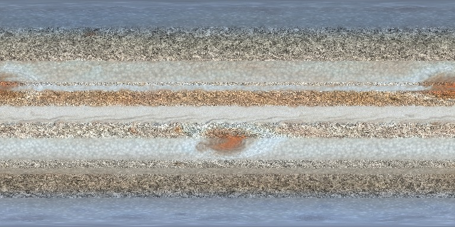 high &middot; 2</td>
</tr></table>

### intermittency

`detail.intermittency` &mdash; range **0 to 1**, default **0**, tier `post`.

Breaks the filament and striation texture into patches along each band, so violent folded stretches abut calm laminar runs. Higher = a more broken-up mosaic; 0 = off, the texture stays uniform (longitudinal patchiness — the real mosaic's chaos is intermittent, not uniform). No rand: a draw here would reshuffle every later randomize draw

<table><tr>
<td align="center"> low &middot; 0</td><td align="center"> preset &middot; 0.65</td><td align="center">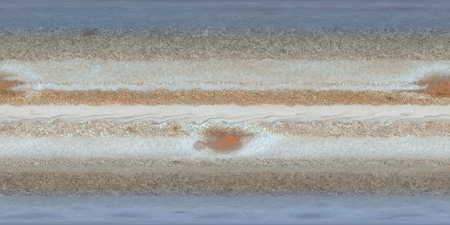 high &middot; 1</td>
</tr></table>

### mottle

`detail.mottle` &mdash; range **0 to 1.5**, default **0**, tier `post`.

Temperate lace mottle at 35-60 deg: granular bright rings, dark dots, and lacy folds where the banding gives way. Higher = a more flecked mid-latitude; 0 = off (the reference's mid-latitude storm-flecked character)

<table><tr>
<td align="center">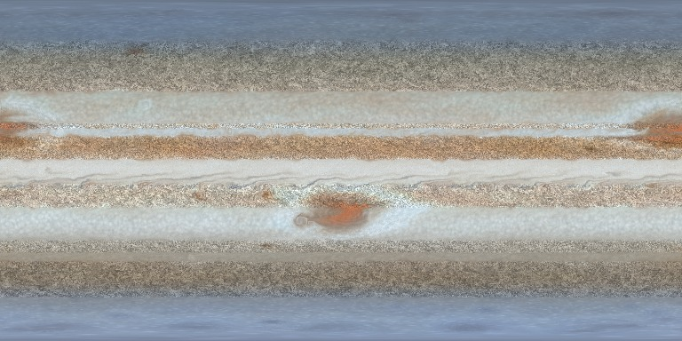 low &middot; 0</td><td align="center"> preset &middot; 1.1</td><td align="center">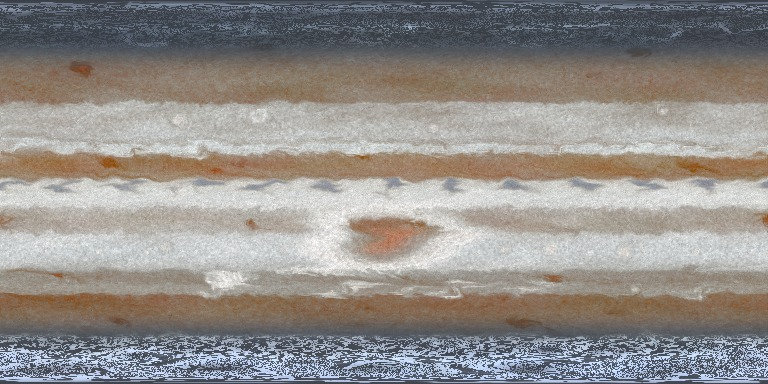 high &middot; 1.5</td>
</tr></table>

### polar filaments

`detail.polar_filaments` &mdash; range **0 to 2**, default **0**, tier `post`.

Polar folded-filamentary region (the Juno cap look): dense, multi-scale, flow-folded RIDGED filaments tangling between the circumpolar cyclones poleward of ~65 deg. Backtraced through the polar patch velocity so the lace winds with the cap vortices; only active when the polar route is on (cyclone-cluster/plain poles). 0 = off (byte-identical)

<table><tr>
<td align="center">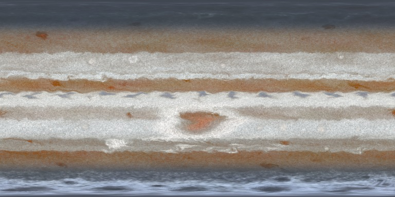 low &middot; 0</td><td align="center"> preset &middot; 1.3</td><td align="center">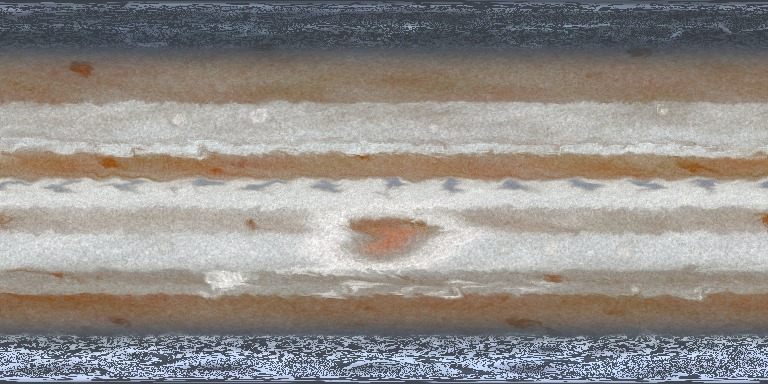 high &middot; 2</td>
</tr></table>

### polar stipple

`detail.polar_stipple` &mdash; range **0 to 2**, default **0**, tier `post`.

Bright granular storm speckle poleward of ~55 deg. Higher = a more heavily flecked cap; 0 = off (popcorn — the band-to-mottle transition character)

<table><tr>
<td align="center">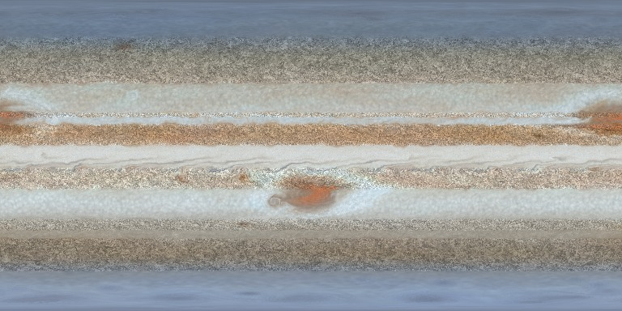 low &middot; 0</td><td align="center"> preset &middot; 0.8</td><td align="center"> high &middot; 2</td>
</tr></table>

### spread

`detail.spread` &mdash; range **0 to 1**, default **0**, tier `post`.

Uniform detail coverage across latitude: 0 = band-gated (belts textured, zones calmer, the default look, byte-identical), >0 = the flow-folded detail-FX texture (belt/zone/mottle folds + filaments) applied at EVEN density everywhere at this level, so there are no detail-starved zones or stamped latitude bands. Still flow-folded (not flat noise). Pole-faded. ~0.36 is a balanced value

<table><tr>
<td align="center"> low &middot; 0</td><td align="center"> preset &middot; 0.25</td><td align="center"> high &middot; 1</td>
</tr></table>

### streak mute

`detail.streak_mute` &mdash; range **0 to 1**, default **0**, tier `post`.

Suppress the WHOLE filament-streak accumulator (the ungated base flow-streak + its intermittency gate + the belt_texture filament floor; the SPREAD streak too, if spread > 0). The base streak has a speed/shear floor and no zero lever of its own, so smooth laminar planets that enable detail.intensity only for cirrus_fibers would gain planet-wide flow-grain without this. No rand (draw-order safe). 0 = full streak (byte-identical)

<table><tr>
<td align="center"> preset &middot; 0</td><td align="center"> high &middot; 1</td>
</tr></table>

### striation amount

`detail.striation_amount` &mdash; range **0 to 1.5**, default **0**, tier `post`.

Ropey threads running along the flow inside the belts. Higher = a more strongly combed belt; 0 = the pre-v1.1 look (intra-band flow-parallel striation thread texture)

<table><tr>
<td align="center"> low &middot; 0</td><td align="center"> preset &middot; 1</td><td align="center"> high &middot; 1.5</td>
</tr></table>

### striation frequency

`detail.striation_frequency` &mdash; range **16 to 512**, default **96**, tier `post`, log scale.

How fine the striation threads are. Higher = tighter, thinner ropes (base spatial frequency of the striation noise)

<table><tr>
<td align="center">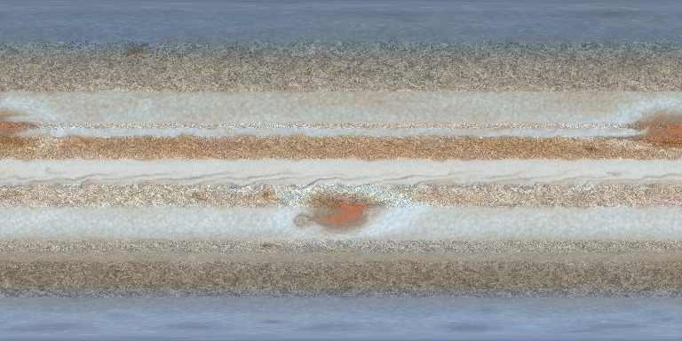 low &middot; 16</td><td align="center"> preset &middot; 160</td><td align="center"> high &middot; 512</td>
</tr></table>

### zone texture

`detail.zone_texture` &mdash; range **0 to 2.5**, default **0**, tier `post`.

Flow-folded luminance structure inside ZONES (the calm lanes between belts, gated by 1 - belt_mask). Belt interiors get belt_texture and shear-gated filaments; zones get neither and read as detail-starved smooth bands cutting across the disk. This gives zones their own flow-structured fold (calmer than belts, not flat). 0 = starved zones (byte-identical)

<table><tr>
<td align="center"> preset &middot; 0</td><td align="center"> high &middot; 2.5</td>
</tr></table>

## Mask

### band fade

`mask.band_fade` &mdash; range **0 to 1**, default **0**, tier `post`.

Fade the busy features (storm tint, polar tint, detail, lanes) back toward the plain band color where the mask is painted -- a way to calm chosen regions to clean bands. Weight is mask * this gain; 0 = off (byte-identical)

<table><tr>
<td align="center"> preset &middot; 0</td><td align="center">high &middot; 1 (not rendered)</td>
</tr></table>

### detail gain

`mask.detail_gain` &mdash; range **0 to 1**, default **0**, tier `post`.

Modulate color luminance/detail by the mask, settling painted-dark regions while painted-bright regions stay untouched. Factor is mix(1, mask, this gain); 0 = off (byte-identical)

<table><tr>
<td align="center"> preset &middot; 0</td><td align="center">high &middot; 1 (not rendered)</td>
</tr></table>

### emission gain

`mask.emission_gain` &mdash; range **0 to 1**, default **0**, tier `post`.

Modulate the night-side emission map (thermal/lightning glow + aurora) by the mask, dimming the glow where the mask is dark. Factor is mix(1, mask, this gain); 0 = off (byte-identical). Only visible on the Emission map, not Color

<table><tr>
<td align="center"> preset &middot; 0</td><td align="center">high &middot; 1 (not rendered)</td>
</tr></table>

### file

`mask.file` &mdash; file path, default **None**, tier `post`.

Path to a grayscale PNG that paints WHERE the three Mask targets act — white = full effect, black = none. Use a 2:1 equirect image (width exactly twice the height): any other aspect is refused with a warning and the mask stays off. Use forward slashes. None = no mask (all Mask targets inert). The path is resolved relative to a loaded preset's folder and re-saved next to a preset you save, so a preset stays portable; a missing file at load warns and disables the mask (never crashes)

_File-path field: the GUI shows a text entry + **Browse...** button (empty = None). Documented as text; no rendered example._

## Emission

### aurora pole offset

`emission.aurora_pole_offset` &mdash; range **0 to 20**, default **8**, tier `post`.

Magnetic-pole tilt from the rotation pole, degrees (longitude seeded); Saturn's axis is aligned: use 0. Preview: Emission channel, not Color

_Shown on the **emission map** (night-side glow) with all three glows enabled; tonemapped for display. The color map is unchanged by emission sliders._

<table><tr>
<td align="center">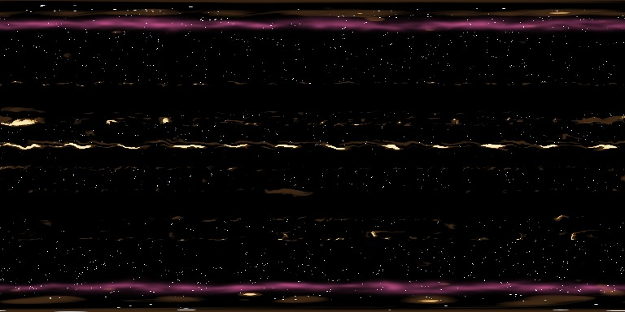 low &middot; 0</td><td align="center">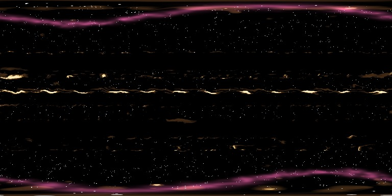 demo &middot; all glows on</td><td align="center">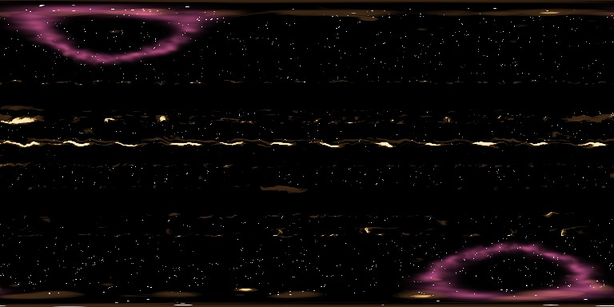 high &middot; 20</td>
</tr></table>

### aurora radius

`emission.aurora_radius` &mdash; range **5 to 25**, default **14**, tier `post`.

Oval angular radius from the magnetic pole, degrees. Preview: Emission channel, not Color

_Shown on the **emission map** (night-side glow) with all three glows enabled; tonemapped for display. The color map is unchanged by emission sliders._

<table><tr>
<td align="center">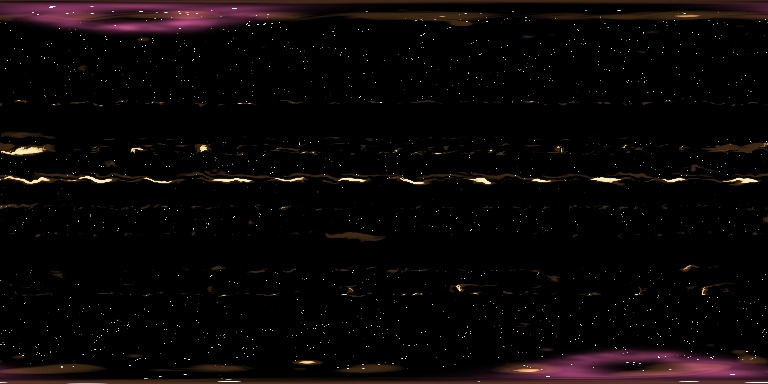 low &middot; 5</td><td align="center"> demo &middot; all glows on</td><td align="center">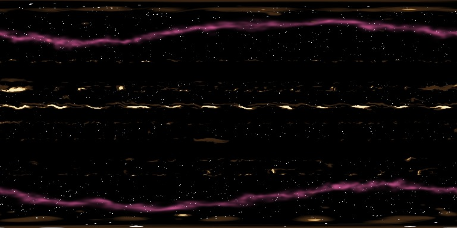 high &middot; 25</td>
</tr></table>

### aurora strength

`emission.aurora_strength` &mdash; range **0 to 2**, default **0**, tier `post`.

Auroral ovals ringing the (offset) magnetic poles. Higher = a brighter oval; 0 = off. Written to emission.exr's ALPHA channel so the importer can lift it onto a shell. Preview via the viewport's Emission channel (composited as alpha x aurora_color); not visible in the Color preview

_Shown on the **emission map** (night-side glow) with all three glows enabled; tonemapped for display. The color map is unchanged by emission sliders._

<table><tr>
<td align="center">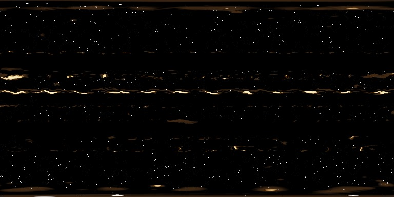 low &middot; 0</td><td align="center"> demo &middot; all glows on</td><td align="center">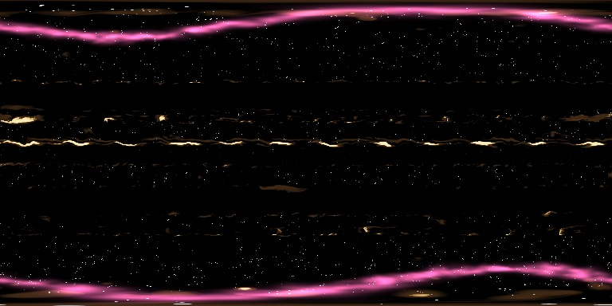 high &middot; 2</td>
</tr></table>

### aurora width

`emission.aurora_width` &mdash; range **0.5 to 8**, default **2.5**, tier `post`.

Auroral oval ring thickness, degrees. Preview: Emission channel, not Color

_Shown on the **emission map** (night-side glow) with all three glows enabled; tonemapped for display. The color map is unchanged by emission sliders._

<table><tr>
<td align="center">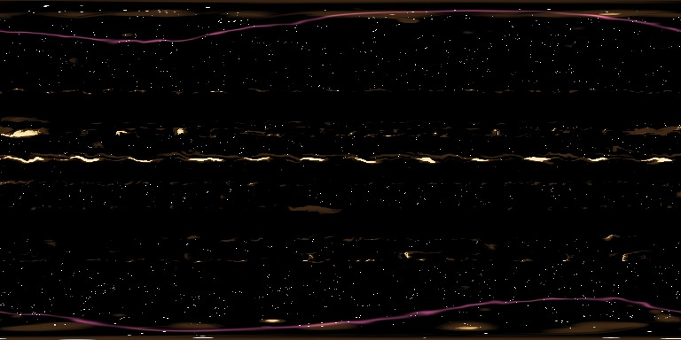 low &middot; 0.5</td><td align="center"> demo &middot; all glows on</td><td align="center">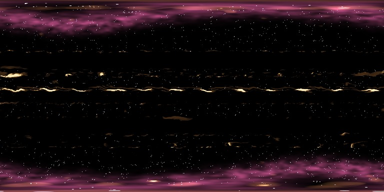 high &middot; 8</td>
</tr></table>

### lightning density

`emission.lightning_density` &mdash; range **0 to 1**, default **0.5**, tier `post`.

Lightning-flash cluster population density. Preview: Emission channel, not Color

_Shown on the **emission map** (night-side glow) with all three glows enabled; tonemapped for display. The color map is unchanged by emission sliders._

<table><tr>
<td align="center">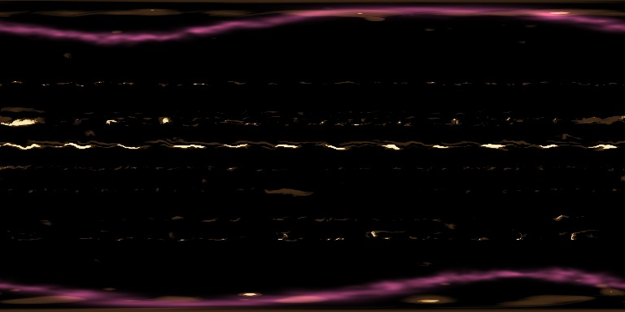 low &middot; 0</td><td align="center"> demo &middot; all glows on</td><td align="center">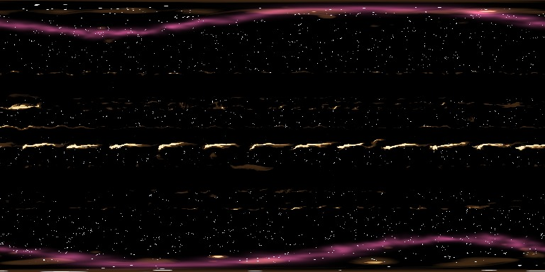 high &middot; 1</td>
</tr></table>

### lightning strength

`emission.lightning_strength` &mdash; range **0 to 2**, default **0**, tier `post`.

Frozen lightning-flash clusters in the cyclonic belts and at high latitudes. Higher = brighter, more visible flashes; 0 = off (the Juno look: light pools under the deck plus sparse HDR cores). Preview: Emission channel, not Color

_Shown on the **emission map** (night-side glow) with all three glows enabled; tonemapped for display. The color map is unchanged by emission sliders._

<table><tr>
<td align="center"> low &middot; 0</td><td align="center"> demo &middot; all glows on</td><td align="center">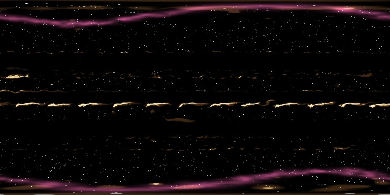 high &middot; 2</td>
</tr></table>

### thermal hdr

`emission.thermal_hdr` &mdash; range **1 to 40**, default **16**, tier `post`.

Radiance of the deepest hot spots relative to the faint belt glow (real 5-micron maps span ~50:1). Preview: Emission channel, not Color

_Shown on the **emission map** (night-side glow) with all three glows enabled; tonemapped for display. The color map is unchanged by emission sliders._

<table><tr>
<td align="center">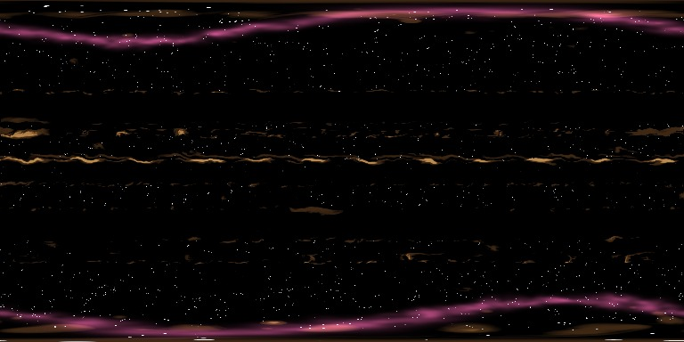 low &middot; 1</td><td align="center"> demo &middot; all glows on</td><td align="center"> high &middot; 40</td>
</tr></table>

### thermal strength

`emission.thermal_strength` &mdash; range **0 to 2**, default **0**, tier `post`.

5-micron thermal glow shining up through gaps in the cloud deck. Higher = a hotter interior showing through; 0 = off (gated on the cloud-top DEPRESSION vs the band stamp: hot-spot chains blaze, barges glow, belts glimmer, zones stay dark). Preview: Emission channel, not Color

_Shown on the **emission map** (night-side glow) with all three glows enabled; tonemapped for display. The color map is unchanged by emission sliders._

<table><tr>
<td align="center">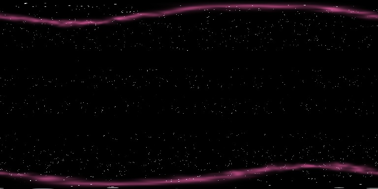 low &middot; 0</td><td align="center"> demo &middot; all glows on</td><td align="center">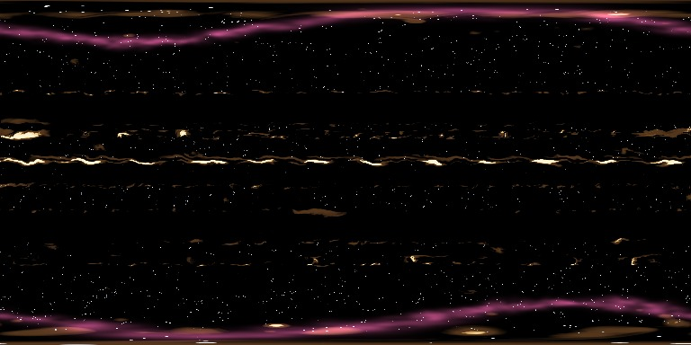 high &middot; 2</td>
</tr></table>

### thermal threshold

`emission.thermal_threshold` &mdash; range **0.05 to 0.5**, default **0.18**, tier `post`.

Cloud-gap anomaly where the HDR hot-spot term begins (higher = only the deepest holes blaze). Preview: Emission channel, not Color

_Shown on the **emission map** (night-side glow) with all three glows enabled; tonemapped for display. The color map is unchanged by emission sliders._

<table><tr>
<td align="center">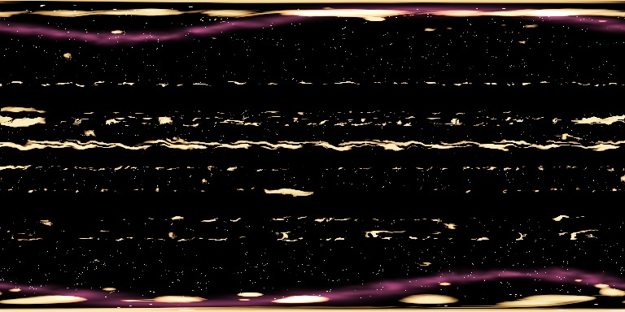 low &middot; 0.05</td><td align="center"> demo &middot; all glows on</td><td align="center">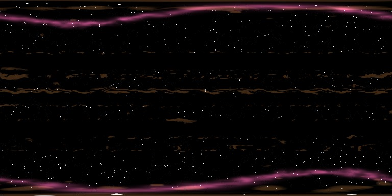 high &middot; 0.5</td>
</tr></table>

## Physical

### height midlevel

`physical.height_midlevel` &mdash; range **0 to 1**, default **0.5**, tier `post`.

Which height-map value counts as the mid cloud deck: above it reads as raised cloud, below as a gap. Only used when the Blender import turns Displacement on — the default bump path ignores it (the importer's reference level)

_Passed to the Blender importer / controls the output file, not the texture appearance &mdash; no visual example._

### height scale

`physical.height_scale` &mdash; range **0 to 0.05**, default **0.004**, tier `post`.

How far the cloud deck stands out in relief. Higher = deeper displacement in Blender (a fraction of planet radius, across the full height-map range)

_Passed to the Blender importer / controls the output file, not the texture appearance &mdash; no visual example._

### radius km

`physical.radius_km` &mdash; range **1000 to 200000**, default **69911**, tier `post`.

Planet equatorial radius in kilometers. A scale hint only: it changes nothing in the texture, and is passed through to the Blender importer

_Passed to the Blender importer / controls the output file, not the texture appearance &mdash; no visual example._

### ring inner km

`physical.ring_inner_km` &mdash; range **1000 to 1e+06**, default **74500**, tier `post`.

Inner radius of the ring system in kilometers, measured from the planet center (default = Saturn's C-ring inner edge). Only meaningful when rings are enabled; passed through to the Blender importer, which builds an annulus from ring_inner_km..ring_outer_km

<table><tr>
<td align="center">low &middot; 1000 (not rendered)</td><td align="center"> preset &middot; 74500</td><td align="center">high &middot; 1e+06 (not rendered)</td>
</tr></table>

### ring outer km

`physical.ring_outer_km` &mdash; range **1000 to 1e+06**, default **136780**, tier `post`.

Outer radius of the ring system in kilometers (default = Saturn's A-ring outer edge). Only meaningful when rings are enabled

<table><tr>
<td align="center">low &middot; 1000 (not rendered)</td><td align="center"> preset &middot; 136780</td><td align="center">high &middot; 1e+06 (not rendered)</td>
</tr></table>

## Export

### flow map

`export.flow_map` &mdash; toggle (on/off), default **`False`**, tier `post`.

Also export flow.exr: the sim's per-step velocity field resampled to the equirect grid as an (east, north) flow map (R = eastward, G = northward; B=0, A=1), so Blender / a compositor can drive motion vectors or advected effects. Off by default -- the default export file-set (color + height) is unchanged. No rand.

_Boolean toggle (GUI checkbox) &mdash; documented as text; no rendered example._

### png compression

`export.png_compression` &mdash; range **0 to 9**, default **2**, tier `post`.

How hard the color PNG is squeezed on export. Lower = much faster writes, which matters at 16K; higher = a smaller file. Only the color map uses it; the 16-bit height PNGs are always written at the default level (zlib deflate level)

_Passed to the Blender importer / controls the output file, not the texture appearance &mdash; no visual example._

### projection

`export.projection` &mdash; dropdown, one of `equirect` / `cube`, default **`equirect`**, tier `post`.

Output projection. 'equirect' writes the classic 2:1 equirectangular color/height(/emission) set (the default -- unchanged file-set and manifest). 'cube' instead writes a 6-face cube map (px,nx,py,ny,pz,nz per map) sized width/4 per face, for game engines / real-time renderers that texture a sky-cube or cube-mapped sphere. Cube export bumps the manifest schema to v2 (projection='cube', per-map 'faces' block); older importers that only build equirect geometry reject it cleanly. No rand.

_Choice field (GUI dropdown) &mdash; documented as text; no rendered example._

### width

`export.width` &mdash; range **512 to 16384**, default **2048**, tier `post`.

Map width in pixels. On the default equirect projection the height is half the width, the standard 2:1 ratio; on the cube projection each of the six faces is width/4 square instead

_Passed to the Blender importer / controls the output file, not the texture appearance &mdash; no visual example._

## Rings

### brightness

`rings.brightness` &mdash; range **0 to 2**, default **1**, tier `post`.

How bright the rings read. Higher = whiter, more reflective ice; 1.0 = the physically-derived value (multiplier on the ice reflectance, ring RGB)

<table><tr>
<td align="center">low &middot; 0 (not rendered)</td><td align="center"> preset &middot; 1</td><td align="center">high &middot; 2 (not rendered)</td>
</tr></table>

### enabled

`rings.enabled` &mdash; toggle (on/off), default **`False`**, tier `post`.

Export a ring texture strip (rings.exr) and, in Blender, build a Saturn-style annulus from it. Blender-only -- invisible in the GUI equirect preview. Off by default: the default export file-set (color + height) is unchanged. No rand

_Boolean toggle (GUI checkbox) &mdash; documented as text; no rendered example._

### fine grain

`rings.fine_grain` &mdash; range **0 to 1**, default **0.15**, tier `post`.

Amount of seeded fine-grain ringlet variation added on top of the bounded optical-depth table (0 = the smooth table only). Uses the master seed's 'rings' substream, so it is deterministic

<table><tr>
<td align="center">low &middot; 0 (not rendered)</td><td align="center"> preset &middot; 0.15</td><td align="center">high &middot; 1 (not rendered)</td>
</tr></table>

### opacity

`rings.opacity` &mdash; range **0 to 2**, default **1**, tier `post`.

Multiplier on the ring alpha (coverage) derived from the optical-depth table. 1.0 = physically-derived Beer-Lambert coverage

<table><tr>
<td align="center">low &middot; 0 (not rendered)</td><td align="center"> preset &middot; 1</td><td align="center">high &middot; 2 (not rendered)</td>
</tr></table>

